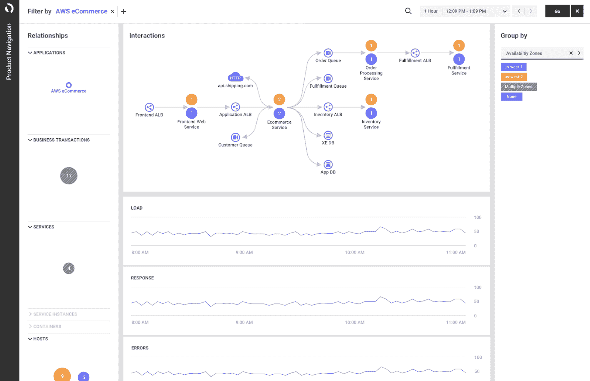

# AppDynamics 扩大 APM 数据消费

> 原文：<https://devops.com/appdynamics-expands-apm-data-consumption/>

思科系统公司(Cisco Systems)旗下的 AppDynamics 本周扩展了与其同名的[应用性能管理](https://devops.com/?s=application%20performance%20management) (APM)平台的可观察性功能，以[从开源工具和无代理服务](https://www.appdynamics.com/newsroom/press-release/appdynamics-solves-visibility-gap-with-new-portfolio-of-cloud-native-solutions)接收数据，以及通过其代理软件收集的指标。

与此同时，AppDynamics 增加了云数据收集器，可以从亚马逊 Web 服务(AWS)的亚马逊 CloudWatch 等工具生成的公共云服务中自动捕获数据。

最后，AppDynamics 增加了一个可视化界面，该界面针对监控云原生应用程序进行了优化，并与思科的 Intersight Workload Optimizer 工具进行了集成，组织可以利用该工具来更好地优化 IT 基础架构资源的使用，以降低混合云计算环境的成本。

AppDynamics 首席技术官 Ty Amell 表示，在新冠肺炎疫情之后，对 IT 环境更深层次的可观察性的需求变得更加明显。组织已经启动了多项数字业务转型计划，这些计划依赖于实时关联 IT 环境中发生的事件的能力。他说，为了提供这种能力，AppDynamics 一直在投资机器学习算法，以分析现在更容易收集的数据。

与此同时，思科一直在投资各种机器学习技术，以自动化计算、网络和存储基础设施的管理，Amell 表示，当与 AppDynamics 平台结合时，这些技术还可以提供对整体 IT 环境的更深入的见解。

向更全面的可观察性方法的转变证明了思科收购 AppDynamics 的合理性，app dynamics 提供了一个广泛使用的 APM 平台。然而，这种转变大部分是由开发运维团队进行的，他们的角色比传统 IT 环境中的角色更容易融合。然而，Amell 指出，随着 IT 组织意识到他们也可以通过合理化传统监控工具来降低成本，这种转变将继续加速。

随着 IT 环境变得越来越复杂，毫无疑问，花费数天甚至数周时间浏览多种工具来发现问题根源的容忍度正在下降。当一个问题的根本原因是一些可以在几分钟内解决的小事时，这尤其令人沮丧。

当然，每个组织都需要在可观察性和可观察性平台发现的问题的自动补救之间取得平衡。许多 IT 团队更喜欢在应用更改之前对其进行审查。

不管他们对自动化的适应程度如何，可以收集和分析的指标、日志和跟踪的数量已经显著增加。随着收集的数据越多，可观测性平台就变得越精确。现在的挑战是找到最有效的方法来管理 IT 环境，因为运行单片或基于微服务的应用程序的平台数量在不断增加。事实上，在这一点上，收集所有相关的数据仍然是一个比分析它更大的挑战。