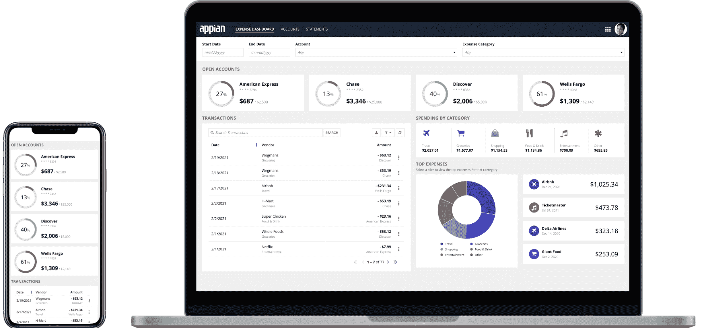

# Appian 扩展了聚合数据的低代码方法

> 原文：<https://devops.com/appian-extends-low-code-approach-to-aggregating-data/>

在一次在线 [Appian World](https://appianworld.com/) 会议上，Appian 今天发布了其低代码平台的更新，增加了一套可视化工具，使开发人员能够在数据库管理员(DBA)或数据工程团队的帮助下在应用程序中聚合数据。

Appian 产品副总裁 Malcolm Ross 表示，阻碍应用程序开发的最大因素之一是需要等待数据以一种在应用程序上下文中有意义的方式进行处理。Appian 低代码自动化平台的最新版本[将多个数据源聚合到位于平台内的单个数据向量列数据存储中。](https://appian.com/resources/newsroom/press-releases/2021/appian-unveils-latest-version-of-the-appian-low-code-automation-.html)

实际上，Appian 正在将低代码方法应用于数据工程过程，而今天，这些过程需要专门的专家来设置和管理。

最新版本的 Appian 还增加了一个智能文档处理(IDP)工具，该工具由光学字符识别和 AI 模型、应用程序设计指南、开发人员协作工具和增强的 DevSecOps 功能支持，使软件包能够以 Appian 平台管理的方式，通过单击在开发、测试和生产环境之间移动。

Appian 还扩展了机器人处理自动化(RPA)工具，以集中管理 Windows 平台应用程序中的机器人。

最后，Appian 正在为有限数量的开发者提供一个正式的、不太强大的社区版本，作为扩大其开发者社区整体规模的努力的一部分。

Ross 说，随着专业人员和所谓的[公民开发人员](https://devops.com/?s=citizen+developers)拥抱低代码应用程序，确保应用程序以符合 DevSecOps 最佳实践的方式部署至关重要。Ross 指出，Appian 低代码自动化平台包括设置这些护栏所需的软件开发生命周期(SDLC)工具，无论任何开发人员的经验水平如何。事实上，对于固定的服务费，Appian 保证一个组织的第一个项目将在仅仅八周内上线。

Ross 说，总的来说，随着越来越多的“商业技术专家”学习如何构建应用程序，有能力构建应用程序的个人数量会继续增加。以前，这些人可能使用 4GL 工具或宏来构建基于 Microsoft Excel 电子表格的应用程序。Appian 低代码平台使这类高级最终用户能够使用一套工具构建更强大的企业应用程序，这些工具将他们的工作与已知的最佳实践进行比较，并提供改进建议。

与此同时，专业开发人员选择使用低代码工具来构建应用程序，以减少应用程序开发积压量。并不是每个需要开发的应用程序都需要开发人员使用过程代码。

最终结果是，在组织启动多项数字化业务转型计划之际，同时构建和交付的应用比以往任何时候都多。

在 It 环境中完全实现低代码平台的效果可能还需要一段时间。然而，有一件事是肯定的，那就是各种规模的 IT 团队都应该期望管理数量呈指数级增长的应用程序。