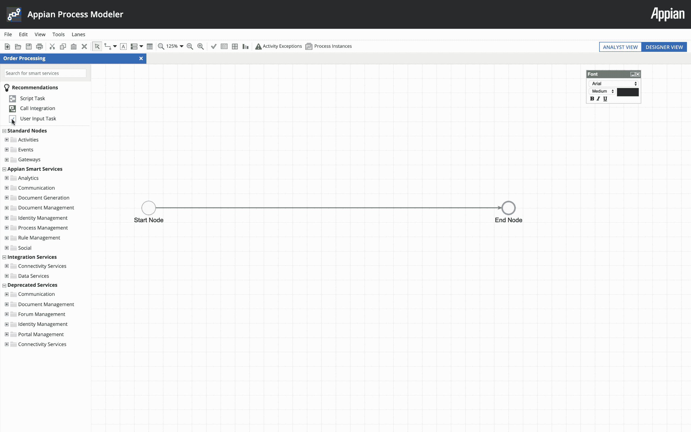

# Appian 为低代码平台注入人工智能

> 原文：<https://devops.com/appian-infuses-low-code-platform-with-ai/>

Appian 本周发布了对其低代码应用开发和部署平台的更新，该平台采用人工智能(AI)来推荐最佳的下一步措施，包括如何解决网络安全问题。

此外，最新版本的 Appian 还可以更容易地集成机器人流程自动化(RPA)模块，以自动化机械任务，此外还添加了对 Google Cloud Document AI 的支持，这使得提取文档以在采用 RPA 的应用程序中使用变得更容易。

Appian 产品战略副总裁马尔孔·罗斯表示，嵌入 Appian 云平台的机器学习算法使得采用最佳 DevSecOps 实践来加速安全应用程序的开发成为可能。他说，随着自动机器学习(autoML)的兴起，将机器学习算法应用于应用程序开发和部署的过程自动化也变得越来越容易。

虽然低代码平台对简化应用程序构建大有帮助，但 Ross 说，部署过程没有得到足够的重视。目标不一定是更快地推出更多应用程序，而是确保部署的任何应用程序都达到一定的质量水平，从而无需在部署后解决网络安全问题。

Appian 通过为应用程序运行自动化测试来实现这一目标，现在还包括 Appian 插件来检测插件版本中潜在的不匹配或缺失的插件。

罗斯说，当谈到人工智能时，总会有一些恐惧。然而，有许多手动任务，许多开发人员会很快看到使用人工智能自动化。他指出，随着人工智能越来越广泛地依赖于推动消费者应用程序体验，IT 团队对内部流程自动化的接受程度也会越来越高。他补充说，网络安全是大多数开发人员都会感谢人工智能所能提供的任何帮助的一个领域。

人工智能不太可能很快取代对 DevOps 团队或网络安全专业人员的需求。然而，在许多组织面临巨大经济压力的时候，人工智能显然在降低 it 总成本方面发挥着重要作用。尽管 IT 自动化取得了进步，但劳动力成本仍然是任何 IT 预算中最昂贵的要素之一。因此，IT 组织非常希望确保开发运维团队和网络安全团队不会在可能更适合由机器处理的任务上浪费时间。

显然，人工智能系统和 IT 团队之间的互动方式仍在定义之中。然而，有一件事是肯定的，那就是像 Appian 这样的平台将会提供更多关于什么时候需要做什么的建议。It 专业人士可能需要一段时间才能对那些 AI 推荐有信心；然而，就经常犯的错误而言，很明显 it 团队很快就没有借口了。