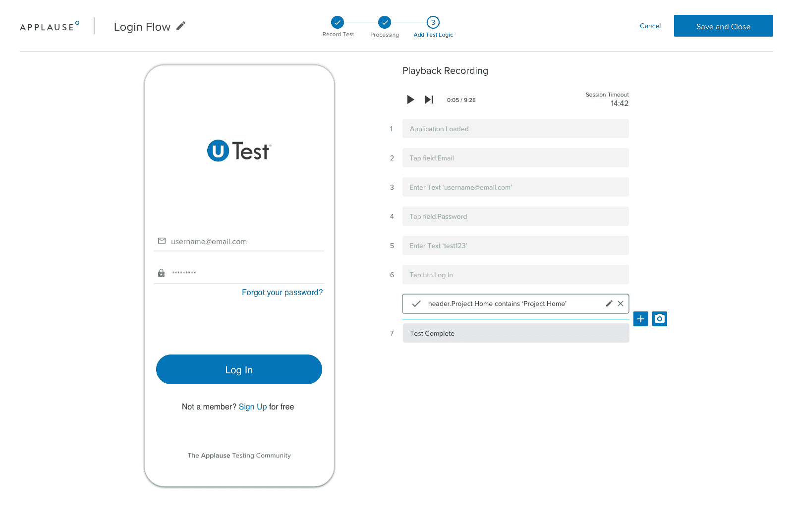

# 通过 saas 平台进行自动化应用测试

> 原文：<https://devops.com/applause-automates-app-testing-via-saas-platform/>

今天的掌声展示了一个软件即服务(SaaS)平台，它使自动创建测试自动化脚本变得更加容易，而无需编写代码。

与此同时，该公司正在增加对应用程序编程接口(API)的支持，通过该接口，DevOps 团队可以发送新功能，供 plateau 平台测试。

这两种产品现在都包含在更名后的[产品卓越平台](https://www.applause.com/product-excellence-platform-launches) (PEP)产品中，这是一套工具和平台，通过这些工具和平台，plateau 使其产品组合更易于访问。

掌声首席技术官罗布·梅森(Rob Mason)表示，掌声无代码自动化(ACA)平台使测试人员有可能使用 SaaS 平台记录一系列测试用例场景，该平台将这些会话翻译成自动化脚本，而无需任何人编写任何代码。梅森说，目前的产品支持 Android 和苹果 iOS 应用程序，并计划支持 web 应用程序。

Mason 说，与此同时，Sprint 中的鼓掌测试功能使用双向 API 使测试过程更加迭代，该 API 可以插入任何软件开发生命周期(SDLC)过程。Mason 说，这种双向能力使得将来自测试过程的反馈嵌入到由应用程序开发团队实现的任何缺陷跟踪系统中成为可能。

Mason 说，这种能力是至关重要的，因为它使 DevOps 团队能够更早地发现问题，从而避免后期的错误修复，这种修复成本更高。Mason 补充说，它还提供了额外的好处，使开发人员更容易在编写应用程序时解决问题，而不是在几天或几周之后，当围绕该问题的上下文早已丢失时。梅森说，SaaS 平台为开发人员提供了即时测试能力。

Mason 说，最终目标是通过使测试更容易重用，使更广泛的个人参与应用程序测试变得更简单。此外，他说，它将允许主题专家记录测试，这些测试可以代表他们转化为测试脚本。Mason 补充说，这种方法将使组织能够进一步向左推动测试，超越最初创建应用程序的开发人员，以包括该应用程序的所有者。

构建应用程序以推动数字业务转型计划的速度正在加快，这使得测试变得更加困难。自动化是缩小一个组织可以投入的应用测试人员数量和所有正在开发的应用之间差距的唯一方法。自动化方法不仅减少了创建测试所需的时间和精力，还使得跨不同应用用例重用测试变得更加容易。

最终，机器学习(ML)算法和其他人工智能能力在应用测试中发挥更大作用只是时间问题。挑战将是在应用程序测试的上下文中找到人机界面的确切位置。

与此同时，自动化测试变得越多，它将被更广泛地实施。这些测试的结果可能不总是受欢迎的消息，但它们提出的问题总是越早解决越好。