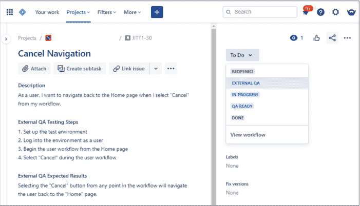

# 掌声交付测试集成工具

> 原文：<https://devops.com/applause-delivers-testing-integration-tool/>

今天，掌声推出了一个双向集成功能，简化了应用程序代码测试的请求，被称为[掌声冲刺测试](https://www.applause.com/blog/shift-left-with-applause-in-sprint-testing)。

plateau 产品副总裁 Kristin Simonini 表示，应用程序所有者将能够使用吉拉项目管理应用程序创建一个标签，请求由专门测试团队的成员或在 DevOps 工作流环境中承担更多应用程序测试责任的开发人员测试特定代码。或者，这个请求可以发送给 uTest 的成员，uTest 是 plateau 监督的专业测试人员的在线社区。

该公司还公布了对 1，800 名质量保证(QA)、产品、工程和开发运维专业人员的全球调查结果，发现 44%的开发团队已经将应用测试转移到了其他地方，他们每周都要花一整天的时间进行应用测试。超过一半的受访者(52%)指出，花费在测试上的时间会影响开发人员的工作效率。

另一方面，调查还发现，每月发布多次代码的受访者中有整整 88%的人表示，他们的组织现在在开发时就测试功能，而不是等到应用程序开发过程结束时才测试。

受访者提到的测试转移的主要好处是减少发布到生产环境中的 bug 数量(57%)，减少后期 bug 修复的成本(48%)，以及减少对热修复的需求(39%)。

将测试责任转移给开发人员的两大障碍是他们太忙于编码(45%)以及开发和质量保证(QA)工作仍然孤立(37%)。将近一半的开发人员(44%)说，当他们在编码和测试任务之间转换时，他们有上下文切换的问题。

Simonini 说，Sprint 测试中的掌声将使应用程序所有者更容易决定何时使用专业测试人员，而不是让开发人员运行测试。然后，[plateau Product Excellence Platform](https://devops.com/applause-automates-app-testing-via-saas-platform/)使 IT 组织能够利用软件即服务(SaaS)平台来记录一系列测试用例场景，这些场景可以自动转换为自动化脚本，无需任何人编写代码。

总体目标是简化测试，因为在新冠肺炎疫情带来的经济衰退之后，人们越来越关注数字业务转型，这在一定程度上导致了应用程序构建数量的加速。Simonini 指出，随着组织意识到他们如何依赖这些应用程序来区分自己，对质量保证的关注自然会加强。

毫无疑问，越来越多的组织正在以更高的频率进行测试。开发人员以前倾向于在部署到生产环境中之后，将解决大量 bug 作为一系列应用程序更新的一部分，现在他们的努力受到了质疑。组织意识到他们的应用程序只有一次机会给最终客户留下第一印象。因此，对应用程序测试细节的关注程度，无论是好是坏，都是前所未有的。