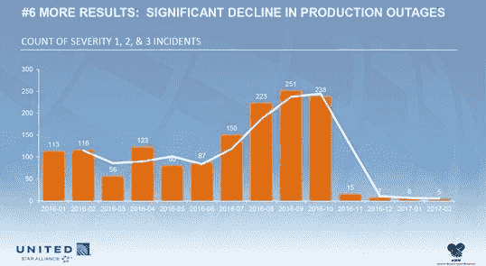

# 在应用经济中，每个公司都是软件公司

> 原文：<https://devops.com/application-economy-every-company-software/>

最近，我在纽约参加了第三届 DevOps 虚拟峰会。(是的，我必须亲自参加一个“虚拟”峰会——虽然对与会者来说是虚拟的，但对演讲者、小组成员和支持人员来说却发生在现实生活中。)

广播在一个小录音棚里进行，大厅装饰着名人的亲笔签名照片，这些名人以前曾使用过这些设施。西尔维斯特·史泰龙、阿尔·帕西诺，甚至约翰·斯塔莫斯——从“爆满”时代就有了完整的鬃毛——都从墙上俯视着我们。

无论如何，当演讲者在活动开始前在大厅里介绍他们自己时，我想到演讲者的抽样说明了 DevOps 在各行业的重要性。参加此次活动的公司并不是你传统上认为的“软件企业”，但他们在软件开发实践方面进行了投资，认识到了在应用经济中竞争的重要性。它强调了一点，在应用经济中，每个公司都是一个软件公司，不管他们在哪个行业。这就是为什么 DevOps 和持续交付的概念应该是首要考虑的，即使你的公司可能不认为自己“在”软件业务中。不管你的公司销售什么样的最终产品，你都要依靠你的软件和应用程序来实现。

看看小组成员和他们所代表的公司就能说明这一点:联合航空公司的西尔维娅·普里克尔。通用金融公司的马特·麦科马斯。CNN 的约翰·桥本。珠宝商互助保险公司的凯利·麦卡特尼。

一家航空公司，一家汽车金融公司，一家新闻机构和一家保险公司，已经有 100 年的历史了。这些公司并非生来就是数字公司，不像你通常会联想到的许多网络公司。相反，这些传统组织认识到了进行数字化转型的必要性。

结果令人印象深刻。当我们谈论连续交付时，我们经常关注速度，但重要的是要记住，你也可以看到质量的提高。下图取自 United presentation，显示了生产中断的大幅减少。

这并不是说没有看到速度的提高。来自 GM Financial 的 Matt McComas 讲述了他的公司现在平均每月进行 1，800 次部署，每次只需 3 到 5 分钟。

这里我不会透露任何更重要的细节。如果你有兴趣了解更多，我鼓励你观看网络直播的重播:[http://bit.ly/DOVSreplay](https://bit.ly/DOVSreplay)

— [布兰登·海耶斯](https://devops.com/author/brendan-hayes/)