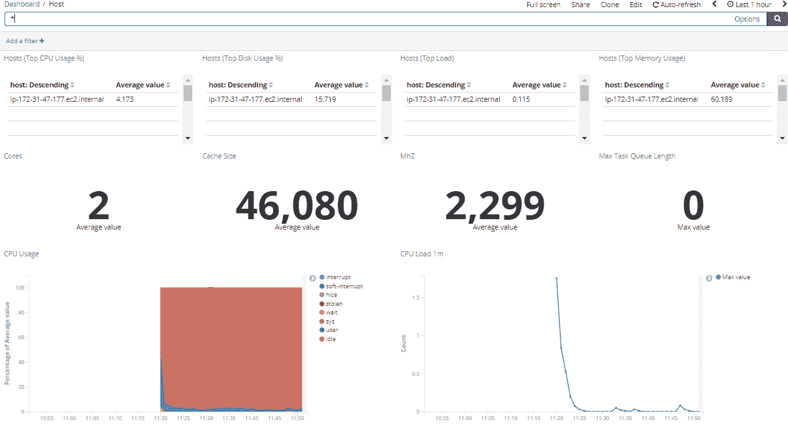

# 使用 Stagemonitor 监控应用程序

> 原文：<https://devops.com/application-monitoring-using-stagemonitor/>

本文涵盖了使用 Stagemonitor 工具、作为仪表板查看工具的 Kibana 和作为数据处理引擎的 Elasticsearch 来监控典型 Java 应用程序的重要步骤。

Stagemonitor 是一个开源的 Java 应用程序性能监控(APM)工具，它提供了开发、质量保证和生产中监控 Java web 应用程序性能所需的一切。

使用这个工具，我们可以拥有不同的仪表板，如 JVM 仪表板、应用服务器、请求指标、主机、请求分析、web 分析等。

## 舞台监视器的体系结构

Figure 1

Stagemonitor 代理位于应用程序内部，向 Elasticsearch 发送有关请求的指标和细节(请求跟踪)。可以选择将指标发送给 Graphite、Influx DB 和 Prometheus。

### 先决条件

*   最低 2GB 内存和 200GB 硬盘
*   1.8 或更高版本的 Java
*   安装最新版本的 Kibana 和 Elasticsearch

## 使用 Stagemonitor 监控 Java 应用程序的步骤

### 使用浏览器小部件监控开发时间

这一步演示了如何在开发时间监控中启用一个小部件，在 Java 应用程序中添加 Stagemonitor 插件。我们可以通过两种方式做到这一点:我们可以通过添加所需的 stage monitor 插件来直接编辑 pom.xml/build.gradle 文件，或者我们可以在应用程序的 LIB 目录中添加依赖项。

我们在 pom.xml/build.grade 必须拥有的一些重要插件是 Stagemonitor 配置、Stagemonitor 跟踪弹性搜索、Stagemonitor 跟踪、Stagemonitor-jdbc、Stagemonitor-jvm、Stagemonitor-os、Stagemonitor-web-servlet 和 Stagemonitor 警报。

我们将从以下位置获得 Stagemonitor 插件:[https://mvnrepository.com/search?q=stagemonitor](https://mvnrepository.com/search?q=stagemonitor)

安装代理后，如果是 maven 应用程序，必须在 src/main/resources 下创建一个 Stagemonitor 配置文件，作为 stagemonitor.properties 文件。否则，该文件必须位于类路径的根目录下。最后，它必须在 WEB-INF/classes 部分下。

以下是 stagemonitor.properties 文件的外观:

stage monitor . Application name =我的应用程序

stagemonitor.instanceName=dev

stage monitor . instrument . include = org . example . app

### 请求仪表板

在本节中，我们将重点介绍如何设置时间序列数据库来收集数据，以及如何使用可视化工具来详细查看指标。这里我们将使用 Elasticsearch 作为时间序列数据库引擎，使用 Kibana 作为可视化工具。

为了从 Elasticsearch 数据库中获取数据，我们将在 stagemonitor.properties 文件中包含属性:

stage monitor . reporting . elastic search . URL = value，

stage monitor . reporting . elastic search . username = value

stage monitor . reporting . elastic search . password = value

stage monitor . reporting . interval . elastic search = 60

在添加了所有必需的值并重启服务器之后，我们将能够在 Kibana 中打开(自动添加的)请求分析仪表板。与此同时，我们将能够自动看到不同的仪表板。

要将 Influx DB 用作时间序列数据库，我们必须配置 stagemonitor.properties 文件中的值:

#以下详细信息包含 influxDB

stage monitor . reporting . influx db . URL = http://localhost:8086

stage monitor . reporting . interval . influx db = 60

stage monitor . reporting . influx db . username = value

stage monitor . reporting . influx db . password = value

### 使用 Kibana/Stagemonitor 进行日志监控

我们可以使用 Kibana/Stagemonitor 跟踪日志。在 metrics dashboard 中，我们可以看到矩阵，比如我们点击了哪个 URL 地址以及完成请求的时间(图 2)。我们可以跟踪主机的详细信息，例如我们的应用程序正在运行多少台服务器、服务器的状态、内存统计、CPU 统计、网络统计、磁盘使用统计、处理的网络、网络数据包错误、网络数据包丢弃以及主机正在使用多少个 CPU 内核。

Stagemonitor 在请求分析仪表板下提供了所有必需的仪表板。要打开请求分析仪表板，请点击:仪表板–加载保存的仪表板，然后选择“请求分析”

Figure 2

图 3 显示了 CPU 的细节，比如 CPU 使用率和 CPU 负载。

Figure 3

下面，图 4 显示了总的页面浏览量、访问站点的唯一访客数和呼叫树，以及完成该操作需要的时间。

Figure 4

图 5 显示了交易历史和单个交易的详细信息。

Figure 5

图 6 显示了 JVM 细节和所有其他内存矩阵。

Figure 6

如上所述，我们可以监控各种应用指标和基础设施指标。

— [赛巴布·唐古特里](https://devops.com/author/sai-babu-tanguturi/)