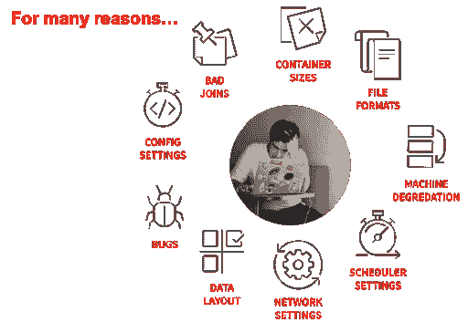

# 数据运营的应用性能管理

> 原文：<https://devops.com/application-performance-management-for-dataops/>

多年来，应用性能管理(APM)工具通常被用来测量和监控诸如 web 应用之类的软件的性能。他们通过跟踪诸如请求响应时间和错误消息这样的事情来做到这一点，从而提供相关数据供 DevOps 团队分析，然后 devo PS 团队可以做出适当的更改来优化他们的软件。但是，对当今许多应用程序的功能做出贡献的数据工作流的有效性如何呢？如何扩展性能监控工具集，为这些工作流提供持续改进的机会？

## 数据管道和性能挑战

下面，我将讨论 APM 工具在[数据操作](https://www.dataopsmanifesto.org/)环境中的使用。我将深入研究 APM 工具必须为工程师提供的指标和见解，以便他们能够有效地支持数据管道，展示如何有效地使用以数据为中心的 APM 工具，为数据运营团队及其组织提供广泛的价值。

## 数据管道和数据操作工程师

成功的 DataOps 实施需要创建能够快速分析大量数据的自动化数据工作流，同时作为最终产品提供高质量的分析。很容易看出数据操作工程师的工作是多么复杂。他们的工作是构建和管理这些管道，以帮助企业实现依赖于最终数据分析的某些目标。换句话说，DataOps 工程师负责确保尽快提供高质量的数据。

考虑一个我们都熟悉的常见场景:网上购物。每当你从一个特定的电子商务网站购物时，系统通常会提供推荐的产品供你购买。这通常是为推荐系统生成数据分析的数据工作流的结果，然后应用程序利用该数据分析为最终用户提供这些推荐。这个管道可能由几个过程组成。

这些过程包括将大量原始数据加载到分布式文件系统中，以便在整个集群中存储数据。接下来需要在这个集群上运行几个过程来格式化和分析这些数据，以便为 web 应用程序所利用的推荐引擎生成高质量的数据。大量的工作都是通过大量的数据来完成的。而且，就像通常发生的事情一样，也有很多可能出错的地方。

## 管理数据管道的挑战

管理上述类型的管道会带来几个主要的性能挑战。以下是对数据管道性能的一些常见威胁:

*   **可伸缩性:**在处理数据管道的构建时，一个更明显的挑战是可伸缩性，换句话说，就是管道在需要处理大得多的数据集时的有效性和效率。当编写作业来处理这样的数据转换和分析时，很可能是在开发环境中针对较小的数据集进行测试。当情况不再如此时，会发生什么？也许现在在测试环境中处理相对少量的数据，而在生产环境中运行时需要处理更多的数据。这些流程是否仍能充分执行，以时间高效的方式交付质量分析？
*   **应用故障:**数据管道依赖并行处理。但是，当您遇到一个或多个正在执行以清理和分析数据的并行运行的进程失败时，会发生什么呢？这可能会影响您向业务部门传达质量和完整分析的能力。能够快速解决故障并使管道恢复正常运行对特定数据工作流的成功起着巨大的作用。
*   **碎片化:**大多数数据管道由各种处理不同任务的工具组成(比如摄取、存储、处理、分析等。).有了这么多不同的工具，管道可能会变得支离破碎。工具不兼容问题可能会出现，数据格式也可能会有所不同。即使数据在不同的工具之间移动，能够在管道内统一数据也是非常重要的。

## APM 工具助您一臂之力

### 手动与自动

在您的组织内实现数据运营需要对您的数据工作流进行持续反馈和持续改进。实施这些策略的一个好地方是使用 APM 工具来帮助管理这些管道的性能。

考虑不使用 APM 工具的改进过程。It 和数据运营人员需要在这些管道中手动定位与性能相关的问题，并开始挖掘日志文件以找到原因。由于缺少查看这些信息的集中位置，缺少向团队通知这些性能混乱的自动警报，以及缺少从收集的性能数据中获得洞察力的帮助，解决这些故障可能会增加大量时间。APM 工具可以为调试此类问题提供直观的用户界面，并提供快速检测和解决这些问题所需的洞察力。

也就是说，大数据流程监控与其他类型的应用程序监控有很大不同。某些 APM 软件在处理与数据管道相关的挑战方面比其他软件更有优势。这在很大程度上取决于 APM 工具[与数据工作流](https://unraveldata.com/integrations/)中使用的平台和框架集成的能力，以及性能管理软件收集和利用的指标，以帮助数据运营工程师完善他们的流程。

## 什么类型的指标有助于确定数据管道中问题的原因？

前面，我讨论了由可伸缩性问题和流程失败引起的数据管道性能挑战。让我们讨论应该收集哪些类型的指标来解决数据工作流中的这些问题。

在深入研究指标之前，需要注意的是，拥有全栈数据是必不可少的。对于全栈数据，我不仅指基础设施指标(这是人们在管理数据管道时最容易想到的指标类型)，还指其他数据点，如用户数据、应用程序数据和资源数据。所有这些数据都需要在管道中的所有系统之间进行统一和关联，以便对其进行有效管理。

例如，考虑可伸缩性。您正在使用的 APM 解决方案必须能够跟踪几个关键指标，以帮助识别数据管道中与扩展相关的瓶颈。其中包括:

*   **正在处理的数据量:**在不知道特定运行正在处理多少数据的情况下，我们如何识别可伸缩性问题？答案是:我们不能。能够量化数据管道的每次迭代所处理的数据量是检测工作负载是否是问题的第一步。
*   **每个单独流程的每次运行时间:**组织使用的 APM 软件必须能够与数据管道的结构集成，以报告工作流程中每个单独作业的每次运行时间。如果某个特定的作业在处理 X 倍的数据量时在 1 分钟内完成，但在处理 10 倍的数据量时却用了 20 分钟，那么我们就诊断出了潜在的可扩展性问题，并以省时的方式将其缩小到根本原因。也许修复就像调优一些 SQL 一样简单，可伸缩性问题可以在相对较短的时间内得到纠正。
*   **资源利用:**某些流程可能需要比其他流程更多的资源才能及时完成。APM 工具跟踪每个进程所使用的资源量的能力是确定简单地重新分配某些资源是否可以解决性能问题的关键。

示例问题:

[解开](https://unraveldata.com/)是 APM 工具的一个例子，它可以跟踪所有上述内容，同时在一个用户界面中组织数据，为 DataOps 工程师提供从一个屏幕诊断数据工作流性能问题所需的一切。此外，unallow 还雇佣了[人工智能解决方案](https://unraveldata.com/platform/)来帮助获取他们收集的指标，并为工程师提供关于他们如何优化管道的具体见解。这有助于减少 DataOps 人员在管理现有流程上花费的时间，让他们有更多时间来创建新流程，以提高向企业提供的分析质量。

## 结论

APM 工具不再仅仅用于确保应用程序可用性。面向大数据的 APM 工具，如来自[unrolling](https://unraveldata.com/why-unravel/)的工具，允许在数据工作流中进行性能监控和分析，有助于确保关键的高质量数据分析的可用性。任何希望提高数据分析流程质量的组织都应该扩展其 APM 工具集，将大数据纳入其中。

*本文由[代表](https://unraveldata.com/)撰写。*

——[斯科特·菲茨帕特里克](https://devops.com/author/scott-fitzpatrick/)