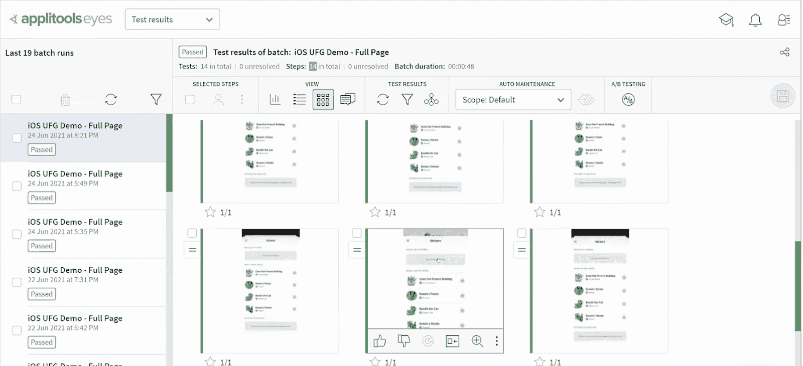

# Applitools 将视觉人工智能测试扩展到原生移动应用

> 原文：<https://devops.com/applitools-extends-visual-ai-testing-to-native-mobile-apps/>

在其在线[测试的未来:移动](https://applitools.com/future-of-testing-mobile-europe/)活动中，Applitools 今天预览了将视觉人工智能(AI)应用于在移动计算平台上本地运行的应用程序的能力。

通过目前在有限基础上免费提供的云服务访问，[用于原生移动设备的超快测试云](https://www.prnewswire.com/news-releases/applitools-unveils-innovative-new-approach-for-native-mobile-test-automation-301321724.html)产品将扩展该公司基于浏览器的移动应用程序的视觉人工智能工具，以支持在苹果 iOS 或谷歌 Android 设备上原生运行的应用程序。

Applitools 首席执行官吉尔·塞弗(Gil Sever)表示，虽然今天大多数移动企业应用程序都依赖浏览器来简化应用程序的构建和部署，但随着时间的推移，越来越多的应用程序将在 iOS 或谷歌 Android 平台上运行，这主要是因为它们提供了更好的用户体验。

这种方法还消除了依赖繁琐的平台仿真器来测试应用程序的需要，因为 Applitools AI 工具可以以简化应用程序测试过程的方式了解每个平台的细微差别。

Sever 指出，事实上，可视化人工智能工具不仅会让开发人员和测试团队更加高效，而且还会让最终用户更容易参与应用测试过程。

AI 测试的 Applitools 方法也为开发人员提供了基于应用程序用例的更多控制。例如，可以应用不同的设置来测试需要完美像素对齐的医疗应用和可能不需要那么多保真度的电子商务应用。然后，开发人员可以通过采用根本原因分析来解决回归问题。

目前还不清楚使用计算机视觉算法进行自动化测试的视觉人工智能工具会有多广泛。毫无疑问，当前应用程序开发的速度比大多数专门的测试团队所能处理的要快。因此，更多的应用测试责任被转移到了开发人员身上，从时间的角度来看，他们可能更倾向于依赖人工智能和其他可以通过云服务访问的自动化形式。

人工智能测试工具的兴起也可能有助于确保更多的应用程序在部署到生产环境之前得到彻底的测试。当项目落后于计划时，任何应用程序开发计划中被压缩的第一步就是测试。随着越来越多的机械测试自动化，专门的测试团队应该有更多的机会专注于改善最终用户体验。

在大多数组织例行使用人工智能测试应用程序之前，可能还需要一段时间。然而，这些组织都不应该指望人工智能取代人类测试应用程序的需求，以及可以看到实际应用程序的人工智能测试平台。毕竟，看到对应用程序所做的更改和理解为什么实际上需要做这些更改是有天壤之别的。