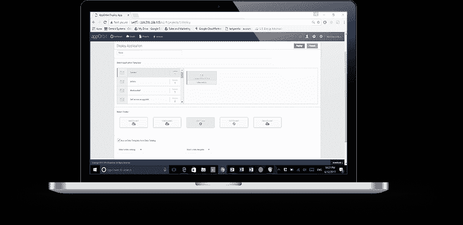

# appOrbit:端到端超云

> 原文：<https://devops.com/apporbit-end-end-hypercloud/>

随着云和 DevOps 的升温，企业对云可移植性和更深入的 DevOps 集成的需求变得非常明显。从第一天起，企业云用户就一直希望获得可移植性，以避免云锁定。许多人都在尝试满足这一需求，但市场仍在不断发展。

在 DevOps 集成领域，目前引起争论的两个主题是安全性和联网。持续部署不可避免地要求两者都是 DevOps 包的一部分，而这些是该领域的最新补充，因此它仍在不断成熟。

## 输入正确的

 appOrbit 最近摆脱了隐形模式，推出了[总体架构](http://apporbit.com/product/)，以支持超云并在整个开发/测试/部署生态系统中扩展开发运维流程。我们的想法是提供一个平台，它不关心您使用什么语言或部署工具，甚至不关心您将数据放入了什么数据库，它涵盖了从第一行代码到部署后管理和监控的整个过程。

这是一个很大的要求，所以我打电话给 appOrbit 询问了一下。更好的办法是花时间使用工具集，但我会解决我们关于流程中传统薄弱环节的问题，以及他们如何实现公司的一些主张。暂时如此。

我的第一印象是，这是应用发布自动化/应用发布管理(ARA/ARM)，appOrbit 的 CEO Rahul Ravulur 告诉我，我离得不远了；我只是想得不够大。这个过程的很大一部分是 ARA，但是除此之外，appOrbit 还担心网络、安全策略和长期监控和管理，同时提供部署可移植性。

## 最后，结局就在眼前

从 DevOps 运动(我喜欢称之为 devOPS)的运营方面开始，最终目标非常明显:改进整个过程。这显然需要时间——优秀的网络工程师是能让网络做出惊人之举的奇才——我们必须想出如何让这一过程更具可重复性。在 DEVops 方面，repeatable 相对来说没有痛苦:我们已经一遍又一遍地执行了预定义的步骤序列；重点是将它们分解成更小的迭代，并自动化已经成熟的东西。大部分运营都是一样的，但网络和安全有更多的变量需要考虑，并且“这是一个规定的序列，执行它”的历史更少

如果 appOrbit 能够像它声称的那样做——它的客户名单包括一些我曾经合作过的客户，如果产品是 vaporware，他们可能不会在那里——那么我们将看到高潮的开始。最终将包括无限的可移植性，类似于“我们不关心您部署在哪里，只要告诉我们，我们就会去做”；它将包括开发工具不可知论——“我们不在乎你用了什么工具，我们会部署它”；它将包括完整的解决方案——“我们将移动您的数据，我们将移动您的应用，我们将配置目标网络，我们将运行与目标平台相关的安全检查。”听起来 appOrbit 已经在这条路上走得很远了。

## 你到底想干什么？

一个有趣的想法是给安全和网络添加“意图”。告诉它你想要什么，通过内置功能和插件的组合，它将按照你的意图部署你的应用程序。对于像打开端口这样的事情，这似乎很简单，但是安全性和网络是复杂的话题。安全策略/意图涵盖/不涵盖什么？如果我的意图是让系统创建一个 VPN，锁定所有端口，然后只打开几个端口，并通过加密端口将 VPN 连接回数据中心，该怎么办？谁管理证书？it 部门从哪里获得返回数据中心的凭据？如果我将整个基于 VPN 的部署放在数据中心内，会发生什么？我需要重新设计网络来移除 VPN 吗？问题层出不穷。

但是，假设这是一条真正能够以“随处部署，随心所欲部署”而告终的道路的开始这是我们一直在等待的，这是不可避免的，所以我很高兴看到我们沿着这条道路有意义地出发。

## 进步带来运动

仅仅是有人谈论将所有这些整合在一起的行为对客户来说就很好。Ravulur 强调“我们做的很多事情都是 ARA”，这无疑会让 ARA 厂商加紧努力，变得像 appOrbit 一样包容，市场也会向前发展。appOrbit 在不单独改变应用程序的情况下进行“遗留应用程序迁移”的用例为企业开始迁移到新平台提供了一条途径。这本身将有助于大量希望迁移到更现代化的环境，但没有准备好或能够重写整个系统的企业。同样，这将刺激竞争对手在相对较短的时间内尝试和实现类似的功能，在这种情况下，最有可能的是在应用程序供应领域。

## 绝望的

简而言之，我希望 appOrbit 能够做它声称的所有事情，但即使它在某些方面有所欠缺(老实说，我只涉及了它整合在一起的几个方面；这里有很多)，这是向前迈出的一步，我认为该公司将从开发和部署两方面推动市场朝着应用程序可移植性的最终目标前进，同时自动化一个更完整的解决方案。

对我来说，这一切都很好。并非所有人都是纯云，更少的人希望成为纯公共云品牌 x。我接触过的自动化工具都非常复杂，毫无疑问，这款工具也是如此；简化自动化，使其易于适应给定的环境，是这些工具执行的任务的一个重要部分。找出弱点是我们客户必须要做的，但最终，我们还是在前进。

就我而言，我将寻找机会玩 appOrbit 的玩具，验证它的一些声明，并看看它有多适合企业需求。但我没有时间表，所以如果你有兴趣，你应该自己去看看。

唐·麦克维蒂