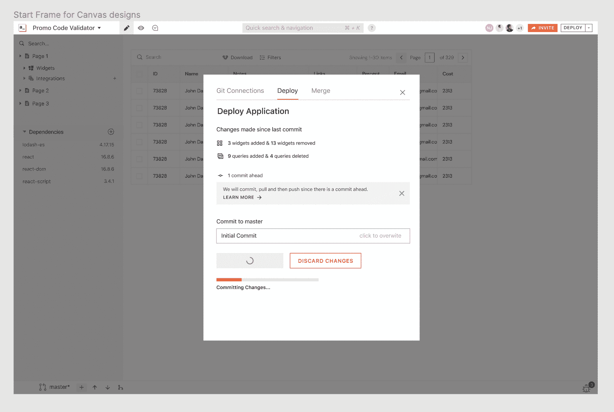

# AppSmith 为低代码应用开发框架增加了 Git 支持

> 原文：<https://devops.com/appsmith-adds-git-support-to-low-code-app-dev-framework/>

AppSmith 在开源框架中增加了对 Git 库的支持，使用基于 JavaScript 编程语言的低代码平台构建定制应用。

AppSmith 的营销负责人 Rishabh Kaul 表示，Git 的支持将使开发人员更容易管理版本控制，因为他们使用 AppSmith 提供的一组图形小部件迭代地构建应用程序。

AppSmith 主要由开发人员用来构建自动执行特定任务或工作流的内部应用程序。对 Git 的支持使得多个开发人员在向一个 [Git](https://devops.com/?s=Git+repository) 分支添加工作并在持续集成/持续交付(CI/CD)管道的上下文中发出请求时，能够更容易地协作。

考尔说，这也使得测试应用程序和在出现问题时回滚到以前的版本变得更加简单。

AppSmith 的社区版将使得在要求开发者升级之前，可以连接到无限的公共存储库和最多三个私有存储库。

近年来，低代码工具的使用急剧增加，因为组织采用了使他们能够更快地构建应用程序的工具。不是每个应用程序都需要开发人员使用工具来处理过程代码。通常有数百个用例，其中组织可以构建和部署一个应用程序，这将消除内部团队许可另一个打包应用程序的需要。

总的来说，AppSmith 和其他开源工具和框架提供商认为，随着经济持续萎缩，随着组织对成本越来越敏感，这些工具的采用将会增加。这种方法将允许他们继续提供定制的应用程序来自动执行特定的任务。

当然，挑战在于，随着正在构建和部署的应用数量的稳步增长，定期更新、保护和维护这些应用的开发运维工作流变得更具挑战性。

现在还不清楚有多少百分比的应用程序是使用某种类型的低代码工具构建的。然而，组织的应用程序组合的总体规模通常比疫情之前要大得多。在许多员工继续在家工作的时候，许多这些应用程序正在推动旨在提高工作效率的数字业务流程。

然而，不太清楚的是，有多少新的应用程序是由所谓的公民开发者开发的。然而，不管怎样，对于那些对软件有一些基本了解的最终用户来说，构建应用程序变得越来越容易了。不可避免的是，这些应用程序开发工作也需要集成到 DevOps 工作流的上下文中。

不管单个 DevOps 团队如何看待低代码工具，他们已经永久地改变了应用程序开发的前景。问题不再是开发人员是否会使用低代码工具，而是会使用到什么程度。与此同时，DevOps 团队最好审查一下他们现有的管道需要变得有多可扩展。