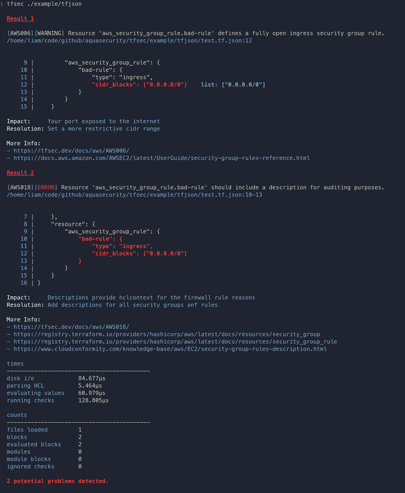

# Aqua Security 收购 tfsec 推进 DevSecOps

> 原文：<https://devops.com/aqua-security-acquires-tfsec-to-advance-devsecops/>

Aqua Security 今天宣布[收购了 tfsec](https://www.prnewswire.com/news-releases/aqua-security-acquires-tfsec-301328713.html) ，这是一个开源项目，为基础设施即代码(IaC)提供静态分析扫描器，旨在集成到 DevOps 工作流中。

Aqua Security 首席技术官 Amer Jerbi 表示，tfsec 扩展了该公司已经提供的安全平台，推动了对最佳实践的采用。此外，为了防止开发人员使用 Terraform 等工具错误配置云基础架构，scanner 提供了一些代码示例，帮助开发人员了解如何正确配置基础架构。

Jerbi 指出，tfsec 已经与 Aqua Trivy 集成，后者是一种扫描容器图像以发现漏洞的开源工具。Jerbi 补充说，随后将与 Aqua Security 产品组合的其余部分进行集成。

Tfsec 联合创始人 Liam Galvin 和 Owen Rumney 将作为云工程师加入 Aqua Security。Jerbi 说，Aqua Security 试图解决的挑战是，需要使组织能够主动预防生产环境中出现的网络安全问题，而不仅仅是识别需要修复的漏洞。

收购 tfsec 的决定是在一系列高调违规事件发生后做出的，当时许多组织都在努力确保软件供应链的安全。云平台充斥着错误配置，主要是因为开发人员通常缺乏必要的专业知识来确保基础设施在配置后是安全的。组织正在采用 DevSecOps 最佳实践，希望教育开发人员对应用程序安全性承担更多的责任。然而，开发人员不会在一夜之间获得这种专业知识。tfsec 扫描程序提供了一种方法来实施当今的安全策略，同时还提供了时间来教导开发人员如何避免错误配置。

目前还不清楚有多少网络安全事件是由云错误配置问题引起的。云服务提供商采用了一种共享责任模式，让采用云的组织对部署在这些云上的应用程序以及如何调配基础架构负责。许多在 DevOps 工作流环境中自行调配云基础设施的开发人员通常认为云服务提供商在防止错误配置方面做得更多。与此同时，网络罪犯已经非常擅长扫描这些错误配置。

当然，对于 DevSecOps 来说，有很多层次和细微差别。Jerbi 说，可以说，对大多数组织来说，最重要的事情就是简单地开始。Jerbi 补充说，能够快速轻松地集成到现有 DevOps 工作流中且中断最小的工具至关重要。

与此同时，DevOps 团队应该期待网络安全团队更多地参与到他们的工作流中，特别是在政府旨在保护软件供应链的命令变得更加严格的情况下。最终，随着组织对其 DevOps 团队保护其应用程序环境的能力越来越有信心，这些网络安全团队将重新专注于寻找威胁。与此同时，DevOps 团队应该让这些网络安全专业人员感到尽可能地受欢迎，因为他们中的大多数人都被赋予了应用程序安全的使命。