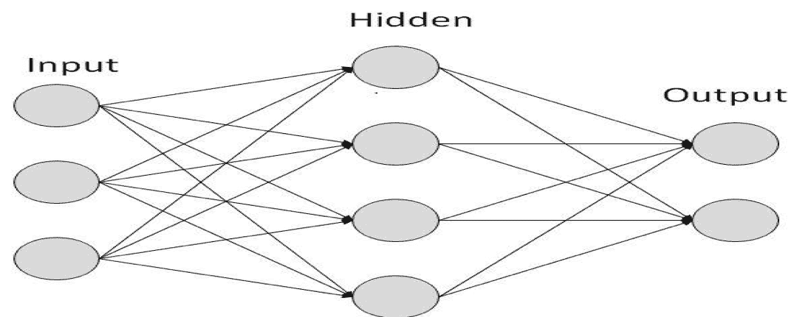
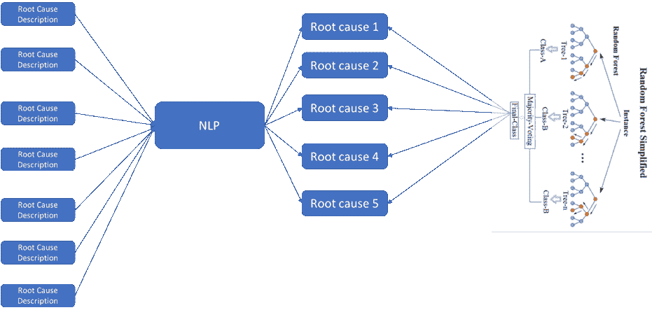

# 人工智能:拯救 ITOps

> 原文：<https://devops.com/artificial-intelligence-coming-to-the-rescue-of-itops/>

根据麦肯锡 2018 年的全球研究所报告，人工智能(AI)有潜力在不同的行业领域创造 35 亿至 58 亿美元的年价值。今天，仅在金融和 IT 领域就有大约 1000 亿美元；因此，它正在成为 it 世界的游戏规则改变者。

随着云应用的开始，IT 开发人员的世界发生了巨大的变化。ITOps 的重点正在转变为一种能够最大限度提高业务服务可用性的[集成的、以服务为中心的方法](http://www.relevancelab.com/RLCatalyst/catalyst_commandcenter.html)。AI 可以帮助 ITOps 早期检测停机，预测潜在的根本原因，找到易受停机影响的系统和节点，平均解决时间等。这篇文章重点介绍了几个用例，在这些用例中，[人工智能可以与 ITOps](https://www.youtube.com/watch?v=9wdFbLezg0A)集成，从而简化日常操作，并使[修复](https://www.youtube.com/watch?v=zvCSu7E2GzM&t=1s)更加强大。

## **停机预测分析**

误报会导致 ITOps 团队的威胁警报疲劳。一项调查表明，大约 52%的安全警报通常是误报。这给团队带来了很大的压力，因为他们必须手动检查每个警报。在这种情况下，深度神经网络可以预测警报是否会导致停机。

**报警层是/否**

如上所述，具有两个隐藏层的前馈反向传播在预测停机方面应该产生良好的结果。规定时间内的所有警报类型都可以作为输入，而中断将作为输出。应该使用历史数据来训练模型。每个企业都有自己的断层线和弱点，只有通过历史数据，潜在的特征才会浮出水面；因此，每个企业都应该建立自己的定制模型，因为“一刀切”的模型更有可能无法实现预期的结果。

另一种方法是逻辑回归，其中所有“警报类型”都是输入变量，“二进制中断”将是输出。

逻辑回归通过使用累积的[逻辑分布](https://en.wikipedia.org/wiki/Logistic_distribution)的[逻辑函数](https://en.wikipedia.org/wiki/Logistic_function)估计概率来测量分类因变量和一个或多个自变量之间的关系。因此，它使用类似的技术处理与[概率单位回归](https://en.wikipedia.org/wiki/Probit_regression)相同的问题，后者使用累积正态分布曲线代替。

## **根本原因分类和预测**

这是一个两步过程。第一步，基于关键字搜索进行根本原因分类。从自由流动的根本原因分析字段中，自然语言处理(NLP)用于提取关键值并分类到预定义的根本原因中。这可以是有人监督的，也可以是无人监督的。

在第二步中，多类神经网络的随机森林可用于预测根本原因，而其他属性充当输入。根据数据量和数据类型，可以选择正确的分类模型。一般来说，随机森林具有更好的准确性，但它需要结构化的数据和正确的标记，并且对数据质量的容错性较差。虽然多类神经网络需要大量的数据来训练，但它的容错能力更强，但准确性稍差。

## **平均出票时间预测**

可以使用一个简单的加权平均公式来预测解决票证问题所需的时间:

平均时间(t) = (a1。T1 + a2。T2+ a3。T3)/(T1+T2+T3 的计数)

其中 T1 是票据类型。

其他属性可用于将票据划分到正确的群组中，以使其更可预测。这有助于更好地规划和利用资源。特征加权可以启发式地或凭经验地进行。

## **系统上的异常负载**

简单的异常检测算法可以告知系统是正在经历正常负载还是具有高变化。时间序列上与平均值的较高差异/偏离可以通知没有释放的异常活动或资源。然而，算法应该考虑季节性，因为系统负载是时间和季节的函数。

****

鉴于上述场景，很明显，人工智能有巨大的机会为 it 运营服务。它可用于多种 ITOps，包括预测、事件关联、检测系统上的异常负载(例如网络攻击)以及基于根本原因分析的补救。

— [维维克·辛格](https://devops.com/author/vivek-singh/)