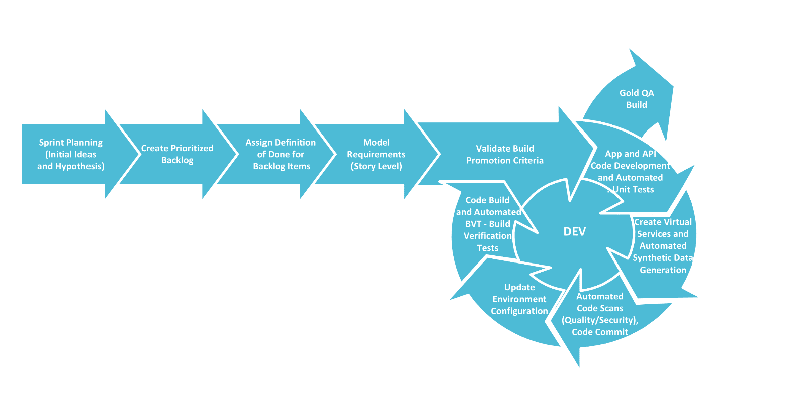
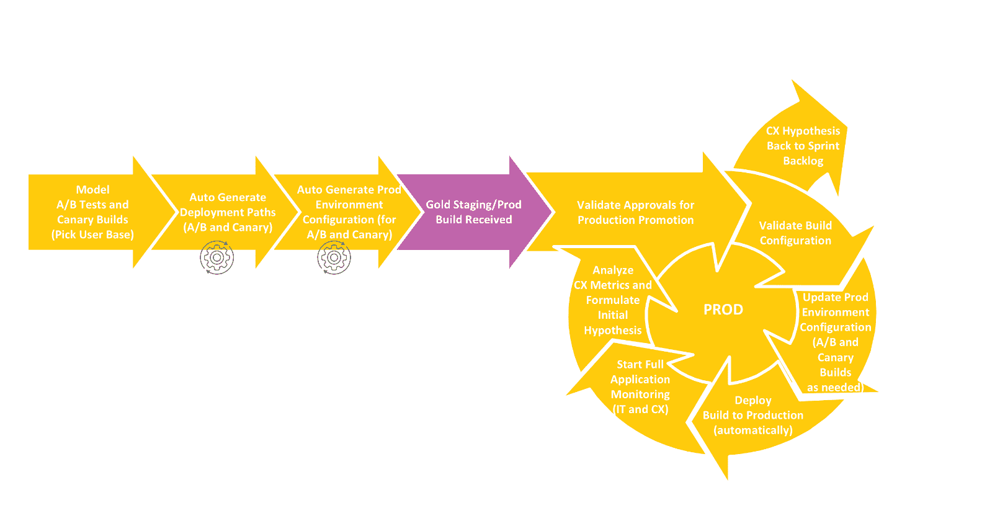
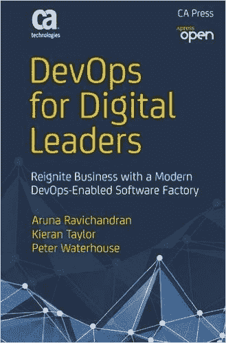

# 组装持续交付的关键组件

> 原文：<https://devops.com/assembling-components-continuous-delivery/>

随着敏捷方法在上个十年开始普及，工程团队获得了在更短的周期内开始生产软件的机会，同时以更频繁的间隔可靠地发布软件。

这个概念在 2009 年获得了更大的关注，当时 Tim Fitz 发表了他对持续部署的想法。Jez Humble 在 2010 年撰写了他的开创性著作《持续交付:通过构建、测试和部署自动化实现可靠的软件发布》，这种方法开始得到广泛的关注。在书中，Humble 提出了持续交付的三个构建模块:配置管理、[持续集成](https://continuousdelivery.com/foundations/continuous-integration)和[持续测试](https://continuousdelivery.com/foundations/test-automation)。

此后，出现了[敏捷运营](https://www.youtube.com/watch?v=ePBjcHUIoOE)——使用端到端监控，通过分析来提高运营敏捷性的实践。这补充了连续交付，目标是在最小化开销的同时提高软件交付的质量和速度。

从那时起，特别是在过去六年中，随着 DevOps 的采用呈爆炸式增长，围绕在软件开发生命周期(SDLC)中拥抱“[持续一切](https://devops.com/devops-chat-jeff-schaeffer-ca-technologies-everything-continuous/)”以持续交付功能和优化最终用户体验的机会，出现了大量的讨论(和困惑)。

今天，在与数百个使用敏捷和 DevOps 的组织交谈后，有可能扩展这些概念来更好地定义持续交付的关键组件。

在这篇博客中，我将详细介绍“CD”的规则，CA 的客户认为它对于通过频繁发布具有广泛可见性和可追溯性的小批量代码来减少软件交付的时间、风险和费用是至关重要的。

持续交付的这些组成部分是:

*   持续发展和整合，
*   持续测试。和
*   持续释放。

## 持续发展和整合

说到更快地交付高质量的应用，每一秒都很重要。

这就是为什么自动化规划、开发、单元测试和代码与不同的相互依赖的组件的集成非常重要，同时为了质量保证对其进行打包。我们将这些活动归类到持续开发和集成中，如图 1 所示。

这一切都从 sprint 计划和在[敏捷管理](http://www.ca.com/us/rewrite/articles/devops/did-agile-land-a-man-on-the-moon.html)软件中的需求建模开始。单元测试可以基于需求和用例故事自动创建。然后，这些单元测试可以使用自动生成的合成数据，基于预定义的标准自动执行。

***图 1:** 持续发展整合*

接下来，虚拟服务接口可以通过模拟 SDLC 中不可用的系统来自动生成，允许开发人员、测试人员、集成和性能监控团队并行工作，从而加快交付速度，提高质量和可靠性。

集成的代码可以根据验证标准自动构建和测试，一旦通过，就可以进行连续的测试。在代码开发之后，QA 之前的这个后期阶段，通常也被称为[持续集成](http://webinars.devops.com/apm-continuous-integration)。

## 连续测试

跨应用交付的持续测试不仅使企业能够[向左](http://www.ca.com/us/collateral/case-studies/manheim-accelerates-systems-testing-and-business-transformation-with-ca-test-data-manager.html)转移测试，在 SDLC 中更早地进行测试，而且还帮助他们向右转移，在整个阶段和生产中利用相同的流程。

在单元测试通过并且集成的构建可用于 QA 之后，可以完成功能和性能测试——在构建可用于试运行和生产之前。连续测试期间的各种活动如图 2 所示。

在执行功能和性能测试之前，还需要验证构建提升标准和配置。测试人员需要提供 QA 环境来部署构建，以及虚拟服务和测试数据。使用测试数据管理来创建生产数据的子集并屏蔽敏感信息是另一个持续的测试需求。

***图 2** :连续测试*

同样重要的是，在运行自动化测试之前，在 QA 环境中进行应用程序性能监控，向开发人员提供关于任何问题的反馈。

在执行了[自动化测试](https://www.blazemeter.com/blog/how-run-jmeter-test-jenkins-20-pipelines-and-github)并且满足了升级标准之后，构建就可以在试运行或生产环境中部署了。

## 持续释放

持续发布通过受控和可扩展的部署使发布速度与开发速度相匹配。

持续发布(有时也称为持续部署)的目标是持续地、自动地将构建部署到生产中；类似的活动也可以在分段环境中执行。

如图 3 所示，构建配置需要被验证，生产环境配置在被发送到生产环境之前被更新。与应用程序代码一样，配置也在版本控制系统中维护，并且可以自动进行部署。

***图 3** :持续释放*

在将构建部署到生产中之后，应该启动应用程序监控来跟踪性能和客户体验。来自生产环境的反馈可以反馈给开发人员，以指导改进或冲刺积压。

这个博客旨在概述核心 CD 活动，在后续文章中，我将提供关于进入和退出标准的更多细节，以及在跟踪持续开发和集成、持续测试和持续发布中有用的度量标准。

与此同时，请阅读我的同事 Aruna Ravichandran、Kieran Taylor 和 Pete Waterhouse 撰写的新书《面向数字领导者的 DevOps:用支持 DevOps 的现代软件工厂重燃业务》。

根据从众多已经接受 CD 和 DevOps 的客户那里获得的经验，it [重点介绍了开始这一旅程的关键实践](http://webinars.devops.com/devops-digital-leaders)、相关的 ROI 指标和其他有用的技巧。

-[安娜·阿基拉](https://devops.com/author/ananda-akela/)