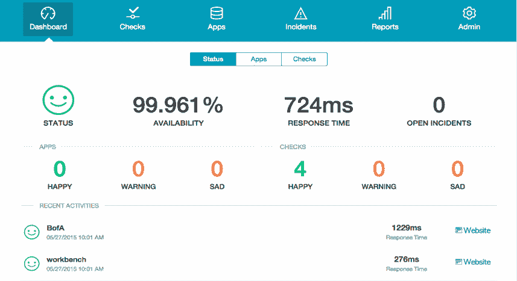

# IT 资产管理:如何发现您的数据库是否导致了性能问题

> 原文：<https://devops.com/asset-management-find-database-causing-performance-problems/>

随着您的 IT 基础架构的增长，能够识别哪里出现了瓶颈、性能问题或停机变得越来越重要，以便您可以快速采取行动解决任何问题。一旦您已经习惯了拥有多个应用程序、服务器和数据库，确定问题的来源可能会有点棘手，但有一些工具可以显著减轻您在定位问题发生位置时的负担。

**问题:识别来源**

 
当服务无法正常运行时，最终用户体验会受到影响。来源:[http://logical read . solarwinds . com/response-time-analysis/# . vwnncfm 4 tiu](http://logicalread.solarwinds.com/response-time-analysis/#.VWNncfm4TIU)

通常，IT 基础设施都是从小规模开始的。也许你从一个应用程序开始，它运行在一个服务器上，只有一个小数据库。此时，通常很容易确定该服务器是否停机，因为一切都将停止工作。如果只是数据库本身，应用程序很可能会返回连接到数据库的错误。

在这个层次上，你可能不会觉得有任何建立一个更强大的监控形式的迫切需要。毕竟，可能出错的事情就那么多。然而，随着服务的增长，以高效的方式管理这些服务变得越来越重要。

一旦您开始拥有多个应用程序、服务器或数据库，您会发现跟踪问题变得更加耗时和困难，因为可能并不总是清楚系统的哪个部分出现了故障。例如，如果有两个应用程序使用同一个数据库服务器，但都没有响应，您需要确定是两个应用程序服务器都关闭了，还是单个数据库服务器关闭了。这可能需要检查几个不同的地方，以确保您确定正确的原因。

**解决方案:使用监控服务来管理您的服务**

如果您有任何问题，监控服务可以快速向您显示。来源: [http://www.happyapps.io](http://www.happyapps.io)

在诊断和修复服务的任何停机时间时，解决时间非常重要。通过监控各种服务，您可以节省大量时间。监控服务不仅可以在出现问题时向您发送警报，还可以指定哪个服务出现了问题或出现了故障。

例如，如果您的数据库服务器由于某种原因崩溃了，您会立即收到警报，并确切地知道去哪里修复问题。如果您有多台数据库服务器，这甚至更有价值，因为您不用查看每台服务器就能知道是哪一台，直到您找到出错的那一台。

有了像 [Happy Apps](http://www.happyapps.io) 这样的监控服务，你还可以定制提醒，以最有效地满足你的需求。您可以选择通过电子邮件、短信或向您的移动设备推送通知来接收通知。如果需要，您还可以限制您的警报，以便您只在出现严重问题时才接收消息，而不是出现暂时比正常情况慢的情况。每当检查失败时，事件将自动打开，一旦事件中的所有检查都通过，事件将自动关闭。您可以随时深入查看特定事件并查看详细信息(即问题、历史记录和成员)，Happy Apps 会跟踪您的事件，以便在事件再次发生时了解您是如何解决之前的问题的。

那么，为什么不用快乐的应用程序来设置你的服务呢？配置过程通常是一项耗时的挑战，但 Happy Apps 让这一过程变得异常简单:只需几次点击和不到 60 秒的时间，Happy Apps 就会检查您的服务。此外，在 DevOps 风格中，也有一个 API 来添加检查。您在识别问题发生的地方所节省的时间将会让您和您的最终用户感到高兴！