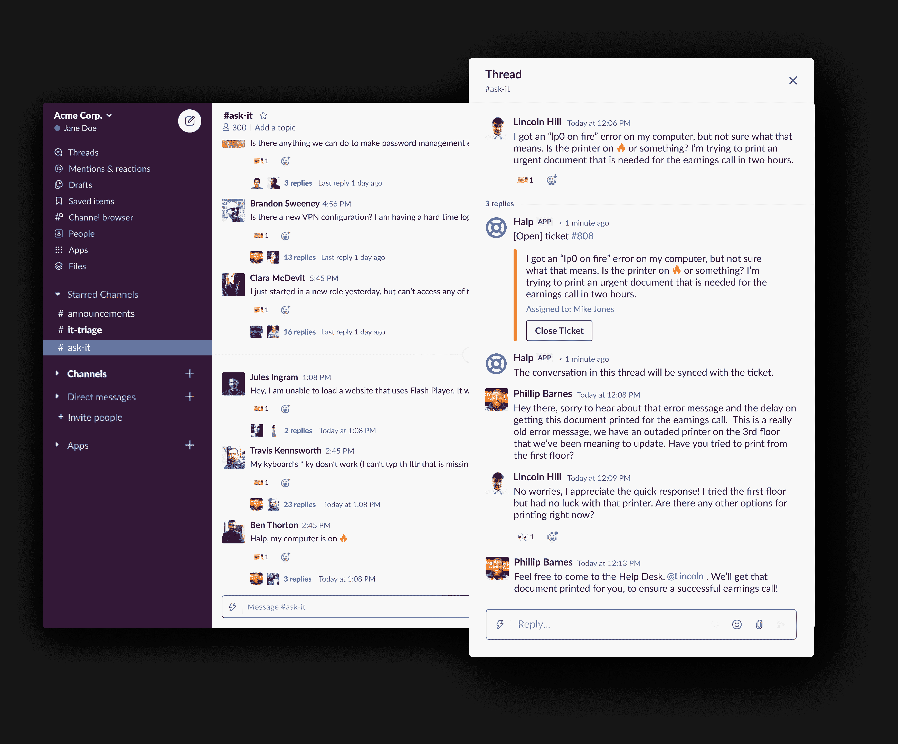

# Atlassian 收购 Halp 以获得基于 Slack 的帮助台

> 原文：<https://devops.com/atlassian-acquires-halp-to-gain-help-desk-based-on-slack/>

Atlassian 本周宣布已经收购了 Halp T1，这是一家使用 Slack 作为用户界面的服务台平台提供商。

Atlassian 的产品集成负责人史蒂夫·戈德史密斯说，Halp 将为组织提供一种通过许多组织已经普遍使用的界面来管理轻量级流程的方法。他说，目标是在 Halp 和 Atlassian 的 JIRA 服务台平台之间提供一定程度的集成，以处理更复杂的请求。

Halp 平台已经与 Confluence 集成，Confluence 是 Atlassian 的一个知识库平台，帮助服务台工作人员共享解决已知问题的最佳实践。戈德史密斯补充说，与 JIRA 更深层次的整合和融合即将到来。

与此同时，Atlassian 正在努力加强其服务台平台和微软团队之间的整合，这已经成为 Slack 的一个受欢迎的替代方案，他指出。

Halp 首席执行官 Fletcher Richman 表示，这种方法已经获得了关注，因为当涉及到帮助台时，最大的挑战是让员工尽可能容易地生成帮助单。Halp 解决了这一问题，让最终用户只需拖放表情符号即可生成帮助台票证。

然后，服务台工作人员将获得一个 web 界面，通过该界面，他们可以远程管理票证，并通过 Slack 响应请求。他说，这种方法消除了服务台工作人员物理上位于办公室或使用虚拟专用网络(VPN)来访问在局域网上运行的服务台平台的需要。

Richman 指出，员工们经常因为生成一张罚单的过程过于复杂而相互支持。当许多员工在家工作以帮助对抗新冠肺炎疫情病毒时，员工们目前提供这种相互支持是不太可能的。

他补充说，目前还不清楚有多少员工会回到办公室，因此 Halp 也为远程员工提供了一种更容易保持工作效率的方式。

当然，Slack 和 JIRA 已经是许多 DevOps 团队中事实上的标准。Halp 应该为开发人员提供一种方法，通过 Slack 生成一个帮助台票证，以接近实时的方式即时解决各种低级问题。

Richman 指出，任何 IT 服务管理(ITSM)平台要取得成功，都需要满足用户的需求。如果平台过于复杂或令人生畏，用户会首先向同事寻求帮助。然而，没过多久，所有的相互支持就削弱了生产力。他说，通过使帮助只是一个简单的松弛消息，更多的问题将由已经知道正确答案的帮助台人员来解决。

现在说会因为闲置产生多少服务台票证还为时过早。然而，随着对整个企业进行远程支持的热潮，现在比以往任何时候都更需要一种更简单的方式来提供支持。