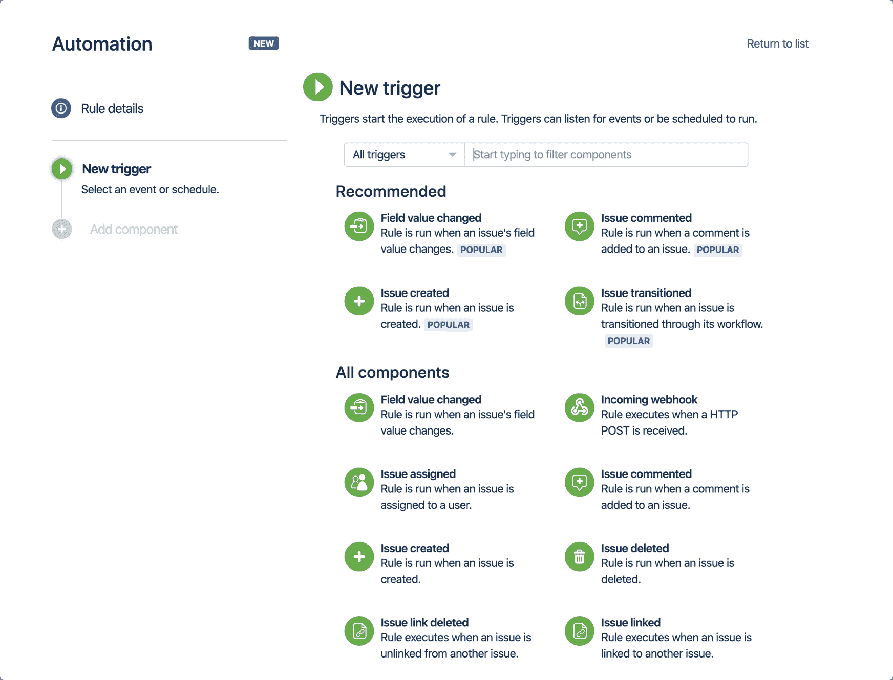

# Atlassian 向吉拉云添加无代码自动化工具

> 原文：<https://devops.com/atlassian-adds-no-code-automation-tool-to-jira-cloud/>

Atlassian 今天宣布，它已经添加了一个无代码工具，使 DevOps 团队能够更容易地定制吉拉项目管理软件，而不必学习如何编码。

Atlassian 软件团队增长负责人 Sean Regan 表示，吉拉的自动化现在将成为吉拉云的核心部分，将提供给所有 65，000 名使用吉拉软件的客户。该工具最初由 Code Barrell 开发，去年被 Atlassian 收购。他说，以前，它是作为附加软件提供的，被大约 6500 个客户采用。

目标是使跟踪项目的管理员能够减少手动输入数据所花费的时间。Regan 指出，平均而言，组织每月花费 51 个小时在涉及项目管理的行政任务上。他说，组织应该清点这些任务，并使用吉拉自动化来开始自动化最重复的任务。

里根说，吉拉的自动化是一个更大的雄心勃勃的努力的一部分，使超过 1 亿活跃的最终用户可以使用吉拉软件。通过使用可视化工具来自动化任务，更多的组织应该可以更容易地通过定义触发事件的规则来定制流程。他指出，组织不会被迫依赖开发人员编写代码来创建这些工作流。

吉拉的自动化也是使古老的吉拉项目管理应用程序现代化的协同努力的一部分，该应用程序已经被软件开发团队广泛使用了几十年。Regan 说，最终目标是使软件开发团队能够花更多的时间来构建应用程序，而不是试图确定任何给定开发项目的状态。

吉拉工具的无代码自动化还被设计成在一组最佳开发运维实践的上下文中集成协作工具 Slack 和微软团队。事实上，Regan 注意到，任何时候软件开发项目出现问题，几乎总是归结为所有相关利益方之间缺乏协作。

当然，在通常试图同时组织多个项目的开发运维团队中，对项目管理软件有更多的欣赏。一个项目的延迟可能会带来重新分配资源以加速另一个项目的机会。然而，如果没有人首先意识到存在哪些瓶颈，这就不可能发生。

不是每个人都理解项目管理的所有细微差别。项目管理越不引人注目，就越有效率。开发人员因不总是更新项目管理应用程序而臭名昭著，这通常导致项目经理不得不唠叨他们，以共享其他团队在他们前进之前所依赖的信息。希望有一天所有的项目管理应用程序都能自动更新。与此同时，花费在手工任务上的时间越少，软件开发团队的所有成员就可能越快乐。

— [迈克·维扎德](https://devops.com/author/mike-vizard/)