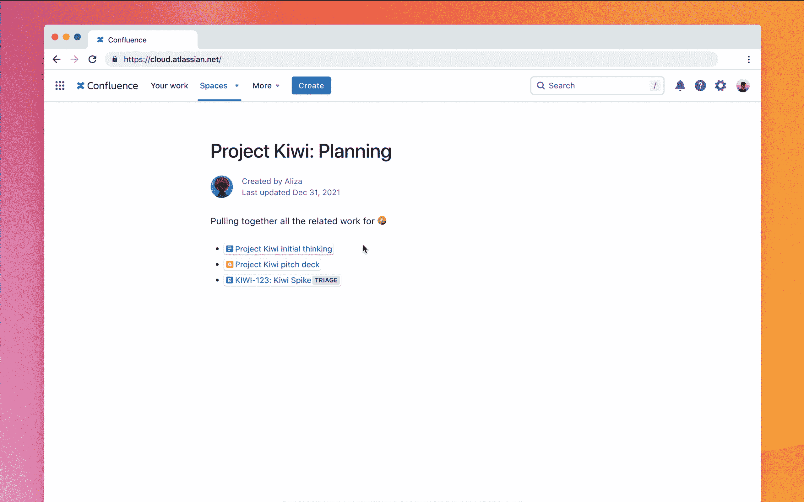

# Atlassian 旨在改善与 DevOps 团队的合作

> 原文：<https://devops.com/atlassian-aims-to-improve-collaboration-with-devops-teams/>

在今天举行的 Atlassian Presents: WorkLife 活动中，Atlassian 进一步努力整合工具技术和商业专业人士用于管理流程的工具。

Atlassian 的总经理兼面向所有人的工作管理产品副总裁 Erika Trautman 表示，随着组织越来越依赖数字流程来吸引客户、合作伙伴和员工，促进不同知识工作者之间协作的需求变得越来越迫切。

作为这项工作的一部分，Atlassian 现在正在 Atlassian 平台内普遍提供智能链接功能。智能链接可用于集成 Trello 和吉拉等 Atlassian 应用程序以及第三方应用程序。Trautman 指出，这种能力现在至关重要，因为软件即服务(SaaS)应用程序的采用出现了寒武纪大爆发，所有这些应用程序都需要集成到一组通用的工作流中。否则，每个 SaaS 应用程序环境都会变成另一个围墙花园，阻止任何有意义的合作，她补充道。

此外，该公司宣布，Atlas，一个跟踪项目并简化使用不同应用程序的团队之间通信的目录，将于下个月全面推出。例如，DevOps 团队将能够通过 Atlas 平台将吉拉事件与被跟踪的项目同步。

Atlassian 还简化了其提供的工具，以减少管理其应用程序和新用户所需的步骤。

最后，该公司还推出了 Atlassian Together，这是一个单一的订阅服务，通过它，组织可以许可其通过云交付的 Trello、Confluence、Atlas 和吉拉工作管理应用程序。例如，一个拥有 5，000 多名用户的企业组织现在可以以每名用户 11 美元的价格获得这些应用程序的许可。

Trautman 指出，Atlassian 正在共同努力，使各组织在比以往任何时候都更加依赖软件的时候更容易合作。她指出，在许多情况下，由于采用了 [DevOps 最佳实践](https://devops.com/?s=DevOps+best+practices)，企业现在正试图适应软件交付的快速速度。

因此，开发团队管理项目所使用的工具(如吉拉)与各个部门的知识工作者所使用的各种工具之间的集成需求越来越大。她补充说，实际上，Atlassian 正试图让组织减少因工作流跨越多个孤岛而产生的“协作税”。

事实上，在许多情况下，组织正在努力跟上敏捷软件开发团队的步伐。具有讽刺意味的是，就在不久前，企业高管们还在抱怨 it 组织需要多长时间来适应业务环境的变化。现在，许多企业正在通过软件更新推出额外的数字功能，这些更新可以一个月进行多次。

组织跨部门协作的速度自然会有所不同，但是每个部门各自为政的日子即将结束。一旦合作变得更加容易，挑战和机遇现在可能会决定现代组织应该如何构建。