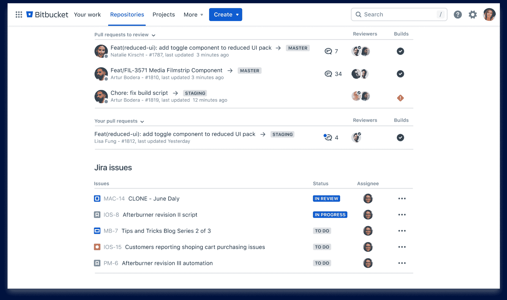

# Atlassian Bitbucket CI/CD 云服务面向企业

> 原文：<https://devops.com/atlassian-bitbucket-ci-cd-cloud-service-aims-for-the-enterprise/>

Atlassian today [概述了其战略](https://www.atlassian.com/blog/bitbucket/bitbucket-clouds-enterprise-roadmap-2022)，以增加 Bitbucket 持续集成/持续交付(CI/CD)云服务在企业 IT 组织中的吸引力。Atlassian 表示，从计划于第三季度进行的更新开始，它计划专注于四个核心支柱:性能、管理、可扩展性以及安全性和合规性。

Atlassian 的 Bitbucket Cloud 和 Compass 工程主管单涛表示，总体目标是随着组织提高构建和部署软件的速度，在亚马逊网络服务(AWS)云上大规模使用 Bitbucket 云服务变得更加简单。

他指出，Atlassian 仍然支持该平台的 Bitbucket Server 和数据中心版本，但显然更多的组织正在将软件开发转移到云上。Atlassian 现在不仅通过提供 Bitbucket Cloud Migration Assistant 工具来简化向云的迁移，还努力确保应用程序可以大规模开发。

他补充说，实现这一目标包括利用更先进的 diff 算法，该算法在更大的 DevOps 环境中速度快 4 倍。

其他计划中的增强包括通过位桶管道执行 CI/CD 工作流的能力、跨存储库重用多步管道的能力、与其他 Atlassian 应用程序更紧密的管理集成、加密静态数据的能力以及与 Snyk 工具的集成，用于发现软件中的[漏洞以提高安全性。](https://devops.com/?s=secure+code)

最后，Bitbucket 云服务也将很快支持 Bitbucket Mesh，这是一种分布式存储功能，已经在 Bitbucket 数据中心使用。

总的来说，Atlassian 将向云的迁移视为一种手段，不仅可以使更多组织更容易访问 DevOps 工作流，还可以为已经投资 DevOps 的组织提供简化这些流程的机会，Tao 说。

如今，许多 DevOps 团队维护着复杂的平台，这些平台带有他们需要维护和支持的定制集成。他补充说，Atlassian 为 DevOps 团队提供了选择，要么采用集成平台，要么使用它作为 Atlassian Open DevOps 框架的一部分创建的连接器，以使团队更容易使用他们喜欢的任何工具组合。Tao 说，无论是哪种情况，维护 DevOps 环境的总成本都可以显著降低。

尚不清楚已经投资开发运维的组织在多大程度上考虑替换其现有的 CI/CD 平台。然而，随着加快软件构建和部署速度的压力稳步增加，进一步自动化开发运维工作流的压力也在增加。与此同时，DevOps 团队现在被要求集成安全网关，这需要在传统平台内进行额外的定制集成，他们需要在现有集成的同时支持这些集成。

至少，比以往更多的组织正在权衡他们的开发运维选项。当然，问题是，鉴于当前对现有工作流的依赖，切换出 DevOps 平台的总成本并非无关紧要。