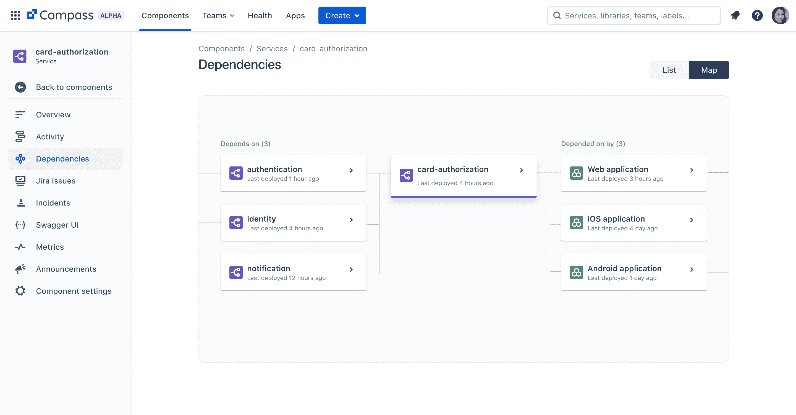

# Atlassian 扩展 DevOps 工具组合以改善协作

> 原文：<https://devops.com/atlassian-expands-devops-tools-portfolio-to-improve-collaboration/>

Atlassian 在其 DevOps 工具组合中添加了一个可扩展的目录，用于跟踪软件组件，称为 [Compass](https://www.atlassian.com/blog/announcements/introducing-compass) ，以及一个 [Atlassian 数据湖和 Atlassian Analytics](https://www.atlassian.com/blog/announcements/atlassian-analytics) 云服务，使聚合和查询从该公司工具组合中收集的数据变得更简单。

此外，Atlassian 正在使其 [Atlas](https://www.atlassian.com/blog/announcements/introducing-atlas-teamwork-directory) 协作框架——以前称为 Team Central——正式推出测试版。实际上，这个框架提供了一个覆盖，通过这个覆盖，不同 DevOps 团队采用的不同协作工具可以更容易地集成。

Compass 为 DevOps 团队提供了映射他们用来组装软件的所有组件以及拥有这些组件的团队的能力。开发运维团队可以访问共享的组件和文档以及记分卡，以允许他们根据可能需要满足的基线、安全性或合规性要求来衡量和评估他们的架构。它可以通过使用 Forge(现有的 Atlassian 云开发环境)的集成应用程序引擎扩展到其他应用程序。

Atlassian 敏捷和 DevOps 产品负责人 Tiffany To 表示，Compass 是为通常试图管理 50 个或更多微服务的 DevOps 团队设计的。它被设计为与吉拉项目管理软件一起部署，后者被软件开发团队广泛用于管理多个项目。

与此同时，Atlassian Analytics 基于该公司去年通过收购 Chartio 获得的一个可视化和分析平台。最初，Atlassian 数据湖将包括来自吉拉软件和吉拉服务管理工具的数据，并支持计划中的其他 Atlassian 平台。

总的来说，这些工具是正在进行的 Atlassian 努力的一部分，以使集成多个 DevOps 团队变得更简单。这些团队中的许多人更喜欢对他们选择的工具保持自主权。她说，这带来的挑战是，组织需要某种类型的覆盖，通过这种覆盖，他们可以合作并分享最佳实践。

Atlassian 对 2000 名开发人员进行的一项调查发现，一半的受访者对他们使用的工具有很强的自主权，随着开发人员变得更有经验，他们对工具选择的控制权也越来越大。同一调查还发现，65%的开发人员认为他们应该对软件产品的生命周期承担比现在更多的责任。

很明显，大多数构建软件的组织都试图在开发人员自治和集中控制之间取得平衡。雇佣和留住开发人员的成本很高，所以开发他们喜欢的工具是一种自然的趋势。但是，这可能会导致一定程度的工具泛滥，从而难以确定组织内应用程序开发和部署的整体状态。

无论采用哪种方法，都需要尽可能地消除 DevOps 工作流中的摩擦，这一点是显而易见的，尤其是在同时进行的应用程序开发项目的数量持续增长的情况下。当然，挑战和机遇是在让开发人员满意的同时实现这个目标。