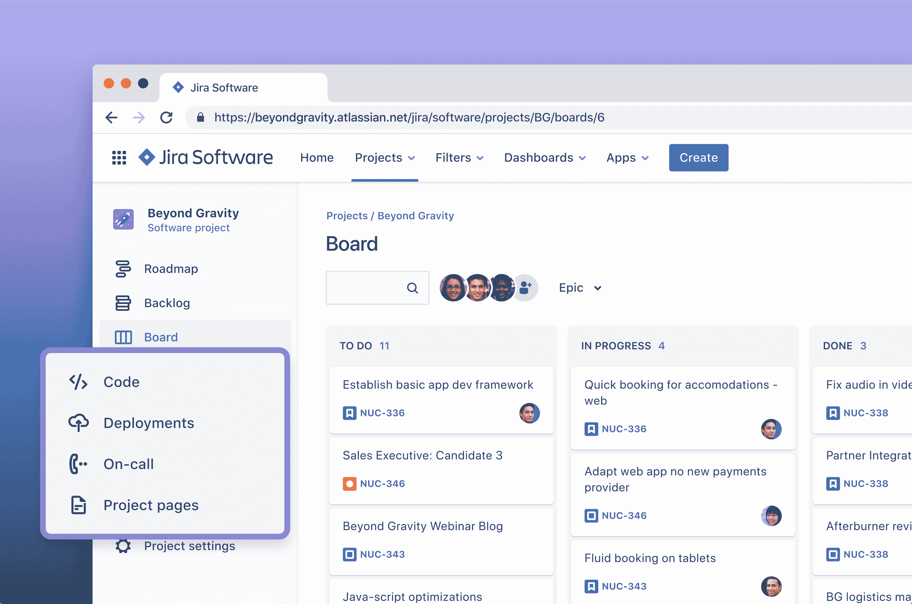

# Atlassian 扩展了 Open DevOps 的野心

> 原文：<https://devops.com/atlassian-extends-open-devops-ambitions/>

在本周举行的在线 [Atlassian Team 2021](https://events.atlassian.com/team21) 活动上，Atlassian 发起了一项双管齐下的努力，为组织提供更多关于使用多家供应商的工具构建的软件开发工作流的见解。

Atlassian 的产品负责人 Suzie Prince 表示, [Open DevOps](https://www.atlassian.com/blog/devops/open-devops) 计划将加强 Atlassian 提供的吉拉项目跟踪和管理工具与 DevOps 团队常用的各种工具之间的集成。我们的目标不仅是更容易将吉拉列出的问题与各种软件平台中发现的工件关联起来，而且还能从 DevOps 工具中收集数据以自动更新吉拉。

根据 Atlassian 在吉拉提供的图表，这些数据将用于关键绩效指标(KPI ),以跟踪价值流。不需要获得一个单独的价值流管理(VSM)平台来跟踪软件开发进度，例如，理解一个项目延迟的影响所需的洞察力成为使用吉拉的红利。

与此同时，Atlassian 正在使组织中的其他利益相关者更容易跟踪软件开发项目。一个[吉拉工作管理](https://www.atlassian.com/blog/announcements/introducing-jira-work-management)应用程序是专门为需要高级工具来跟踪项目的商业用户设计的。与此同时，Atlassian 本周透露，它已经收购了 ThinkTilt，这是一家为吉拉优化的[低代码](https://devops.com/category/blogs/low-code-no-code/)应用程序开发工具提供商。

Atlassian 本周首次披露，半数吉拉用户不是软件开发人员。随着组织越来越意识到他们现在对软件的依赖程度，以推动数字化业务转型计划，Atlassian 增加了一套项目跟踪应用程序，专为需要以更直观的方式使用吉拉数据的用户设计。

Prince 表示，Atlassian 致力于简化只需点击一下鼠标即可将一个 DevOps 工具集成替换为另一个的过程。Prince 补充说，开发人员无需要求组织在单个 DevOps 平台上实现标准化，而是能够继续淘汰和替换他们认为合适的工具和平台，而不会影响应用程序开发工作流的可见性。

此外，Atlassian 提供的集成将减少配置构成 DevOps 工作流的所有工具所需的时间和精力，从目前的大约 60 个步骤减少到大约 6 个步骤。

随着开发运维工作流变得越来越普遍，组织的运营方式正在发生根本性的变化。正式的产品发布正在让位于源源不断的软件更新，这些软件更新几乎不声不响地为任何平台添加新功能。随着新功能的不断增加，从销售团队到定制支持人员的最终用户现在需要更密切地跟踪平台的更新。

当然，不是每个组织都有相同的成熟度。然而，随着竞争对手开始向竞争对手的产品添加新功能，大多数业务流程——越来越多地围绕软件更新——开始发展和变化只是时间问题。随着软件开发的步伐不断加快，遗留业务流程的压力只会继续。