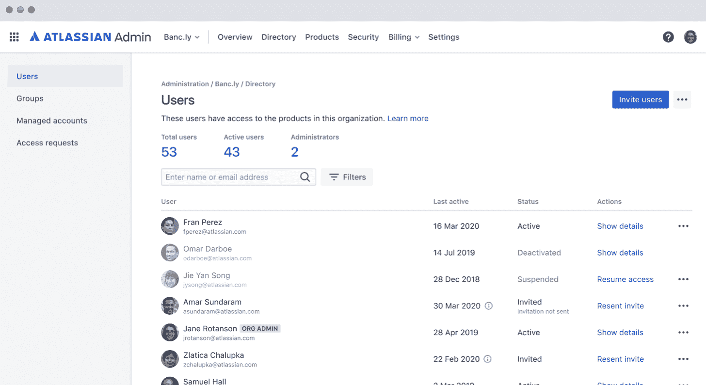

# Atlassian 向云的转变正在进行中

> 原文：<https://devops.com/atlassians-shift-to-the-cloud-gets-underway/>

[Atlassian](https://devops.com/?s=Atlassian) 今天宣布[云企业](https://www.atlassian.com/blog/platform/cloud-enterprise-launch)正式推出，这是一项基于云的服务，组织可以通过它在单一订阅下混合搭配公司的各种产品。

几个月来，该公司一直表示有意转向云服务；现在，最初的云企业订阅将涵盖该公司的吉拉软件、Confluence 和吉拉服务管理产品。

Atlassian 企业云产品负责人 Bala Venkatrao 表示，目标是让组织使用该公司的软件比仅仅获得在内部 it 环境中部署软件的许可证更具成本效益。

该公司还提供控制功能，通过集中的管理中心实现用户治理和变更管理。管理员可以通过 hub 将用户分配到实例，配置安全策略并监控使用趋势。还有与第三方身份即服务提供商的内置集成，使管理员能够自动进行配置和取消配置。

管理员还可以设置和自定义多个应用程序实例；他们可以将数据固定在不同的区域，以便使用特定的市场应用程序或配置来定制这些实例，从而实现合规性。

最后，市场将允许 IT 组织扩展他们从 Atlassian 及其合作伙伴那里使用的应用程序的数量。面向吉拉和 Confluence Cloud 的智能链接和应用切换器功能支持跨 Atlassian 应用程序的不同实例进行轻松协作。

Atlassian 目前拥有超过 194，000 名客户，因此将现有客户群过渡到这种模式可能需要一些时间。与此同时，Atlassian 正在推动尽可能多的新客户转向云平台，使 Atlassian 更容易让客户了解其软件的最新版本。Atlassian 计划在今年晚些时候支持每个应用程序实例多达 20，000 个用户。

Venkatrao 表示，虽然 Atlassian 产品组合经常被个人终端用户消费，但云企业产品旨在吸引首席信息官和其他高级管理人员，他们希望对现在通过云访问的应用服务进行集中计费。Venkatrao 说，这种方法将使大型组织更容易利用随着总体使用量的增加他们可能有资格享受的折扣。

虽然 Atlassian 在软件即服务(SaaS)应用游戏方面可能有点晚，但 Venkatrao 指出，云企业平台将使 Atlassian 更容易将人工智能应用于它将收集的元数据。Atlassian 已经利用人工智能改善了 Confluence 和吉拉的文档搜索，此外还采用了预测分析来提出将人员纳入项目的建议。

对于 Atlassian 来说，向云的过渡可能是一个缓慢的过程，但这种过渡显然正在进行中。