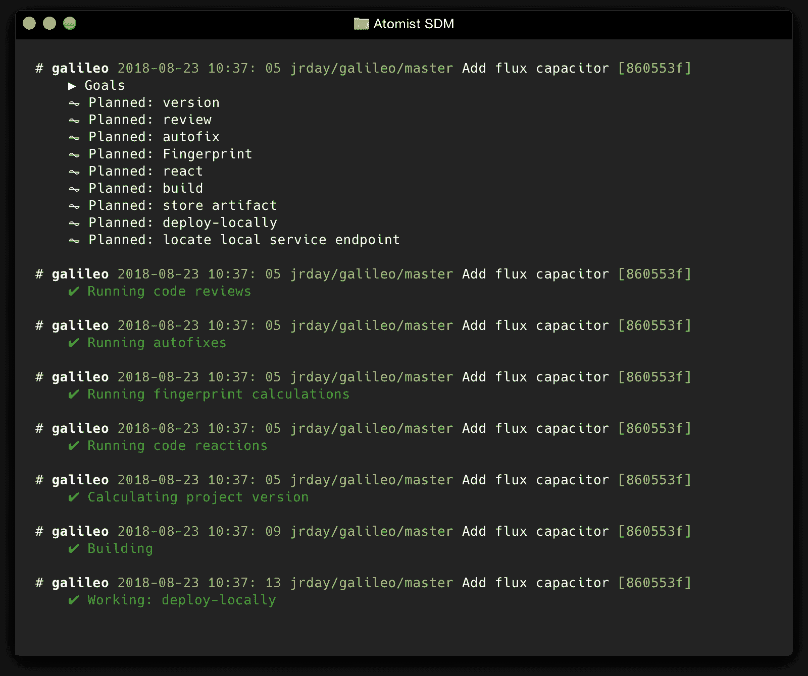

# Atomist 提高了开发人员的工作效率

> 原文：<https://devops.com/atomist-advances-developer-productivity/>

Atomist 正在将管理软件交付的自动化方法延伸到开发人员每天工作的本地机器上。

公司创始人兼首席执行官 Rod Johnson 表示，通过其软件交付机器(SDM)项目，Atomist 寻求消除开发人员当前在构建代码时必须导航的大部分复杂性，包括进行需要跨项目依赖关系更新的更改。

Johnson 说，这种能力使得保持多个开发项目的一致性和自动更新变得更加容易。

Atomist 正在应用 Johnson 用来创建广泛使用的 Spring 框架的许多概念，作为 Java 企业版(J2EE)的替代方案，Java 企业版目前正在戴尔技术公司(Dell Technologies)的 Pivotal Software 的赞助下开发。Atomist 创建了一个基于 API 服务器和 GraphQL(一种开源数据查询和操作语言)的软件交付领域模型。

Johnson 说，这种方法消除了在基于例如 YAML 文件的更麻烦的框架结构内工作的需要。相反，Atomist 正在利用代码来开发一个替代框架，该框架围绕一个更熟悉的 API 结构进行优化，这使得开发人员可以在任何最能反映他们想要如何工作的方向上扩展 SDM。

Atomist 目前向积极采用 DevOps 的大型企业提供基于 SDM 的服务。Johnson 说，该服务使组织能够在可由 IT 运营团队定义的策略的上下文中允许开发人员最大程度的灵活性。SDM 的本地实例旨在作为一个开源工具来提高个人开发者的生产力。

当公司意识到他们是多么依赖软件来区分自己的时候，大多数组织越来越被开发人员的生产力所困扰。新的和现有的应用程序的推出和更新速度已经大大提高。对于面临挑战的开发人员来说，他们中的许多人都采用了微服务，这使得使用 Docker 容器添加和替换新功能变得更加容易。然而，这些微服务创建了跨不同代码库的大量依赖项，必须进行跟踪。SDM 不仅可以用来提升容器映像和 Kubernetes 集群，还可以更新跨多个集群的所有相互依赖的微服务。

约翰逊说，要求开发人员跟踪并手动更新所有涉及多个项目的依赖关系并不是对他们时间的最佳利用。只有当组织提供工具，让开发人员更容易以不强加不灵活框架的方式做正确的事情时，才能实现真正的 DevOps 进展。

如今，组织用来构建代码的大多数过程都没有达到应有的自动化程度。事实上，如果 DevOps 不需要如此多的人工努力，它的采用可能会比现在更进一步。

— [迈克·维扎德](https://devops.com/author/mike-vizard/)