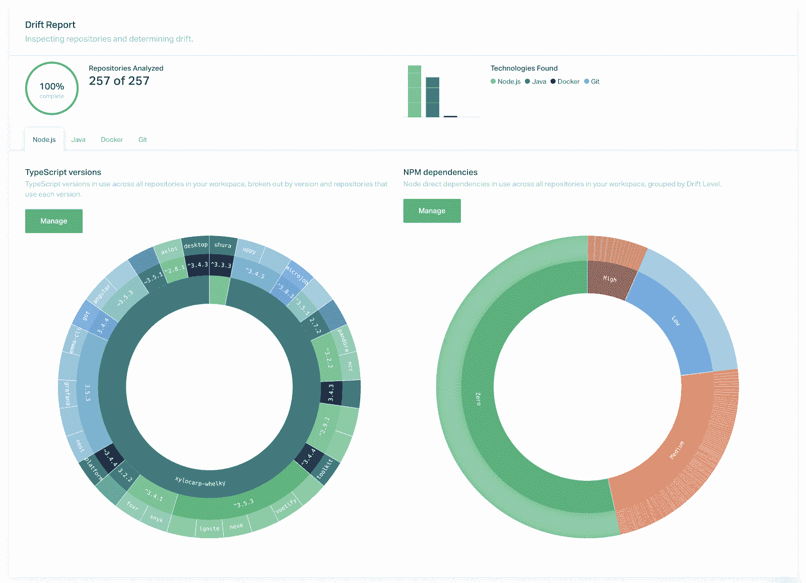

# Atomist 负责应用程序漂移管理

> 原文：<https://devops.com/atomist-takes-on-application-drift-management/>

Atomist 今天宣布，它正在扩展其软件交付自动化平台的功能，以包括漂移管理工具，使其更容易识别代码的变化。

现在处于测试阶段，该功能基于一个名为 Org Visualizer 的开源项目，通过单击鼠标就可以克隆 GitHub 存储库中的整个项目，然后对其进行可视化检查。

DevOps 团队还可以利用内置的策略管理器来捕获和跟踪代码中的更改，定义自动应用更新和自动化操作的自定义策略，并生成进度报告，显示他们距离实现目标策略目标有多远。

Atomist 首席执行官 Rod Johnson 表示，报告工具提供了一个组织代码库中正在发生的事情的可视化表示，使其更容易识别过于复杂的依赖关系和漏洞。

Johnson 说，漂移管理工具建立在软件交付机器(SDM)概念的基础上，这是公司核心平台的核心。Atomist 平台基于软件交付的域模型，该模型是围绕应用程序编程接口(API)服务器和 GraphQL(一种开源数据查询和操作语言)构建的。例如，这种方法消除了掌握复杂的 YAML 文件来交付软件的需要。他指出，添加可视化工具不仅可以更容易地看到开发环境中发生的事情，还可以更容易地识别应用程序开发项目中以错误和漏洞形式出现的技术债务。

Johnson 补充说，这些问题解决得越早，DevOps 团队就越有可能部署可靠、安全的代码，而不是需要更新它或回滚整个应用程序。

Johnson 说，虽然 Atomist 平台能够在任何应用环境中工作，但在已经接受基于容器的微服务的组织和寻求使用 Atomist 平台自动化软件交付的组织之间有很高的相关性。他指出，采用基于容器的微服务的组织通常需要频繁更新生产环境中的代码库，并补充说许多组织不知道微服务更新对生产环境其余部分的影响。

总的来说，在应用程序开发项目的环境中，当谈到自动化持续集成时，DevOps 已经取得了很多进展。然而，软件交付的自动化被证明是一个更加难以实现的目标。随着代码开发的速度和数量不断加快，软件交付自动化成为一个更紧迫的问题只是时间问题。当业务领导要求 IT 团队变得更加敏捷时，容易出错的手动部署流程只会加重应用程序开发和部署积压。

至少，在给定代码库的当前状态的情况下，使 DevOps 团队能够可视化未来挑战范围的工具应该有助于构建关于什么是真正可实现的现实对话。

— [迈克·维扎德](https://devops.com/author/mike-vizard/)