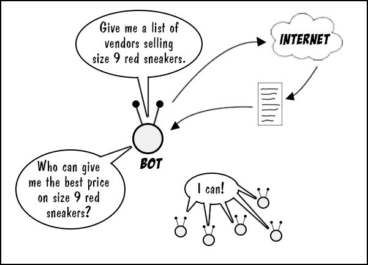

# 自动化:用修补程序解决机器人安全问题

> 原文：<https://devops.com/automation-addressing-bot-security-botchain/>

机器人技术如今风靡一时，而且有充分的理由。机器人帮助你购物并提供客户服务。事实上，有一个机器人一直在脸书上联系我，告诉我如何优化我的营销支出。它们无处不在，而且变得越来越聪明。任何一个机器人都可以访问互联网的全部智能，来回答你最神秘的问题，或者根据你的在线个人资料给你量身定制的有见地的建议。

尽管如此，bot 技术的全部潜力尚未实现。现在，大多数机器人之间的互动发生在机器人和人类之间。但是，如果机器人可以利用它们的识别、推荐和讨价还价的能力来与其他机器人互动，那会是什么样子呢？这样的时刻并不遥远。这种影响将是深远的，尤其是对那些在 DevOps 的人。

## 机器人对机器人通信的出现

机器对机器的通信并不新鲜。无人协助的股票交易已经持续了多年。一台机器监控着全世界的股票交易所，根据它的程序逻辑买卖股票。一旦发现机会，交易就会在没有任何人为干预的情况下进行。虽然每台机器都有一定程度的自主性，但是交互的范围是有限的。一台被设计用来买卖股票的机器是不会出错去买一辆车的。此外，互动的细节是众所周知的。当交易发生时，交易的细节被记录，并且在交易的两端创建审计跟踪。然而，当涉及到 bot 技术时，事情开始变得不同了。

机器人可以自主行动。例如，想象一个机器人正在寻找 9 码红色运动鞋的最佳价格。该机器人可以使用谷歌等互联网搜索服务来查找销售运动鞋的在线商家，而不是使用预定义的运动鞋供应商列表。机器人将使用搜索的结果继续前进，寻找最好的运动鞋价格。(参见图 1。)正如您所看到的，已经有了大量的机器自主性。

****

**图 1:机器人使用互联网，可以自主行动**

通常，一旦确定了 9 码红色运动鞋的最佳价格，机器人就会委托人类做出购买决定。然而，服从人类并不是强制性的。正如我们在股票交易场景中看到的，机器对机器的购买交易是完全可能的。因此，给定适当的编程，没有什么可以阻止“买方机器人”与“卖方机器人”进行交互。此外，“买家机器人”也完全有可能与各种“银行机器人”进行交互，以确定用于购买运动鞋的最佳信用卡。谁知道呢？在购买日，信用卡 A 可能比信用卡 B 提供更好的航空里程。

需要理解的重要一点是，在过去，机器对机器的交互很大程度上是双方的交互，这是众所周知的。今天，现代机器人技术使一个机器人能够以高度自治的方式与任何数量的其他机器人进行任何数量的交易。伴随这种自主性而来的是大量的风险:这些机器人中的任何一个都可能是冒名顶替者，或者可能使用欺诈性信息。

## 机器人模仿的危险

任何交易都有欺诈的可能——一个人在没有支持资金的情况下开支票，另一个人使用偷来的信用卡购物，还有人冒充供应商向公司提交发票。在人类活动范围内，这些类型的不端行为无时无刻不在发生。同样，这种犯罪也会发生在机器人身上。正如网络罪犯可以冒充银行网站来引诱不知情的客户放弃金钱和敏感信息一样，机器人将能够欺骗其他机器人进行欺诈交易。

随着机器人变得越来越自主，一个机器人对另一个机器人造成的伤害程度也将增加。那么，该怎么办呢？

## 使用区块链确保机器人之间的互动

如果你想知道机器人是否遵守规则，你必须能够观察它们的行为。对于开发运维人员来说，观察企业内系统行为的通常方法是分析日志。

伐木是 DevOps 的一种生活方式。我们将日志语句放入我们编写的软件中，以报告所执行命令的细节；我们在写入数据库的记录中输入输入日期；我们记录向网站发出的请求，管理员使用日志提供必要的审计跟踪，以确定系统内和系统间进行的交易的完整性。将日志记录与全面的系统安全和数据加密实践相结合，可以让 it 运营部门知道谁在系统中以及这些实体在做什么。

然而，考虑到机器人可以拥有的自主权和它们可以参与的广泛的交互范围，用于确定事务完整性的通常机制会退化。回到我们上面描述的红色运动鞋的例子，想象一下“买方机器人”联系未知数量的“卖方机器人”来协商运动鞋的最佳价格。谈判过程的一部分是所有“卖家机器人”之间的竞价战。然后想象一下，一旦运动鞋被识别，“买家机器人”与两个“银行机器人”谈判，以确定使用最佳信用卡。这是大量的事务性活动，所有这些活动都是动态的，而且大部分是未知的。我们如何知道这些“卖家机器人”是真实的？我们对运动鞋竞标战中所有机器人所做的谈判细节了解多少？我们怎么知道用来购物的信用卡不是偷来的？事实是，如果没有一个描述运动鞋场景中所有交易的共同的真实来源，我们就没有。

虽然每个机器人可能会记录其在给定对话或交易中的角色，但没有记录所有机器人在给定场景中进行的所有交互的公共分类账。如果没有一个审计活动的通用分类帐，bot 行为的安全性、完整性和质量就会受到影响。

这不是一个新问题。那些使用[加密货币](http://www.investopedia.com/terms/c/cryptocurrency.asp)的人长期以来一直面临这个问题——确保交易中提供的信息是可信、真实和可审计的。加密货币系统解决这个问题的方法是使用[区块链](http://www.developer.com/services/blockchain.html)技术。鉴于加密货币和机器人有许多相同的安全问题，区块链技术可以应用于机器人。事实上，有一种新兴技术将区块链的原理应用于机器人。它叫做[糟践](https://www.broadwayworld.com/bwwgeeks/article/Talla-Launches-Botchain-a-Blockchain-Based-Platform-for-Ensuring-Certainty-and-Security-in-AI-Autonomous-Agents-for-Business-20170914)。

Botchain 使得机器人之间进行的所有活动都在一个共同的、安全的账本中报告。垃圾分类帐是互联网上的分布式资源。Botchain 提供了必要的机制和审计跟踪，以确保互联网上基于 bot 的交易是由可信的 bot 在其权利范围内进行的。

修补技术预计将成为现代互联网的重要组成部分，尤其是随着物联网技术的发展。随着机器人越来越成为一般 DevOps 领域的一部分，特别是在支持电子商务的物联网领域(想想:可以购买自己库存的冰箱)，系统和工程人员将需要更加擅长使用 botchain 技术来保护企业。

毫无疑问，机器人将为企业带来额外的好处，但它们也将创造新类型的威胁载体。代理冒充只是肯定会出现的许多安全风险之一。明智的 DevOps 组织会做好准备。至少，对 botchain 有一个实用的了解将是对抗即将到来的威胁的一个很好的保险策略。正如我们这些从事 IT 行业的人所了解到的，你能买到的最好的保险是你从未用过的保险。

掌握 botchain 技术的细节是 DevOps 解决安全问题的一个很好的方法，这些安全问题将随着现代互联网中机器人的使用增加而出现。为肯定会到来的未来做准备没有什么坏处。

鲍勃·雷瑟曼