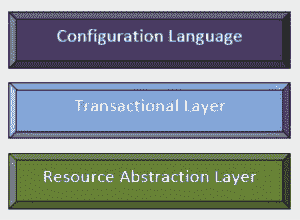

# 使用 PUPPET 进行自动化、供应和配置管理

> 原文：<https://devops.com/automation-provisioning-configuration-management-puppet/>

这是包含自动化、供应和配置管理的多部分系列的第 3 部分。在这篇后续文章中，我们将介绍 Puppet 的最佳实践。

**为什么是木偶？**

虽然每个系统管理员都想出了要管理的更先进的系统，但是每个日常任务的自动化变得越来越重要。

与其实现内部开发的脚本，不如共享一个可以被所有人使用的系统，而不管他的雇主是谁。但毫无疑问，这是手动做不到的。

因此，开发 Puppet 是为了让系统管理员社区在构建和共享所有成熟工具方面受益，这可以防止许多人正在解决的问题的重复。

以下是 Puppet 遵循的主要方法:

**1)。**它支持一个强大的框架，负责简化系统管理员需要完成的大部分技术任务。

**2)。系统管理员的工作是以代码的形式编写的，很容易像其他代码一样用 puppet 的定制语言共享。**

Puppet 的使用加速了您作为系统管理员的工作，因为它监督和处理所有的细节。您可以从其他系统管理员那里下载代码，帮助您更快地完成工作。大多数 Puppet 实现利用了一个或多个其他人已经开发的模块。人们可以找到社区开发和共享的数百个模块。

**什么是木偶？**

Puppet 是由 **Puppet Labs** 开发的开源 IT 自动化工具。它是用红宝石写的；由用于表达系统配置的声明性语言组成；客户端和用于分发它的服务器；和用于实现该配置的库。Puppet 帮助在云中或现场实现应用程序的自动化、部署和扩展。

Puppet 的基本设计目标是提出一种强大的、富有表现力的语言，由一个有影响力的库支持，使您只需几行代码就可以编写自己的服务器自动化应用程序。其强大的适应性和开源许可让您可以添加所需的功能。并且，你也可以和别人分享你的创新。

**系统组件:**

Puppet 通常用于客户机/服务器结构，所有的客户机都与一个或多个中央服务器通信。默认情况下，每个客户端都定期联系服务器，即每半小时联系一次。它甚至下载最新的配置，并确保它与配置同步。当它完成时，客户机能够向服务器发回一份报告，还可以引用所需的更改。

下图显示了常规木偶操作中的数据流:

Puppet 的功能被框定为一堆单独的层。每一层都对系统的一个固定方面负有责任，并严格控制这些层之间的信息传递。

图 2

木偶是如何工作的？

Puppet 代理充当一个守护进程，运行在所有需要配置的客户机服务器上，以及将来由 Puppet 管理的服务器上。现在，所有要控制的客户端都将在它们的系统中安装傀儡代理。这个傀儡代理也称为傀儡中的一个节点，它将有一个指定为傀儡主机的服务器。

**傀儡主机:**这台机器为不同的主机约束整个配置，并在这台主服务器上作为守护进程运行。

傀儡代理:这是将在整个服务器上运行的守护进程，将在傀儡的帮助下进行管理。在特定的时间间隔，傀儡代理将从傀儡主服务器查询配置。

现在，傀儡代理和主代理之间的连接网络是在 SSL 支持下建立在一个安全的加密通道中的。例如，如果傀儡代理已经申请了一个必要的配置，并且没有新的更改，那么它将什么也不做。默认情况下，傀儡代理将每 30 分钟从傀儡主服务器获取所需的配置数据。

从上图中可以清楚地看到，puppet master 服务器拥有适用于**主机 1 或节点 1、主机 2 或节点 2** 和**主机 3 或节点 3 的所有配置选项。**

以下是每当任何节点的傀儡代理在节点和傀儡主服务器之间建立连接以获取数据时总是要遵循的步骤。

**步骤 1:** 每当客户端节点连接到主服务器时，主服务器检查要应用于该节点的配置。

**第二步:** 傀儡主服务器将节点上应用的所有资源和配置进行获取和组装，并汇集在一起制作一个目录。现在，这个傀儡就交给了节点的傀儡代理。

**第三步:** 根据目录，傀儡代理会在节点上应用配置，然后回复。它还将提交应用于傀儡主服务器的配置报告。

谁会觉得木偶有用？

希望降低维护计算机成本的组织可以从使用 Puppet 中获益。因为投资回报与几个因素有关，例如当前的管理开销、现有计算机的多样性以及停机时间的成本。对于一个组织来说，确定是否应该投资于任何配置管理工具可能是复杂的，更不用说 Puppet 了。

一般来说，任何组织都应该利用服务器自动化，前提是满足以下任何条件:

1.  它带来了更高的服务器管理成本
2.  无论是因为合同还是机会成本，它都为停机付出了高昂的代价。
3.  它包含大量基本相同或几乎相同的服务器。
4.  服务器配置需要灵活性和敏捷性。

**结论:**

傀儡指的是两种不同的东西

*   编写代码的语言
*   管理基础设施的平台。

Puppet 是一个简单又复杂的系统。它是由几个松散地连接在一起的移动部分组成的。这是一种可用于所有配置问题的结构。我们未来的成功取决于结构变得更加强大和简单，因为在获得能力的同时它应该是可接近的。