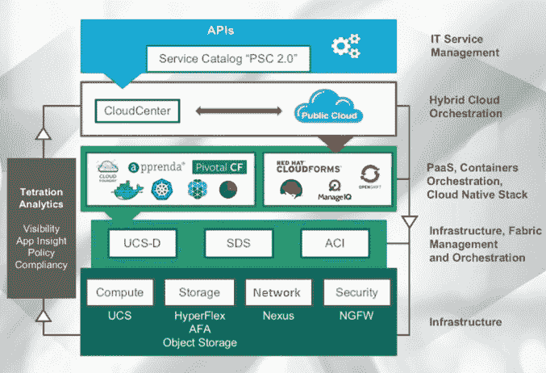
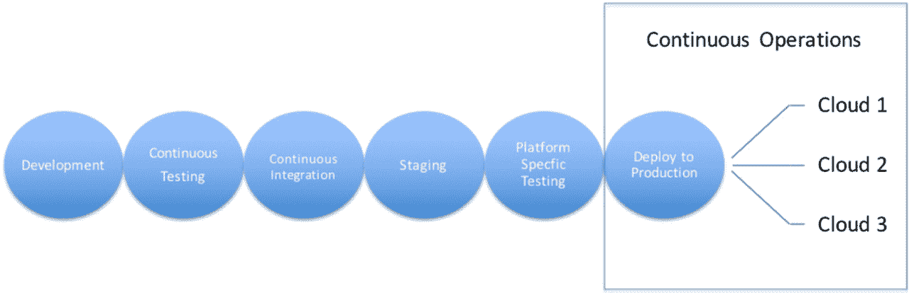

# 如何在将应用部署到多个云时避免麻烦

> 原文：<https://devops.com/avoid-trouble-deploying-apps-multiple-clouds/>

部署是开发人员与运营人员相遇的地方。将两者结合在一起的是编排，它将操作指南放在应用程序本身中。以下是如何在将应用部署到多个云中时避免麻烦。

当您的基础架构是云时，事情会变得更快。应用从概念到生产只需几个小时，而不是几周或几个月。一切都同时发生:开发、测试、部署、更新。您的工具必须像虚拟环境一样快速灵活。在编排的开源方面，两个脚本工具占主导地位——Chef 和 Puppet。正如 Tom Nolle 在 2016 年 7 月 TechTarget 上的一篇文章中解释的那样，Chef 被认为是两者中更“程序员友好”的，而 Puppet 的根源可以追溯到操作方面。然而，在实践中，根据诺尔的说法，命令式或指令式厨师模型和声明式木偶模型“越来越接近”。

### 厨师和木偶:通向同一目的地的两条路

使用 Chef，您可以以编程的方式创建“食谱”和“烹饪书”；每个部署步骤都是单独描述的，并且独立的方法被组合成一个可重复的应用部署过程。相比之下，Puppet 让您构建一个描述或“声明”最终状态的模型。傀儡模型旨在简化这些部署描述。Puppet 方法是应用生命周期管理(ALM)的自然补充，因为它提供了完整的 ALM 功能。其他采用纯声明性方法的编排工具有 CFEngine 和 Juju，而 Ansible 和 SaltStack 支持声明性和命令性模型。结构化信息标准促进组织发布了云应用的拓扑和编排规范(TOSCA)，这是一个基于声明的模型，旨在支持最终状态应用部署的定义以及虚拟资源和池的特定建模。

### 开发运维作为云应用部署的“简单按钮”

如今，任何应用程序的组件都可能位于内部、公共云中或两者之间的任何地方。微服务、虚拟化和类似的创新彻底颠覆了“基础设施”的概念。现在，基础设施适应其上运行的应用和服务的需求，而不是软件适应其上运行的硬件。DZone 的马克·杰克逊在 8 月 1 日的一篇文章中写道，IT 组织正在从基础设施的建设者和管理者演变为“安全驱动的云服务中介”

最终目标是采用一种新方法:基于可编程、策略驱动的基础设施的混合云堆栈模型。除了堆栈的基础架构之外，管理层是混合云流程编排和云原生堆栈，它们结合起来支持几乎任何类型的数据驱动型应用，无论是移动、物联网、超大规模还是垂直使用情形。

In a next-generation data center reference architecture, a hybrid-cloud stack accommodates deployment of apps whose components may exist in-house or in public clouds at any given time.

### 消除部署到多个云的痛苦

在当今的 IT 运营中，依赖单一云服务的组织是例外，而不是常规。灵活性是游戏的名称，因为公司使用一系列服务部署到公共云、私有云和混合云:OpenStack、AWS、谷歌云平台、HPE 和微软 Azure 等。Cloud Technology Partners 的 David Linthicum 在 3 月 28 日的一篇文章中写道，部署到多个云面临三大挑战:

使用通用的、相对较新的 DevOps 工具和流程，利用每个服务的本机功能；

确保您的 DevOps 工具跟上平台的快速变化；和

当每个服务针对这些重要操作的规则是特定于平台的时，维护安全性和治理。当部署到多个云中时，必须在准备阶段为目标平台标记相同的代码集(通常与数据结合在一起)。当应用程序运行特定于平台的测试时，工具或流程会对其进行检查，以验证它是否能与平台的原生功能一起工作。虽然这种特征检查可以在一定程度上自动化，但是当潜在问题被识别和纠正时，它通常需要手动重新检查。

Deploying apps to multiple clouds requires platform-specific testing that may not be possible to automate completely.

一旦特定于平台的测试完成，就可以通过将平台放在公共或私有云中的机器实例上，然后启动“持续运营”流程，来自动在每个平台上进行实际的生产部署。该流程的五个组成部分是监控、管理、资源治理、服务治理/服务目录和安全性:

*   **监控**当超过各种子系统的预设阈值时，执行期间的应用程序会报告任何稳定性或性能故障。
*   **管理**通常通过用于资源管理的[云管理平台](http://www.morpheusdata.com)以及主要应用程序和子系统组件，通过解释监控数据来响应潜在问题的警报。
*   **资源治理**通过链接到所有目标平台的单一控制台或仪表板，提取从各个云服务接收的性能数据。用户策略可以设置一次，然后应用于各种云。这是 [Happy Apps](http://www.happyapps.io/) 性能和正常运行时间监控服务采用的方法，该服务提供所有应用和业务服务的状态和实时可见性。
*   **服务治理**允许您为 API 和服务的使用创建策略，这些 API 和服务作为您使用的所有云的公共服务，允许应用程序利用它们部署到的任何云上的服务。一个**服务目录**用于跟踪您所有云和内部的基础架构级和应用程序级服务。
*   **安全性**试图通过减少所涉及的安全服务数量来最大限度地降低多云模型的复杂性，这些服务通常包括用户身份验证、访问管理和漏洞检测。

单个云服务的性质决定了无论您首选哪一套部署工具，部署到多个云在未来都将是复杂的。最大限度降低复杂性的一个方法是从一开始就考虑到多云环境来规划您的开发运维策略。有时候，让应用程序在许多不同的云平台之间无缝传递数据需要大量的手工编码。采用面向服务可以通过在应用程序之间共享服务来降低部署到多个云的相关成本。这样，单个应用程序可以从任意数量的云中运行数百个远程服务。一开始，服务和资源跟踪可能会令人生畏，但微服务应用通过提高开发人员的工作效率和打开新的收入来源证明了它们的商业价值。