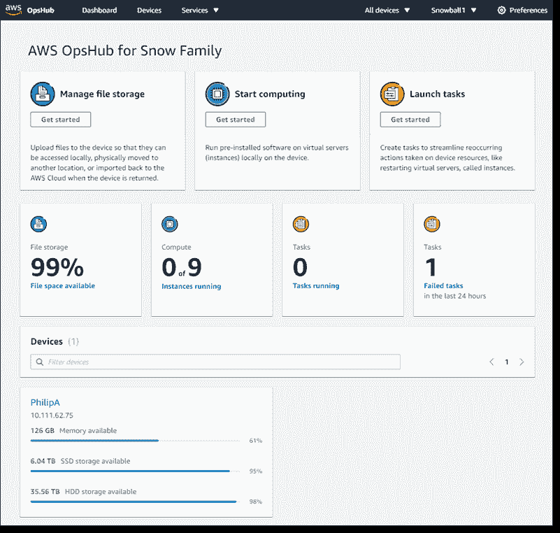

# AWS 为 Snow Edge 计算家族增加 GUI

> 原文：<https://devops.com/aws-adds-gui-to-snow-edge-computing-family/>

亚马逊网络服务(AWS)本周宣布，它已经为 Snow Family 添加了一个名为 [AWS OpsHub 的图形用户界面(GUI)工具，以提供命令行界面(CLI)工具的替代工具，该工具可用于管理部署在内部环境中的 Snow 设备系列。](https://aws.amazon.com/blogs/aws/aws-snowball-edge-update/)

与此同时，AWS 宣布它正在提供更多的雪球存储设备，由于增加了内存，支持更多的虚拟 CPU 和 100GB 网络，比上一代产品快 25%。

最后，AWS 还使通过 AWS 身份和访问管理(IAM)控制对 Snow appliance 的访问成为可能，并且能够使用 AWS 系统管理器自动执行任务。

AWS 的技术副总裁比尔·瓦斯(Bill Vass)表示，组织现在可以使用 Snow appliances 构建现在高达 1.4PB 的存储集群。

AWS 最初推出 Snow appliances 是为了提供一种更简单的方式将大量数据上传到公共云。一旦一个组织将数据加载到一个设备上，它就会以物理方式运送到 AWS。一旦到达那里，AWS 人员就将数据传输到 AWS 云上。

然而，随着边缘计算的兴起，AWS 现在也在使用雪球电器来驱动物联网(IoT)和其他环境中的混合应用程序。AWS 现在为构建混合云应用程序提供了一个 Greengrass 框架。Vass 说，Snow appliance 系列为戴尔技术公司的竞争对手 edge 计算平台提供了一种更高效、更安全的替代方案。

AWS 的 GUI 旨在使普通 it 管理员能够更轻松地配置 Snow 设备，以前只有掌握了 Snow CLI 的 IT 专业人员才能访问这些设备。AWS 甚至还包括演示如何配置其设备的漫画。

虽然 AWS 显然主导着公共云，但尚不清楚它将在多大程度上把这种主导地位扩展到边缘计算。AWS 认为，大量边缘计算应用程序将需要与其公共云上运行的应用程序工作负载紧密集成。传统数据中心平台的提供商也在争相成为这些相同平台的提供商，所有这些平台现在都可以通过云进行集中管理。

当然，边缘计算平台的规模会因使用情况的不同而有很大差异。然而，很快就会有一天，部署在边缘的工作负载总数超过云中的工作负载数。当组织寻求交付下一代实时处理和分析数据的应用时，边缘的计算和存储能力将至关重要，特别是 5G 无线计算网络同时提供更多的网络带宽。

谈到边缘计算平台，AWS 可能不是第一个想到的 IT 供应商，但它表明了它不仅仅是云计算服务提供商的意图。