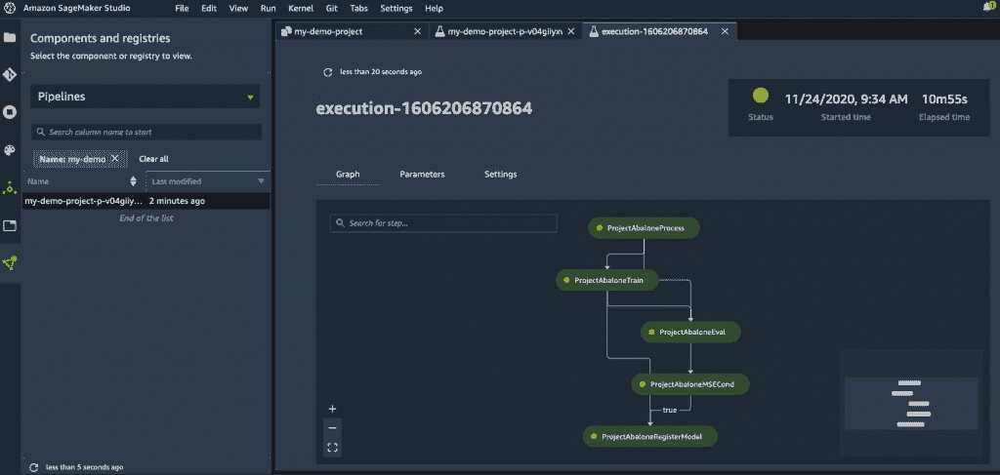

# AWS 希望融合 MLOps 和 DevOps

> 原文：<https://devops.com/aws-looks-to-meld-mlops-and-devops/>

机器学习操作(MLOps)和 [DevOps 最佳实践](https://devops.com/?s=DevOps%20best%20practices)的融合速度将在 2021 年快速加速。在最近的网上 [AWS re:Invent](https://reinvent.awsevents.com/) 会议上，亚马逊网络服务(AWS)宣布，它正在为亚马逊 SageMaker 增加一系列功能，这是一项托管的 MLOps 服务，其中包括为 MLOps 提供的持续集成/持续交付(CI/CD)服务，它称之为亚马逊 SageMaker Pipelines。

Amazon SageMaker Pipelines 使开发人员能够定义一个机器学习工作流，该工作流包含从加载数据到训练配置的所有内容；算法设置和调试算法。AWS 不必为构建人工智能(AI)模型而收购和部署独立的 CI/CD 平台，而是使用托管服务，使开发人员能够从亚马逊 SageMaker Studio 工具中管理工作流，该工具已经为构建人工智能模型提供。

工作流可以在团队之间共享和重用，以重新创建模型或作为创建另一个 AI 模型的起点。

亚马逊 SageMaker Pipelines 还记录了亚马逊 SageMaker 实验中的每个事件，这使得 IT 团队能够组织和跟踪机器学习实验和 AI 模型的版本。此外，Amazon SageMaker 调试器的深度剖析现在使开发人员可以通过自动监控系统资源利用率并在检测到瓶颈时生成警报来更快地训练 AI 模型。

AWS 还为亚马逊 SageMaker 添加了分布式训练功能，据称通过在其云服务中实现数据和人工智能并行性，可以训练大型复杂的深度学习模型，速度比当前的 AWS 方法快两倍。

云服务提供商还增加了亚马逊 SageMaker Edge Manager 服务，使开发人员能够优化、保护、监控和维护部署在边缘计算设备舰队上的机器学习模型。亚马逊 SageMaker JumpStart 服务使开发者能够搜索 AI 模型、算法和样本笔记本。

最后，AWS 增加了额外的数据准备工具，这些工具预先配置了 AWS 和第三方数据源的支持，一个用于存储人工智能模型的存储库，一个用于自动将人工智能模型与数据源(如亚马逊红移数据湖)匹配的额外工具的[预览](https://aws.amazon.com/blogs/big-data/bringing-machine-learning-to-more-builders-through-databases-and-analytics-services/)，将人工智能模型与图形数据库匹配的能力，以及一个检测人工智能模型内偏差的工具。

AWS 副总裁兼机器学习服务总经理 Bratin Saha 表示，随着人工智能模型的使用增加，这些举措的范围自然更适合云平台。许多应用程序开始将多类人工智能模型相互结合使用；Saha 指出，这需要大量的数据和计算资源来训练这些模型，而这些模型只能在云中轻松获得。

总体而言，AWS 声称已经有超过 10 万名客户在其平台上使用各种工具和处理器类别构建人工智能应用程序。AWS 表示，将在 2021 年添加基于 AMD 处理器的 G4ad 图形处理单元(GPU)实例，并透露明年将建立自己的 GPU。该公司还计划添加一个基于多达八个英特尔 Habana GAUDI 加速器的亚马逊 EC2 实例，以提供比当前基于 GPU 的 EC2 实例高出 40%的性价比。

与此同时，AWS 扩大了与英伟达的联盟，在 AWS 市场上提供用于构建人工智能模型的软件模块。

事实上，Saha 表示，AWS 正在邀请 IT 团队要么在 AWS 上建立人工智能模型，要么将他们自己的人工智能模型封装在容器中带到其平台上。

AWS 的目标显然是主导人工智能，不管这些能力如何融入企业应用程序。事实上，在许多情况下，AWS 会自动为客户构建 AI 模型，或者只是通过应用编程接口(API)返回由 AI 模型生成的结果。将由每个组织来确定何时构建他们自己的人工智能模型最有意义，以及他们希望在多大程度上依赖 AWS 来自动化部署过程。

可以肯定的是，许多相同的 DevOps 原则——在人工智能模型出现之前很久就已创建——将仍然相关，因为使用这些模型的应用程序在未来几年将不断更新。