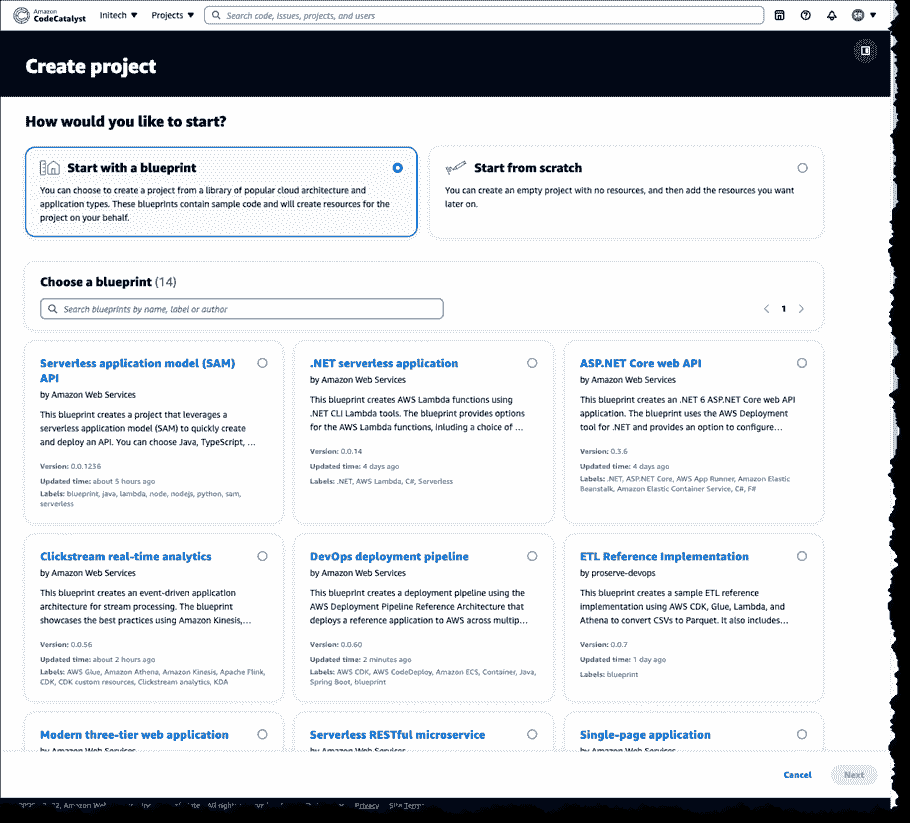

# AWS 预览 Amazon CodeCatalyst 自动创建开发环境

> 原文：<https://devops.com/aws-previews-amazon-codecatalyst-to-automatically-create-dev-environments/>

亚马逊网络服务(AWS)本周发布了亚马逊 CodeCatalyst 框架的预览版，该框架利用蓝图在其云中自动供应和配置开发人员环境。

在 AWS re:Invent 2022 会议上宣布，Amazon CodeCatalyst 利用项目蓝图工具推出源代码库和项目管理跟踪器，然后用于创建构建和发布管道。DevOps 团队既可以使用由 [AWS](https://devops.com/?s=AWS) 提供的工具，也可以用 GitHub 或吉拉项目管理软件的实例来替代。

亚马逊首席技术官沃纳·威格尔告诉与会者，他们的目标是减少开发者目前在需要启动新开发项目时遇到的摩擦。作为这项工作的一部分，Amazon CodeCatalyst 承诺，除了提供仪表板和搜索功能来跟踪提交、拉请求和部署之间的变化之外，还将使使用脚手架一致复制开发环境变得更加简单。

Amazon CodeCatalyst 使用一个 devfile 来定义环境的配置，该环境有四个可调整大小的实例选项，由两个、四个、八个或十六个虚拟 CPU 组成。devfile 定义和配置编码、测试和调试项目所需的所有资源。由所选蓝图添加到源代码存储库中的 Devfiles 也可以被修改。

总的来说，这些功能使得部署示例 TypeScript、Python、Java、.NET，JavaScript，React，Angular 和 Vue 代码运行几分钟。开发人员可以在本地机器上使用 AWS Cloud9 集成开发环境(IDE)或使用 JetBrains IntelliJ IDEA Ultimate、PyCharm Pro、GoLand 和 Visual Studio 代码等工具。因此，开发人员可以简单地在多个代码库之间切换，或者根据需要与其他开发人员合作。

管道可以在云中的预配置构建上运行，或者组织可以选择部署他们自己的容器环境。开发人员可以整合 AWS 合作伙伴内置或提供的构建操作，此外还可以整合 GitHub 操作来组成完全自动化的管道，这些管道可以使用可视化编辑器或 YAML 文件进行配置。构建和发布管道支持在亚马逊弹性容器服务(Amazon ECS)、AWS Lambda 和亚马逊弹性计算云(Amazon EC2)服务上部署。

总的来说，沃格尔斯主张 IT 团队应该构建松散耦合的事件驱动应用程序，以便在不影响整个代码库的情况下，更简单地向大规模运行的现有应用程序添加新功能。为了更简单地构建这些类型的应用程序，AWS 添加了一个 [Amazon EventBridge Pipes](https://aws.amazon.com/blogs/aws/new-create-point-to-point-integrations-between-event-producers-and-consumers-with-amazon-eventbridge-pipes/) 工具，该工具可以在事件生产者和消费者之间创建点对点集成，从而消除了编写代码的需要。AWS 还在 preview 中提供了一个图形化的 [AWS Application Composer](https://aws.amazon.com/about-aws/whats-new/2022/12/aws-application-composer-preview/) 工具，该工具使用基础设施即代码(IaC)定义来简化无服务器应用的设计、配置和构建。

尚不清楚开发人员会在多大程度上接受事件驱动的应用程序。作为一种编程模型，事件驱动架构已经存在了几十年。问题是这些应用程序也往往是最具挑战性的构建和维护。AWS 现在清楚地表明，它的意图是让构建这些应用程序变得容易得多。