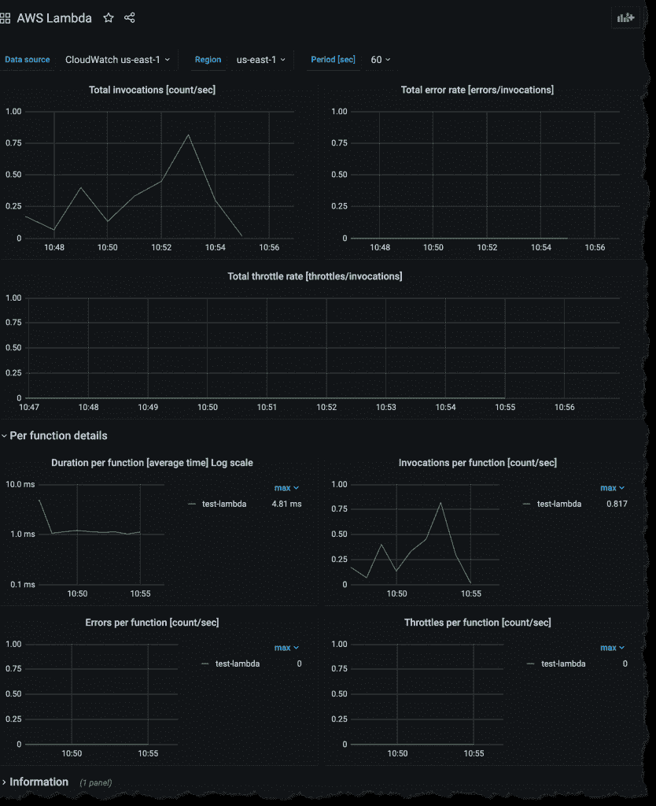

# AWS 利用 Grafana 实验室推出可观测性管理服务

> 原文：<https://devops.com/aws-taps-grafana-labs-to-launch-managed-observability-service/>

亚马逊网络服务(AWS)与 Grafana Labs 合作，在其管理[云应用](https://devops.com/?s=cloud%20applications)和基础设施的工具组合中添加了[基于 Grafana observability platform](https://aws.amazon.com/blogs/aws/announcing-amazon-managed-grafana-service-in-preview/)的托管服务预览。

Grafana 平台基于在云本地计算基金会(CNCF)支持下推进的开源 Prometheus 监控平台的实现。Grafana Labs 策划的实施旨在使用同一个控制台集中多个集群的可观察性。

Grafana Labs 首席执行官 Raj Dutt 表示，在 AWS 上运行工作负载的组织现在可以更容易地调用 observability 平台，该平台运行在他们部署应用程序工作负载的同一云平台上。

此外，Dutt 指出，在 AWS 上运行工作负载的 IT 组织可以无缝升级到 Grafana Enterprise，该企业可以从平台上的第三方数据中提取信息，包括 ServiceNow、Splunk、雪花、Datadog、MongoDB、Oracle、New Relic、Dynatrace、Wavefront 和 AppDynamics。

除了软件即服务版本之外，Grafana Labs 已经提供了其平台的内部版本。AWS 正在运行的版本为运行在 AWS 平台上的应用程序提供了对可观测性平台的访问。想要应用 Grafana Labs 平台来管理在多个平台上运行的应用程序的组织可以使用 Grafana Labs 提供的现有产品。

该公司还在今年早些时候添加了一个名为 Grafana Tempo 的分布式跟踪平台，使得利用现有的对象存储平台和服务来分析痕迹成为可能。Grafana Labs 还推出了 Loki 的 2.0 版本，该版本规范了不同的结构化、非结构化或 JSON 日志格式，允许 DevOps 团队提取额外的标签，并支持额外的过滤和分组。

一般来说，对可观察性的兴趣与 IT 环境变得越来越复杂的速度成正比。随着更多基于微服务的应用的部署，它们之间的依赖程度开始呈指数级增长。尝试关联多个监控工具生成的数据几乎是不可能的，因此 IT 组织开始转向可观察性平台，该平台以提供更多上下文的方式统一应用程序和基础架构指标的收集。

这些平台提供商之间的竞争已经非常激烈，因此与 AWS 的联盟是对 Grafana Labs 所追求的方法的显著认可。不太清楚的是，一旦可观察性平台得到更广泛的部署，IT 团队将在多大程度上取代他们现有的许多监控工具。大多数现有的监控工具针对特定类别的基础设施或应用进行了优化；在许多情况下，取消这些平台的许可费将支付在单一可观测性平台上实现标准化的成本。

无论选择哪种方式，管理方式都在发生根本性的变化。每个 IT 组织都需要调整其 IT 管理流程，以跟上 IT 变得越来越复杂的速度。事实上，下一个大问题可能不是选择哪个可观察性平台，而是引导内部 it 文化必然会发生的深刻变化。