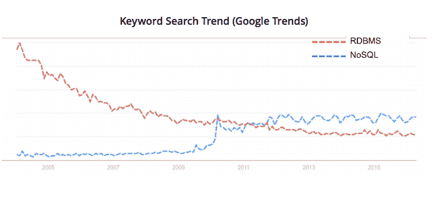

# 分布式数据库的备份和恢复

> 原文：<https://devops.com/backup-recovery-distributed-databases/>

在过去的五年里，应用程序经历了一次范式转变。他们现在需要更多的**敏捷性**、**可扩展性**和**可用性**。社交平台、移动设备和软件即服务的使用推动了这个时代的主要趋势(SaaS)。

能够从各种来源获取大量数据并实时处理这些数据以提供上下文信息或业务见解是一项重要的竞争优势。为了满足这些新的应用程序需求，组织被迫超越传统的关系数据库。这导致了一系列新的数据库系统的出现，这些系统本质上是分布式和横向扩展的，可以部署在商用硬件上，并提供可调的一致性与性能之间的权衡。值得注意的是，为了满足敏捷性要求，云中的数据库即服务模型也正在被采用。

为了显示向分布式数据库的转变有多大，下面是一个关键词搜索趋势图，显示了 NoSQL 搜索的急剧上升。

这意味着，在这个以数据为中心的世界(网络规模的应用程序和分布式数据库)的驱动下，数据保护的要求已经永远改变了。组织正在收集大量数据，并试图从这些数据中挖掘更多价值，以做出更好、更快的业务决策。大多数分布式和云数据库已经提供了复制功能，因此满足了数据保护的可用性要求。但是，需要满足可扩展时间点备份和恢复的数据保护要求。如果没有时间点备份，组织将面临因人为错误、逻辑损坏和其他操作故障而丢失数据的巨大风险。传统备份解决方案旨在满足使用共享存储和 ACID 事务模型的关系数据库的需求。不幸的是，它们远远不能满足分布式数据库的时间点备份需求(本地存储、最终一致性和基础架构的弹性)。

随着数据库体系结构从根本上改变以满足新的应用程序要求，数据保护也需要重新定义和重新构建。以下是数据保护的新要求。

*   获取最终一致的数据库的持久时间点备份副本；我们称之为“版本控制”,这是这个新的分布式时代的数据保护新模式:备份到快照到复制，将数据管理复制到版本控制
*   最大限度地缩短从故障中恢复的时间(低 RTO)
*   随着应用需求的增长而扩展
*   支持轻松刷新测试/开发环境，以实现持续开发
*   出现故障时提供运营弹性
*   在公共云或内部数据中心中提供部署灵活性

大多数组织都在投资企业级时间点备份和恢复产品，以便他们可以放心地在分布式数据库上部署和扩展他们的下一代应用程序。在未来五年内，看到公司重新定义数据保护技术以满足下一代应用程序的要求将是一件令人兴奋的事情。

— [Jeannie Liou](https://devops.com/author/jliou/)