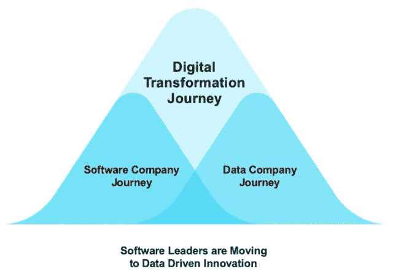
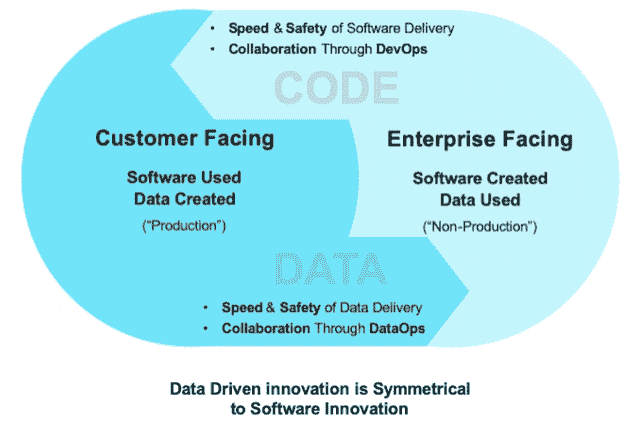
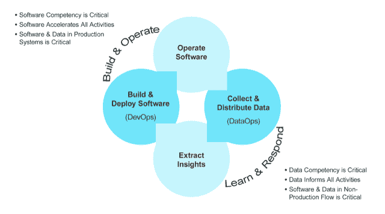

# 成为数据公司:两种趋势的故事

> 原文：<https://devops.com/becoming-a-data-company-a-tale-of-two-trends/>

数据回来了，宝贝！嗯，这似乎是一个奇怪的说法。它从未真正离开过。然而，谷歌最近对 Looker 的收购和 Salesforce 对 Tableau 的收购似乎以放大的方式突出了这种心态。着眼于数据科学和人工智能的新飞跃，很容易理解我们现在对数据的看法就像一个正在移动的钟摆。

过去十年的主题是“每家公司都是软件公司”，这是由云平台的现成计算可用性推动的。在未来十年，我们的数据实践将赶上软件开发实践的持续革命——或者换句话说——让“每家公司都成为数据公司”。

在过去的几个月里，当我与客户交谈、参加会议和与同事交流时，我感觉到数据对话越来越活跃。如今，发展数据能力对企业的重要性正在快速增长，就像 10 年前建立软件能力成为优先事项一样。

然而，我最好奇的观察是，围绕数据和软件的讨论是狭隘的。对话要么侧重于如何移动、管理、清理和利用数据进行分析，要么侧重于如何快速构建和发布高质量的软件。进行这些对话的人要么是数据人员，要么是软件人员，他们生活在孤立的世界中，似乎有不同的关注点，并且只在最低的共同标准(数据库存储)上联系，而软件人员或 gal 需要在某个地方存储数据。很少有人谈到这两个世界之间更深层次的联系和协同作用，以及它与更大趋势的关系。

## 下一波数字化转型

如果你放大一点，你会看到更多的东西。软件世界和数据世界之间有一种优雅的对称，它暗示了现代企业将如何在数字转型的时代转型。正如职能和组织被重塑以支持新的文化和技术趋势，如 DevOps，组织也将在数据优先的世界中被重塑。随着软件能力的增长和成熟，获取数据能力的需求变得更加迫切。看似独立的趋势是数字化转型的超级趋势的成熟延续，试图获得软件和数据方面的能力(并必然以此顺序进行)。

如下图所示，企业一直在追求发展软件能力和成为软件公司的旅程。那些在软件能力方面取得足够进步的人很快意识到，他们现在已经获得的显著增加的数据需要新的能力来收获并从中提取价值。数据能力是完成数字化转型的必要条件，也是成为数据公司的起点。软件和数据是数字化转型的同一个硬币的两面，有着令人放心的熟悉主题的回响。下图突出了其中的一些。

## 镜子，墙上的镜子

速度和安全是这两项能力的核心驱动力。DevOps 运动是由这两个(经常是不一致的)需求驱动的，通过确保传统上被称为“非生产”的东西准确地模仿生产，在不破坏生产部署的情况下快速地将软件从开发交付到生产。我们的目标是构建和测试代码，这样当它被部署到产品中时，就不会破坏已经在工作的东西。

在数据环境中，随着越来越多的组织了解其数据的价值，他们认识到快速将数据从生产地(生产地)传送到需要数据的人(生产地之外，即非生产地)的重要性。数据环境中的安全不仅仅是在提取数据时不中断生产，还包括在此过程中满足法规要求并遵守数据隐私政策。

这种优雅的对称进一步强调了这样一个事实，即软件环境中的主要关注点是将软件从内部开发环境转移到面向客户的生产环境，而在数据环境中，关注点是将数据从面向客户的生产环境转移到内部非生产环境。这就完成了现代企业在数字化转型之旅中必须掌握的实验和学习的良性循环(见下文)。它要求组织通过试用(软件发布)和学习(数据科学、分析、机器学习)快速迭代产品市场适应度，然后再返回。

通过这种方式，数字化转型成为由 DevOps 和 DataOps 的互补运动驱动的良性循环——分别支撑软件和数据之旅的文化运动、哲学、技术和协作，以及企业在数字化转型之旅中正在经历的组织变革的主要驱动因素。

— [卡伦·巴克西](https://devops.com/author/karun-bakshi/)