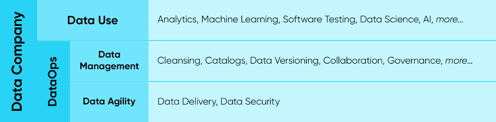

# 成为数据公司:回到未来

> 原文：<https://devops.com/becoming-a-data-company-back-to-the-future/>

变革是复杂的，当你身处其中时，往往很难看到全局。

软件和数据之间和谐协同的最终状态的优雅掩盖了我们所处的转型的复杂性和混乱。不久以前，在软件交付的速度和复杂性与数据分析的速度和成熟度之间有一个总的平衡。市场和客户群稳步增长，使组织能够在软件和数据能力方面保持同步，以处理不断增加的共同范围和复杂性。

然而，IT 消费化——非专业消费者能够从浏览器和移动设备上获得复杂的软件体验——释放了数十亿庞大、热切和苛刻的客户群。这催生了当前的数字化转型浪潮。随之而来的是进入市场的竞争，即以指数级的速度构建和交付高质量的软件，以便利用巨大的全球机会。

软件领域的创新就这样开始了。随着更快、更好的软件的出现，出现了对专门构建的数据存储(文档数据库、图形数据库等)的需求。)，管理从数百万(或数十亿)用户收集的数据的速度、数量和种类的需求，以及以足够快的速度提取洞察力和价值以进一步推动软件创新步伐的需求。因此，软件创新为当前对数据创新的关注埋下了种子。

虽然创新者很快就走过了这段软件之旅，但大多数企业直到现在才完全接受新的软件方法和技术来快速有效地交付软件。那些走在软件之旅前列的企业现在正开始踏上数据之旅，寻找安全、快速利用企业数据资产价值的方法。这包括从分析到为软件测试快速提供生产数据拷贝的一切。事实上，451 Research 指出，86%认为自己在 DevOps 旅程中已经成熟的公司正计划增加在数据运营方面的投资。也就是说，已经走过软件能力曲线的公司现在正在走上数据能力曲线。

## **CDO 的黎明**

数据科学、人工智能、分析和数据运营技术及供应商的日益增长的吸引力表明，发展数据能力的重要性日益增加。最近首席数据官(CDO)的出现是这一趋势的顶点。

鉴于大多数企业对数据的关注刚刚开始，大多数 CDO 仍在努力定义自己的角色，驾驭高管团队的动态，防范监管和合规风险，并通过发现增长机会来证明自己的角色。尽管面临这些迫在眉睫的挑战，但他们确实有一点是有利的:他们知道自己正处于令人难以置信的变革之中，对软件之旅及其带来的许多相似之处有后知之明，并对需要应对的组织、技术和文化变革做好了心理准备。大多数公司都被开发运维及软件转型之旅带来的变化的突然性和速度惊呆了。有了 DataOps 和数据之旅，他们现在意识到、准备好并致力于相关的旅程和长期变化。他们可以积极主动，避免被动反应。

## **规划数据运营时代**

随着走向市场和从市场中学习的周期时间缩短，创新周期加快，CDO 可以预计，以数据为中心的组织将需要在不招致不必要风险的情况下推动全新的顶线和底线结果。这将通过采用新技术、组织结构、文化和工作流程来实现。专注于以数据为中心的活动的新角色，以及不同角色之间新形式的协作将会出现。

在现代企业中， 生产将不再是企业中最重要的数据环境。人们越来越需要快速访问生产环境之外的安全、受监管的数据，而生产环境是企业其余部分(非 IT 部分)工作的中心。过去对 IT 部门不产生影响的事情，现在将对企业的其他部门产生影响。为了取得成功，IT 需要快速、安全地将数据交付给组织的其余部分，甚至跨越组织边界交付给合作伙伴和其他生态系统参与者。采用支持这种新的企业运营模式的协作流程和工作流至关重要。进入 data ops—组织中跨团队实现数据敏捷所需的人员、流程和技术方法的独特组合。

鉴于之前概述的数据之旅与软件之旅的相似之处，组织的数据运营之旅可以从开发运维之旅中吸取经验教训。例如，开发数据能力将需要相应技术支持的新的组织层和工作流模式。主动为数据运营规划和铺设基础设施将产生更好的结果，而不是在通过反复试验得出数据能力蓝图之前临时采用技术。

## **构建数据公司技术堆栈**

与任何复杂的转变一样，将数据能力分解为一系列分层的能力是有意义的，每种能力都建立在之前的能力之上，共同帮助发展复杂的能力。例如，当构建他们的软件能力时，为了以复杂的方式应用软件(例如，云原生架构和微服务)，组织需要管理分布式软件元素(例如，扩展、修复、监控)，这又依赖于增量、一致和快速地测试和部署的能力。

类似的方法也适用于数据。围绕适当的技术工具构建协作流程可以产生分层的组件功能，这些功能共同定义了复杂的数据能力。虽然分层是在软件之旅中出现的，但 CDO 有机会在开发分层方法时深思熟虑，而不是被动反应，如下图所示。

成功的数据能力的基础是在组织中的任何地方交付数据并保护数据以满足法规和合规性要求的能力。能够在混合云环境中快速保护和移动任何类型的企业数据是一项艰巨的工作，但也关系到基本的数据管理卫生。这些都是重要的先决条件，并且这个基础需要是坚实的，以便支持上面的层。

接下来，需要掌握各种数据管理活动，例如自助访问、治理、数据目录、数据清理、协作和版本控制等。这些定义了数据能力的下一个级别，在数据可以以不同方式应用之前必须掌握，例如在机器学习、测试数据管理、分析、数据科学等方面。

构建[数据公司](https://devops.com/wp-admin/post.php?post=132891&action=edit&classic-editor)的深思熟虑的分层方法需要在各层之间构建正确的抽象概念，并避免工具无序蔓延，这种无序蔓延是由不可避免地需要人力来驱动数据工作流的点对点解决方案组成的。

CDO 应该通过这样一个结构化的镜头来评估组织的需求。每一项活动都将带来供应商生态系统，产生对供应商能力的进一步评估。要问的关键问题包括(在众多问题中):解决方案企业准备好了吗？它是否适用于混合云中的所有数据源？它会随着您不断变化的需求而发展吗？它将如何与其他解决方案互操作？可以自动化吗？

当首席投资官们考虑通过这些基础设施投资来连接企业的不同部分时，铺设铁路轨道来连接一个大国的相似性是显而易见的，并且可能具有指导意义:较低层的弹性和稳定性能够在较高层实现灵活性、多样性和创新，就像简单铁路轨道的简单性和可靠性能够运行电力、蒸汽机、豪华转向架和货物转向架一样。

## **走向一家数据公司**

数字化转型的口号是，每家公司都是软件公司。但要完成转型，每个公司也必须成为数据公司。在过去的十年中，软件开发实践和工具有了显著的发展。我们正处于数据实践和工具类似演变的早期阶段，这将引领我们走过下一个十年。软件和数据之间的对称和耦合是明确无误的，从软件之旅中可以学到很多东西。

当首席数据官、首席信息官和首席执行官们在这个新时代规划企业转型时，他们需要考虑为他们的数据能力构建一个稳定、有弹性、与他们的软件开发流程兼容并能适应不可避免的变化的基础。他们应该做好准备，将数据从产生的地方交付到整个企业使用的地方。

[数据公司](https://devops.com/wp-admin/post.php?post=132891&action=edit&classic-editor)不仅仅将数据视为运营的副产品，还将其视为组织的命脉——推动软件开发，提高质量保证，为决策提供信息，并有可能凭借自身优势创造收入。

— [卡伦·巴克西](https://devops.com/author/karun-bakshi/)