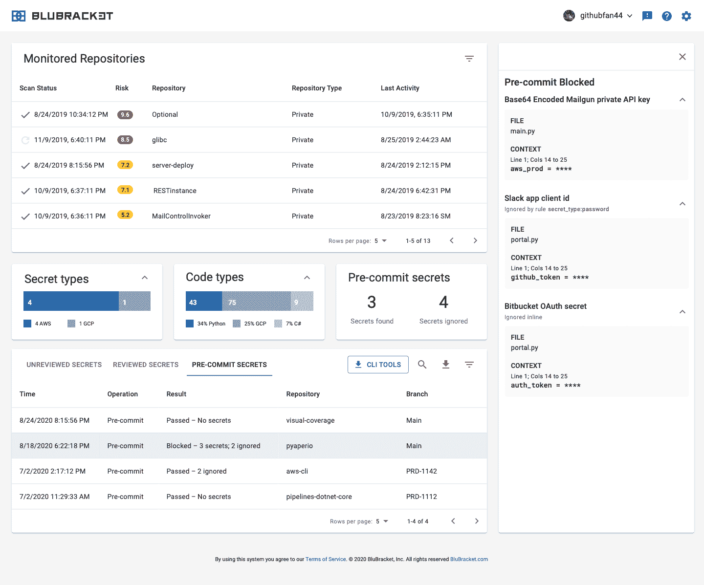

# BluBracket 秘密发现工具社区版现已推出

> 原文：<https://devops.com/blubracket-community-edition-of-secrets-discovery-tool-now-available/>

BluBracket 今天宣布推出一款工具的社区版，该工具采用[机器学习](https://devops.com/?s=machine%20learning)算法来发现代码中的密码、令牌和其他安全漏洞。

BluBracket 的首席执行官 Prakash Linga 表示，代码中存储的应用程序秘密使网络犯罪分子能够以影响整个软件供应链的方式危害应用程序。该公司的同名工具社区版扫描提交，以确定是否引入了任何新的风险，然后阻止提交暂存文件。它可以与任何支持预提交挂钩的持续集成/持续交付( [CI/CD](https://devops.com/?s=CI%2FCD) )平台或集成开发环境(IDE)一起工作，包括 VSCode、Jetbrains IntelliJ 和 PyCharm。

然后，根据在代码中发现的秘密数量，开发人员会得到一个风险分数。例如，Amazon Web Services (AWS)的活动令牌会得到高分，而测试环境中的密码会被评为低分。

BluBracket 的社区版可以通过 [GitHub](https://github.com/) 访问。BluBracket 的免费版本可以用来扫描多达 10 个存储库，并实时共享报告，涵盖了 50 多种可能使用任何编程语言的秘密。

Linga 表示，BluBracket 还通过将机器学习算法与内置规则引擎相结合来减少误报。Linga 说，与开源工具相比，BlueBracket 产生的误报要少得多。

Linga 表示，社区版旨在帮助个人开发人员采用 DevSecOps 最佳实践，希望当这些开发人员被聘用时，他们的组织最终会许可 BluBracket 的完整实例。Linga 说，该公司认为其工具是对暴露代码漏洞的工具和秘密管理平台的补充，秘密管理平台通常不会在组织内广泛使用。

随着最近在广泛分布的应用程序中嵌入恶意软件的高调违规，人们越来越关注保护软件供应链。Linga 说，在某些情况下，很可能是网络罪犯发现了密码和其他在代码中无意暴露的秘密。

无论这些违规行为是如何实现的，很明显，网络犯罪分子正变得越来越善于利用一个应用程序中的漏洞对整个环境造成最大程度的破坏。很难说秘密发现到底扮演了什么角色，但在利用应用程序漏洞时，网络犯罪分子倾向于选择阻力最小的途径。

当然，希望 DevSecOps 最佳流程的采用将网络安全的责任进一步转移给开发人员，从而减少违规数量。然而，如果不找到最简单的方法将所需的安全工具送到最需要它们的开发人员手中，这是很难实现的。