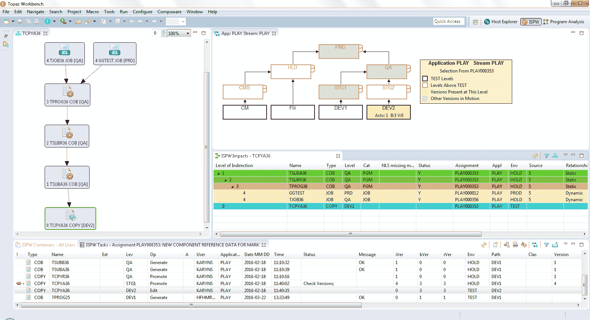

# bmc 与 git 集成的 devops 大型机产品组合

> 原文：<https://devops.com/bmc-integrates-devops-mainframe-portfolio-with-git/>

通过将 BMC Compuware ISPW 持续集成/持续交付(CI/CD)平台与 Git 存储库相集成，BMC 进一步努力将 DevOps 最佳实践引入大型机应用程序的开发。

此外，该公司加强了 BMC Compuware ISPW 公司和 BMC AMI Ops 平台之间的集成，并集成了 BMC Compuware Topaz Workbench，用于使用 Vercacode 的代码扫描工具构建应用程序。

最后，现在还有一个用于 Illumio 的 BMC 企业连接器，它在来自 Illumio 的零信任分段平台和大型机之间提供了一个双向接口。此外，BMC AMI 安全系统指挥中心现在还可以发现恶意性能活动，以加快事件响应。

BMC 智能 Z 优化和转型高级副总裁兼总经理 John McKenny 表示，总体目标是使[大型机](https://devops.com/?s=Mainframe)成为另一个平台，IT 团队可以在其中应用 DevOps 最佳实践来更快地构建应用。这比以往任何时候都更加重要，因为大型机通常是数字业务转型计划的核心，需要与各种分布式计算平台集成。BMC 最近发布的一项[调查](https://www.bmc.com/newsroom/releases/bmc-survey-mainframe-instrumental-in-driving-digital-innovation-and-growth.html)发现，三分之二的受访者(66%)正在投资新技术，如 AIOps 和人工智能/机器学习(AI/ML)、DevOps 和集成。

McKenny 补充说，这种方法使组织能够以最大限度地减少技术债务而不是重复功能的方式利用现有的大型机。

他说，当谈到大型机环境中的 DevOps 时，目前最大的挑战更多地与文化有关，而不是所提供工具的成熟度。McKenny 指出，许多构建大型机应用程序的 IT 团队仍然依赖瀑布过程，主要是因为简单的惰性和对变化的普遍恐惧。

然而，McKenny 说，新一代的 IT 专业人员已经接受了跨所有平台的现代开发实践，以加快应用程序构建和部署的速度。他补充说，这种转变正在导致大型机和分布式计算环境中更广泛地采用 DevOps 最佳实践。他指出，事实上，企业 IT 从未像现在这样混合。

IBM 继续在大型机方面投资，所以这个平台在这个十年和下一个十年都应该保持相关性。尽管这一备受推崇的平台问世已近 60 年，但它仍在继续为众多企业 it 组织托管任务关键型应用。最近，IBM 增加了一个 [IBM z16](https://devops.com/ibm-z16-delivers-ai-and-quantum-safe-levels-of-security/) 版本的大型机，除了量子安全加密之外，还增加了一个专用的片上人工智能加速器。尚不清楚拥有大型机的组织升级的速度有多快，但这一投资水平表明 IBM 仍在大型机研发方面投入巨资。

不管如何——甚至是谁——为大型机构建应用程序，像 Git 存储库这样的工具将会得到更广泛的使用，如果没有别的原因，就是为了更容易地共享代码。现在，问题是提高大型机环境中 DevOps 成熟度的整体水平，以跟上应用程序在企业其余部分构建和更新的快速步伐。