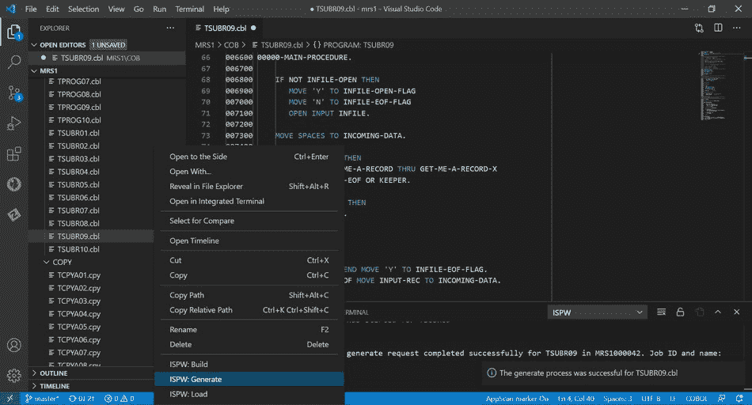

# BMC 加强了大型机开发运维工具的集成

> 原文：<https://devops.com/bmc-tightens-integration-across-devops-tools-for-mainframes/>

BMC 已经[扩展了其 BMC 自动化大型机智能(AMI)和 BMC Compuware 产品组合](https://www.prnewswire.com/news-releases/bmc-enables-organizations-to-develop-and-deliver-code-faster-301260110.html#)，作为持续努力的一部分，使大型机成为 DevOps 团队构建和部署应用程序的另一个平台。

BMC 智能 Z 优化和转型高级副总裁兼总经理 John McKenny 表示，该公司去年通过收购 Compuware 获得的 DevOps 技术现已与 BMC 大型机产品组合的其余部分完全集成。

他补充说，BMC Compuware 连续集成/连续交付(CI/CD)平台已经与 Visual Studio Code 集成，Visual Studio Code 是微软的一个免费工具，被开发人员广泛使用。

The BMC Compuware ISPW solution integrates with Visual Studio Code to enable developers to compile changed code on the mainframe with a right-click.

此外，用于将 DevOps 实践应用于大型机应用程序开发的 BMC Compuware Topaz 平台具有新的命令行界面(CLI)以及对多应用程序编程界面的支持。

BMC Compuware File-AID 21 工具现在可以减少在主机上搜索数十亿个交易和日志文件所需的时间，同时 BMC AMI 安全工具已经与 BMC Helix IT 服务管理(ITSM)平台集成。

最后，BMC AMI Ops Insight 工具已经更新，提供了诊断功能，可以更容易地确定问题的可能原因，同时 BMC AMI SQL Performance for DB2 工具现在包括一个用于开源 Jenkins 持续集成/持续交付(CI/CD)平台的插件。

McKenny 表示，目标是将大型机与任何 DevOps 工作流集成，作为部署新应用程序或更新平台上已运行的遗留应用程序的一部分。他指出，大型机应用程序的现代化是由向需要与更广泛的分布式应用程序集成的大型机应用程序添加应用程序编程接口(API)的需求推动的。

McKenny 补充说，对这些 API 的大部分需求是由数字业务转型计划驱动的，这些计划要求应用程序能够访问运行在大型机上的后端事务处理和分析应用程序。

尚不清楚在大型机上构建和部署应用程序的 It 团队以何种速度从基于瀑布的流程转向采用最佳 DevOps 实践。然而，McKenny 指出，在过去几年中，大型机应用程序的变化速度大大加快了。

虽然在过去的十年中，大量的应用程序已经从大型机中迁移出来，但是仍然有大量的企业 IT 组织继续依赖这个古老的平台来处理事务。许多组织不相信重写他们依赖了几十年的应用程序是值得的，因为通过添加 API 可以更容易地让其他应用程序访问它们。McKenny 指出，实际上，大型机应用程序正在成为开发者可以调用的另一种微服务。

不管动机如何，很明显，大型机应用程序将在下一个十年继续良好运行。IT 团队现在面临的挑战是找到一种方法，使这些大型机成为在 DevOps 工具链末端部署应用程序的另一个平台。