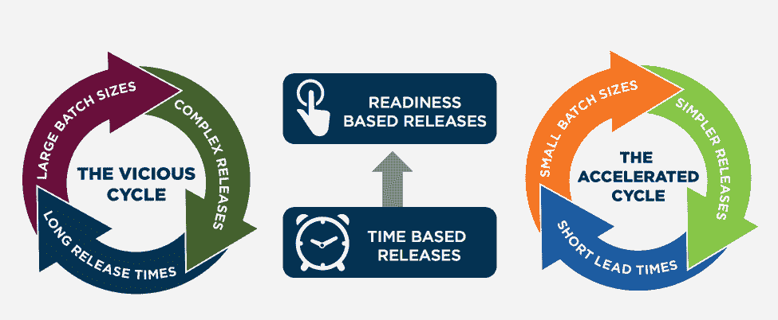

# 打破依赖的循环

> 原文：<https://devops.com/breaking-cycle-dependency/>

虽然技术是 DevOps 和加速交付的重要组成部分，但流程和文化的其他方面对于保持周期运行至关重要，以实现缩短交付周期的目标，从而更好地响应业务需求。

如果你去问大多数敏捷团队，是什么阻碍了他们更快的发展，他们通常会回答说他们在等待“某些东西”其中可能包括:

*   等待工作进入他们的积压
*   等待环境
*   等待另一个开发团队提供一些所需的服务或功能

这些障碍包括:

*   大批量
*   敏捷团队的积压工作中缺乏连续的工作流
*   基于日历的门控发布
*   测试环境的复杂性
*   环境可用性

这在如下所示的恶性循环的当前状态中表现出来。当团队一年只发布几次系统版本时，那么企业认为它需要把它能想到的所有东西都打包到那个版本中，因为等待下一个版本会导致几个月的延迟。这会导致具有许多依赖项的大型复杂版本。这反过来又会减缓这些发布的开发和测试，并且需要大量的发布协调，从而导致很长的交付周期和不能频繁发布。这导致了循环往复。

那么打破这种循环需要哪些对策呢？它们包括:

*   较小的批量
*   架构、设计和开发去耦技术
*   自动化程度提高
*   基于就绪的发布能力

较小的批量需要应用 MVP(最小可行产品)技术。当 IT 赢得业务部门的信任，能够更频繁地交付产品时，业务部门会更加开放地关注它认为能够交付业务价值的最高优先级项目的最小产品集。加速交付提供了测试业务假设和更快地从客户那里获得反馈的能力，以确定什么有效，什么需求改变了。能够更快转动曲柄的企业将在市场中获得巨大优势。

现代 web 架构技术(例如微服务、API)以及支持黑暗启动和金丝雀启动的功能切换等设计技术允许独立部署应用程序，并直接控制对客户的影响。这提高了开发速度，因为简化和减少了管理代码库中的特性或发布分支的生命周期。

自动化程度的提高与向基于就绪性的版本的转变相结合，使得应用程序版本可以在就绪时部署，而不是等待基于日历的更改窗口。这里的关键不是牺牲质量、可审计性或安全性，而是将这些能力构建到您的应用程序和交付渠道中，并要求在发布应用程序之前获得这些认证。

## 关于作者/卡门·迪尔多

Carmen DeArdo 是国家保险公司的建筑技术总监。他负责在端到端交付价值流中利用精益和 DevOps 技术，帮助推动加速交付。目前的一个重点领域是建立综合交付渠道能力。