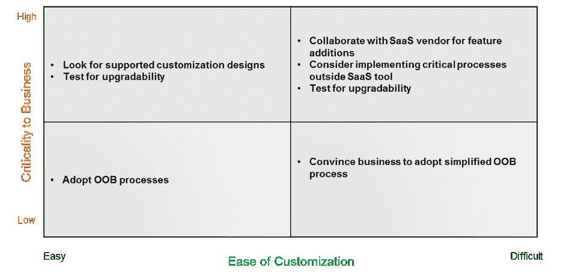

# 弥合 SaaS 的差距以满足业务需求

> 原文：<https://devops.com/bridging-the-gaps-in-saas-to-meet-business-needs/>

如今，软件即服务(SaaS)是应用消费的主流模式，特定行业和以业务流程为重点的产品越来越多。灵活性、缩短上市时间和成本优势是 SaaS 产品的最大优势和卖点。

SaaS 支持的业务流程允许企业实时提供反馈，从而实现平稳的变更管理流程。这种应用程序的灵活性也产生了更高的用户社区满意度和参与度。因此，Gartner 最近的预测预测，SaaS 市场规模在未来四年将以 18%的复合年增长率(CAGR)增长，到 2021 年将达到 1276 亿美元。

尽管有明显的好处，SaaS 模型也有自己的缺点，尤其是当应用程序影响关键的底层业务流程时。这些流程通常是一个组织独有的，很少是现成可用的(OOB)。一个组织需要的特定变更通常证明一个解决方案是不充分的，并且需要大的定制和允许的扩展。

如果解决方案的设计超出了软件最初的预期逻辑，可能会对 SaaS 解决方案的未来升级造成重大破坏。定制的替代方案是简化业务流程，使其符合 OOB 的特点。然而，业务用户拒绝采用新的简化流程，特别是当所讨论的流程是一个可感知的区别时。同时，为了迎合少数组织的需求而修改设计并不符合供应商的最佳利益。

## **建筑的关键作用**

业务流程架构必须与解决方案架构相协调。这就是为什么架构在 SaaS 实施中起着至关重要的作用。业务流程架构师需要量化业务流程的重要性，并利用这些见解在利益相关者之间建立共识，这些利益相关者包括业务用户、SaaS 提供商和 IT 部门。另一方面，解决方案架构师应该确保业务流程需求、产品功能的下游增强和 IT 处理升级的未来准备之间的一致性。

现在拥有业务流程和解决方案架构的架构师应该识别推动 SaaS 采用的业务 KPI，并度量对流程性能的影响。架构师可以使用差距和影响分析工具来确定业务需求和 SaaS 产品的 OOB 功能之间的差距。这些分析工具将产生一个需要进一步评估的定制列表。

## **SaaS 评估框架**

对 SaaS 应用程序的每次定制都应从两个方面进行评估:

2.  **潜在的业务影响/重要性:**当评估潜在的业务影响时，架构师应该从识别差异的来源开始。差异化可能源于面向客户能力的增强或运营效率的提高，或者两者兼而有之。绘制可衡量的量化结果，如 CSAT 评级、周转时间等。可以帮助定义潜在的差异化。
3.  **定制的简易性和成本:**总体拥有成本应作为评估定制简易性的主要方法，并在实施定制的简易性和维护解决方案的简易性之间进行权衡。虽然需要定义用于衡量定制的简易性和成本的参数，但需要考虑的因素包括设计类型、开发、维护和升级活动(例如插件/脚本开发)所需的时间和精力。

上述提议的评估还必须确定以下内容:

1.  没有所请求功能的影响。
2.  配置/定制解决方案以满足每项要求的技术挑战。
3.  无需重新应用定制即可升级 SaaS 应用程序。
4.  弥补提议的 SaaS 解决方案和现有流程要求之间的差距的行动列表。

如上图所示，定制需要根据它映射到哪个象限来区别对待。

## **适当确定定制的优先级**

应尽可能避免易于实施但不会给业务带来任何可衡量的好处的定制，以消除风险、节省精力并允许在其他地方进行投资。

同样，必须避免难以实施且对结果没有明显益处或影响的定制。相反，它必须说服企业采用 OOB 流程。

另一方面，易于实现和维护的关键定制应该被列入候选名单，以便采取进一步的步骤。由于有一个明确的商业案例来保证定制，架构师应该确保设计方法得到供应商的推荐和支持。

必须仔细检查需要困难定制的必备业务功能。考虑以下问题:它是否仍能提供可感知的上市时间优势？它会增加开发和拥有的总成本吗？它会影响可扩展性、可升级性和集成能力吗？

在某些情况下，SaaS 提供者可能在其管道中有功能增强，这将有助于实现这些必备的需求。如果是这样，IT 团队应该与提供商合作，影响和定义即将到来的产品特性。

如果这不是一个选项，一个替代方案是在 SaaS 解决方案之外实施关键功能，然后通过精心设计的后端和前端集成进行连接。例如，一些 SaaS 提供商允许客户在其平台即服务(PaaS)上构建复合应用。这些应用程序可以提供差异化的功能，而无需更改核心 SaaS 解决方案。但是，请记住，PaaS 应用程序需要与 SaaS 应用程序实时集成才能实现这一点。

如上所述，并非所有的业务流程都认为是定制的 SaaS 解决方案。应使用结构化框架来分类哪些定制将在任何组织的 SaaS 采用之旅中发挥关键作用。

所有定制都应由计划指导委员会审查和批准，该委员会由来自 IT、业务领导和 SaaS 提供商的利益相关方组成。所有相关方都需要清楚地了解为什么定制是至关重要的——这意味着业务利益相关方需要提供变通方法或流程变更不可行的理由。同样，IT 部门和 SaaS 供应商需要阐明升级的行动计划和路线图。这样，企业将获得向 SaaS 转移的全部好处。

— [莫诺伊·巴鲁阿](https://devops.com/author/monoj-baruah/)