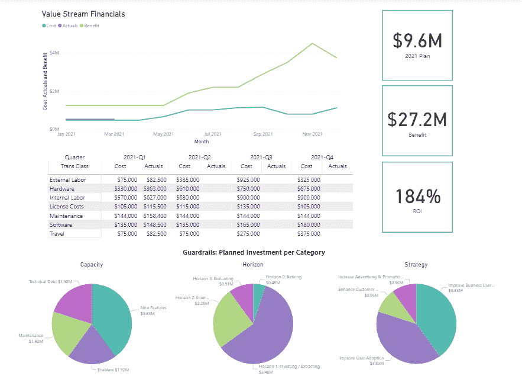

# Broadcom 将 VSM 平台加入 DevOps 产品组合

> 原文：<https://devops.com/broadcom-adds-vsm-platform-to-devops-portfolio/>

Broadcom Inc .今天在其 DevOps 产品组合中添加了一个专用的[价值流管理](https://devops.com/?s=value+stream+management) (VSM)应用程序，作为简化软件开发计划优先级的努力的一部分。

Broadcom 副总裁兼企业软件部门总经理 Serge Lucio 表示，虽然该公司以前在其工具中提供了 [VSM](https://www.vsmconsortium.org/) 功能，但其 ValueOps 产品组合的这一增加标志着 Broadcom 首次提供完整的 VSM 应用程序。

Lucio 补充说，该产品是独一无二的，因为它将 Broadcom 提供的 Clarity 项目管理软件中的 it 投资功能与用于管理敏捷软件开发过程的 Rally 平台相结合。

Lucio 指出，相比之下，VSM 的其他产品在将软件开发项目与实际财务成本联系起来方面没有提供相同的深度。Lucio 说，例如，Broadcom 平台除了显示软件项目和潜在开发人员能力问题之间的依赖性之外，还使 IT 组织能够预测资金变化对软件开发项目的影响。

事实上，Lucio 指出，在代码开发过程中跟踪代码是相对容易的。他说，揭示软件开发项目的财务影响需要额外的分析水平，这是 VSM 的竞争对手所没有的。

VSM 作为一个概念，其根源可以追溯到精益制造方法，这种方法要求对制造过程的每一步进行持续测量。随着软件开发从一门手艺发展成一个使用 DevOps 最佳实践尽可能自动化的过程，随着组织意识到他们现在是多么依赖软件来实现业务目标，对错过软件开发最后期限对业务的影响进行监控的价值日益增长。VSM 平台汇总了从开发运维工作流中收集的技术指标，然后将它们映射到由业务领导定义的关键绩效指标(KPI)。一旦定义了这些 KPI，就可以应用高级分析来评估软件开发进度的变化对业务的财务影响。

总的来说，Lucio 说，随着他们接受数字业务转型，组织正在发展他们的软件开发方法。组织现在管理软件开发的方式与管理产品开发的方式非常相似，而不是孤立地管理单个的软件开发项目。他说，其结果是，一系列相关的软件开发项目现在正以一种更好地与战略商业计划保持一致的方式进行管理。

目前还不清楚组织采用 VSM 平台的速度，但是随着组织中对软件开发有既得利益的利益相关者数量的增加，需要一种工具，使这些个人能够以一种不依赖于他们掌握软件开发团队所使用的项目管理应用程序的方式更容易地跟踪过程。

不管采用什么方法，组织中对软件开发的重视从未如此之大。这种日益增长的欣赏自然会在企业领导者中造成一定程度的焦虑，他们需要根据流程做出影响整个组织的决策，而如今他们对这些流程的了解往往有限。