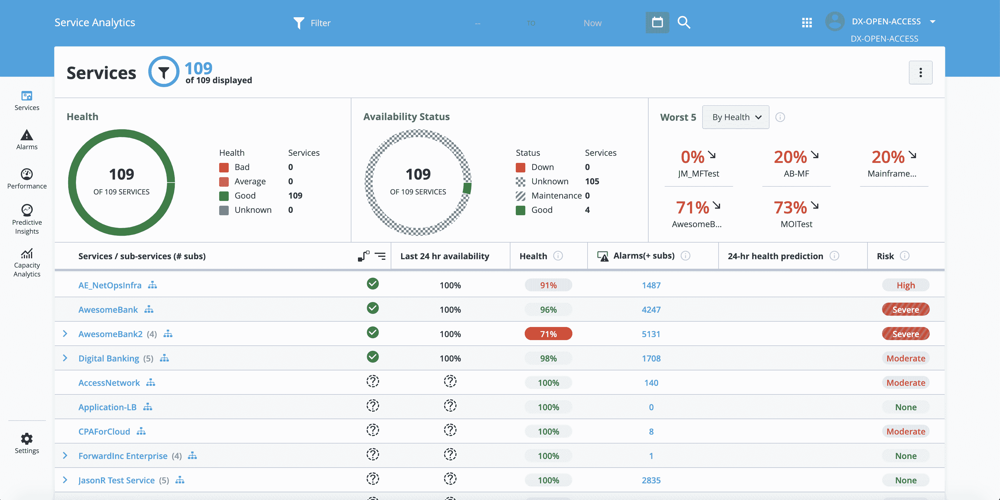

# Broadcom 扩大了 AIOps 平台的覆盖范围

> 原文：<https://devops.com/broadcom-extends-aiops-platform-reach/>

Broadcom 今天扩展了其 IT 运营人工智能(AIOps)平台的覆盖范围，通过与 15 个第三方数据源的集成提供全栈可观察性，包括 Dynatrace、Datadog、AppDynamics、PagerDuty、Splunk、ServiceNow、网络安全管理软件产品和微软系统中心运营管理器。

此外，Broadcom 的 AIOps 2.0 版本现在可以捕获芯片级别的数据，使 IT 团队能够实时对网络拥塞和数据包丢失进行分类。

最新版本还为不同的 IT 角色添加了可视化和仪表板，以及一个建议引擎，一旦平台发现问题的根本原因，IT 团队就可以自动执行任务。

Broadcom 企业软件产品和战略总监 Sreenivasan Rajagopal 表示，新方法允许 IT 团队根据问题的复杂性和业务的潜在风险来决定应用何种程度的自动化。

他说，总的来说，这些功能旨在通过创建一个持续的反馈循环，使人和流程更容易与业务成果保持一致，并指出，嵌入博通 AIOps 的机器学习算法需要大约 90 天才能开始实现这一承诺。

作为最新版本的一部分，其他功能包括附加的机器学习拓扑和相关性功能、因果图和智能情景分析，用于自动根本原因分析、噪音缓解、警报聚类和异常检测。Broadcom 还增加了一个机器学习算法、自然语言处理和本体图形拓扑的库，以实现情景关联。

最后，Broadcom 增加了容量分析工具，可应用于 IT 团队集体管理和维护的特定服务组。

Rajagopal 表示，人工智能得到更广泛的应用，使 it 团队变得更加敏捷，这只是时间问题。他指出，AIOps 不会取代 it 人员，它只会增强 IT 人员的能力。

Rajagopal 补充说，随着 IT 团队中老成员的退休，AIOps 也将变得至关重要。如果 IT 员工能够依靠 AIOps 平台提供的见解和建议，他们将能够更快地提高工作效率。

目前还不清楚 AIOps 平台将在多大程度上作为一个独立的实体存在，而不是传统的 It 服务管理(ITSM)平台，后者也正在注入机器学习平台。Broadcom 正在为一个独特的新 IT 运营平台提供理由，该平台依靠数据来协调人员、流程和平台。Rajagopal 说，实现 IT 灵活性的最大障碍不是工具，而是不同角色的人无法相互理解，因为没有每个利益相关者都可以访问的公共数据源。

无论选择哪种 AIOps 途径，很明显，it 团队管理 IT 环境所依赖的许多现有工具正在慢慢过时。事实上，可能很快就会有一天，IT 团队甚至不会考虑一个没有某种人工智能能力的 IT 管理平台。