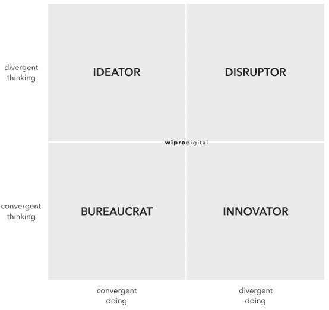
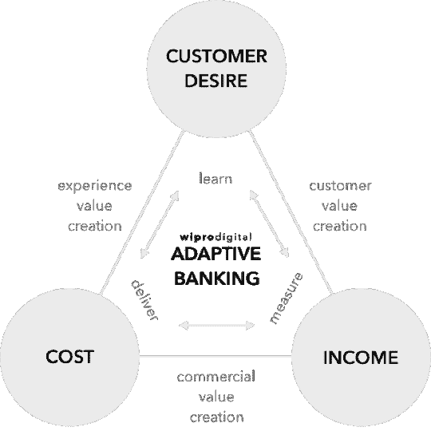
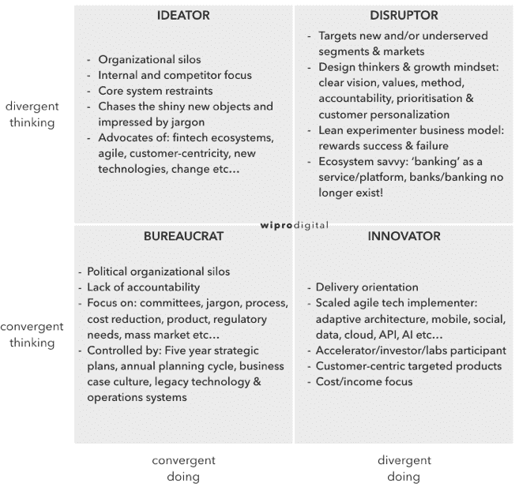

# 对抗银行官僚:从趋同思维到趋异行动

> 原文：<https://devops.com/bucking-bank-bureaucrats-convergent-thinking-divergent/>

作为老客户和新客户，我们与银行互动以及管理个人支出、借贷和储蓄的方式正在经历巨大变化。以应用程序和网上银行形式出现的新数字产品表明了以客户为中心的承诺，但总体而言，银行适应变化的速度很慢。绝大多数银行家确实认识到了应对行业数字化颠覆的战略需求，并正忙于评估和开发移动、区块链和人工智能等变革性技术，试图找到新兴市场的需求和稳健的商业模式。

## 银行应该如何适应？

银行的经营环境是不可预测的，因此需要组织的灵活性。这种敏捷性需要仔细分析客户需求和(潜在)能力。银行家们肯定会问，“我的银行如何才能从趋同思维转向趋异行动？”

从战略角度来看，有必要了解这个人/组织是想成为颠覆者、创新者、创意者还是官僚。这种差异化为他们定义了正确的战略选择。

*注意:对上述问题的一个快速代理答案是银行接待和组织在那里工作的人的设计，看看它是否像其他银行一样，或者在某些方面是独特的。*

## 价值三角化和差异化

每位银行首席执行官都需要一个清晰的战略来应对组织的内部和外部挑战。战略基础有一个全球共性:**每家银行都需要快速、频繁地进行变革**。一家银行在改善客户体验方面做得越好，它就越有可能在[颠覆者和创新者](https://hbr.org/2015/12/what-is-disruptive-innovation)的冲击中幸存下来。此外，大多数银行必须降低成本*和*推动收入。三角形的第三个角是客户需求，这不是一个熟悉的银行概念，但是一个成功的价值三角测量以最有效的方式传递客户需求。

这不是关于价值链映射和成本再造；它是关于用适应能力和资本轻的商业模式创造伟大的客户体验。整个组织，尤其是董事会、首席执行官和关键决策者，都必须理解并实践这三种价值观，以使适应性银行成为可能。

## 客户体验第一

集权化、以产品为中心和通过过程控制的文化抑制了变革。为了适应和创造自己的数字 DNA，银行必须形成新的工作空间和工作方式。当银行员工不使用自己公司的产品时，他们与客户体验脱节。他们也可能基于他们的组织知识原谅客户投诉。员工需要成为银行最重要的客户，并且应该感觉与其他客户和他们的经历完全联系在一起。

新的、精益的业务模式应该在整个组织中流动，并与期望的客户体验保持一致。确定“优先客户体验特征”的业务领导将把组织的重点放在加速交付势头上。领导者需要专注于不断推出和重新定义小规模的功能，而不是要求大规模的、以产品为导向的项目。

这样做可以摆脱年度计划周期中经常流行的大战略或银弹方法，并转向敏捷的、以客户为中心的战略。组织变革是创建具有数字 DNA 的适应性银行的基础。

## 快速失败，更快成功

为了加速增长，需要有适应性的技术架构和敏捷的软件交付方法来交付相关的特性。“交付、衡量和学习”方法将放大整个组织的反馈，以推动商业决策。这将允许银行快速倒闭，但更快成功。正在进行的循环——构思、设计、建造、运输、测量、学习和(当然)调整客户特征——需要成为常态。

通过变得具有适应性，银行的能力(人员、方法、技术、价值观)变得更加适应客户需求，从而更容易提供个性化服务。例如，银行的数据可用于创建个性化功能，允许客户根据自己的需求挑选合适的功能。客户应该总是能够覆盖算法提供的选择。

## 创新、变革和超越

目前，最明显的转型愿望和交付存在于 IT 部门，而不是业务部门。对于产品、金融、合规、营销和一线团队的大多数银行家来说，敏捷的工作方式通常还是陌生的。

银行业的剧本已经为数字时代改写了。这是一个激动人心的时刻，让我们认识到巨大的变化以及颠覆/创新如何成为商业现实——这意味着颠覆这个体系。

## 关于作者/达伦·奥迪

达伦·奥迪(Darren Oddie)是 Wipro Digital 的战略总监，他与全球金融服务公司合作，致力于数字化转型和创新。他拥有设计和建立金融服务品牌的实践经验，从一张白纸到企业和初创公司的行业领先主张。他很高兴银行和客户体验现在经常出现在同一个句子中。在[推特](https://twitter.com/DarrenOddie)上与他联系。