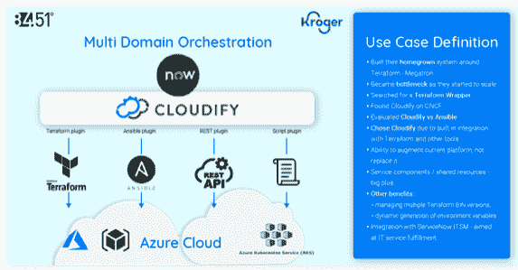

# 在地形上建造:进化，而不是革命

> 原文：<https://devops.com/building-on-terraform-evolution-not-revolution/>

Terraform 被企业和服务提供商广泛采用，他们将基础设施即代码(IaC)作为开发运维环境中基础设施配置自动化的模型。虽然这项技术有局限性，但寻求改变地形的创新是高度分散的，并且被不温不火地采用。这表明市场正在建立一个事实上的标准，因此，基础设施运营商不应试图用下一个伟大的创新来取代 Terraform，而是应该找到扩展和增强 Terraform 的方法，以满足他们的独特需求。让我们探讨一下 Terraform 的几个众所周知的缺点，该技术新替代品兴起的一些驱动因素，以及用户在考虑不同的道路时需要考虑的问题。

毫无疑问，Terraform 很大。在三大公共云中，Terraform 提供商的安装数量说明了问题:8 月底，AWS 的 [提供商安装量为 4.57 亿，Azure 和 GCP 各为 7200 万。是的，与 Ansible、Chef 和 Puppet 等较老的基础设施配置管理工具相比，IaC 作为一个类别仍然很早。但是，趋势很明显:IaC 正在大规模广泛使用，Terraform 是大多数企业使用的 IaC 平台。](https://www.terraform.io/)

Terraform 也有缺点，这也不是什么秘密。在 [上快速搜索 Reddit](https://www.reddit.com/r/devops/comments/9bhpe3/9_reasons_why_terraform_is_a_pain_and_1_making_it/) 和 [Hackernews](https://news.ycombinator.com/item?id=27434363) 会发现一连串的抱怨，有些比其他的更有效:

*   创建一个 Kubernetes 集群，然后向其中添加一个资源是很复杂的
*   挑战通过配置传递值或转储提升配置的纯表示
*   集群删除是一件痛苦的事情
*   对资源调配过程中发生的事情缺乏全面的了解
*   对驱动一切的粘合代码的需求消耗了开发人员的生产力
*   向后兼容性带来的长期挑战
*   持续更新的挑战和重构的需要
*   跨多个工作区和多个云帐户扩展
*   回滚可能很棘手，尤其是在处理不可变的基础设施时

当然，Terraform 的母公司 HashiCorp 一直致力于解决这些和其他棘手问题。但整件事凸显了一个有趣的问题:  为什么 Terraform 这么受欢迎？

Terraform 是满足开发人员需求的唯一 IaC 解决方案，开发人员需要一个 IaC 工具来保留状态，很好地适应他们的 CI/CD 管道，基于意图，并为他们提供正确的粒度级别。即使面临挑战，Terraform 在这些方面也优于其他选择。

原因如下:

Terraform 从一开始就是为开发者设计的，并以他们为目标。它维护状态并支持迭代，使 IaC 成为自动化基础设施的强大模型。相比之下，PaaS 解决方案对于大多数不需要或不想抽象出所有基础设施决策的开发人员来说不够健壮。大多数云管理平台都遭受着 [最小公分母问题](https://thenewstack.io/avoiding-least-common-denominator-approach-hybrid-clouds/) 的困扰，尽管技术在这方面有所改进，但这是一个开发人员普遍厌恶的粒度解决方案；它更适合于 it 管理的需求。作为一种选择，配置管理工具不是基于意图的，所以流程变得太复杂。

有趣的是，状态(维护您在定义文件中表示的资源和云提供商中的实际物理资源之间的映射)被添加到 Terraform 中，有助于解决基础设施漂移的问题。Terraform 也意识到开发者不一定需要 UI。HashiCorp 以开发人员为中心的设计理念的这些实际例子说明了为什么它被如此广泛地采用。

那么，是什么推动了人们对基础设施自动化新方法的兴趣呢？特定领域用例的激增和减少价值实现时间的持续需求是主要原因。特定领域的自动化选项正变得比 OOB 解决方案更占优势，因为它们需要太长时间才能实现自动化；一种工具不适合所有人。特定于域的自动化解决了诸如安全自动化、AIOps、DevSecOps、安全合规性、与容器扫描器的集成等问题，而不仅仅是通用的编排。人们非常快速地寻找价值，这只能通过特定领域的自动化来实现——因此，当出现不同的解决方案来解决这些情况时，就会出现碎片化。

有几个有趣的替代地形的方法。Terragrant 与 Terraform 一起使用，将其功能扩展到多个工作空间。它允许您在许多环境中使用相同的模板。Pulumi 是另一种替代方案，已获得一定程度的采用和知名度。它提供了本机代码支持，解决了 YAML 文件开发复杂性的问题。另一个更加雄心勃勃的项目是 Crossplane 开源项目。它采用以 Kubernetes 为中心的方法来创建一个通用的跨云控制平面。这在概念上看起来不错，但这是一种根本不同的方法，而且采用这种方法还刚刚开始。

转向一种地形替代物并不一定是个坏主意，但充满了地雷。最终，这种选择更多的是关于采用和生态系统动力，而不是技术。供应商和专业人员在围绕 Terraform 的工具、培训和技能组合方面的投资是一条令人生畏的护城河，不容易复制。赢得 Terraform 的工具必须赢得采用，而实现采用意味着提供 Terraform 用户目前享受的所有企业级功能和支持。《厨师》和《木偶》就是这样的例子。两者都是成功的技术，但它们对 Terraform 带来的挑战反应迟缓。最终，这些项目受到了传统思维的影响，并被 Terraform 更专注、更简单的解决方案所取代。

Terraform 的大部分问题在于大规模管理它。当您有许多工作区和模板时，管理就变得很困难；模板不能在各种环境中通用也是一个挑战，这会导致大量的模板冗余。此外，Terraform 仍然需要帮助处理第 2 天的操作和漂移检测的可见性。

当考虑如何扩展 Terraform 来处理更广泛的用例时，您应该首先考虑如何在您的环境中实现良好的互操作。如果你有多个云，多个服务层和多个云供应商，这可能是最重要的因素。此外，调查任何新技术支持对您的第 2 天运营至关重要的 Terraform 的能力。像秘密和状态之类的东西浮现在脑海里。您希望在新解决方案中有足够的管理和监控，而不会成为新的负担。您应该能够使用现有的 Terraform 文件，并且应该能够支持您运行的所有 Terraform 版本。遵从[治理](https://devops.com/?s=governance)和审计是关键，新解决方案应该支持您的内部/空隙环境和云环境的 Terraform。理想情况下，你添加到 Terraform 的任何东西都应该是开源的，消除了跨供应商锁定带来的新的复杂性。

【8451 如何发展其平台部署的架构

尽管有缺点，Terraform 仍然是 DevOps 组织在市场上的最佳选择，并且有一些方法可以更轻松地管理它，而不需要开发人员浪费太多时间编写粘合代码或一次又一次地重新发明轮子。实现这一点的一种方式是将 Terraform 与元编排工具相集成，使 Terraform 在大规模管理环境和工作空间时变得更加灵活。开源的 Cloudify 项目就是一个例子。

两年前，叶夫根尼·布里克曼在 T2 T3 做了一次演讲。当时，DevOps 还处于石器时代。今天，大概是在青铜时代。我们今天构建 IaC 的人被要求部署看起来像现代城市的基础设施，但我们必须使用的工具仍然相对原始。我们正在构建的东西需要太长时间来调配，往好里说，它看起来是定制的、有气质的，往坏里说，它是残次品、脆弱的。

这是一个一遍又一遍重复的故事:团队试图首先在 Terraform 上构建他们自己的、自主开发的解决方案作为包装器。最终，他们意识到这是不可持续的，因为缺乏工程资源成为了瓶颈。我们需要能够增强(而不是取代)他们已经构建的和有效的解决方案。那几乎总是地形。借助 Terraform，DevOps 组织可以获得一个成熟的 IaC 选项，该选项针对开发人员的需求，具有丰富的生态系统和市场。当考虑它的缺点时，最好采用进化策略，而不是从零开始。