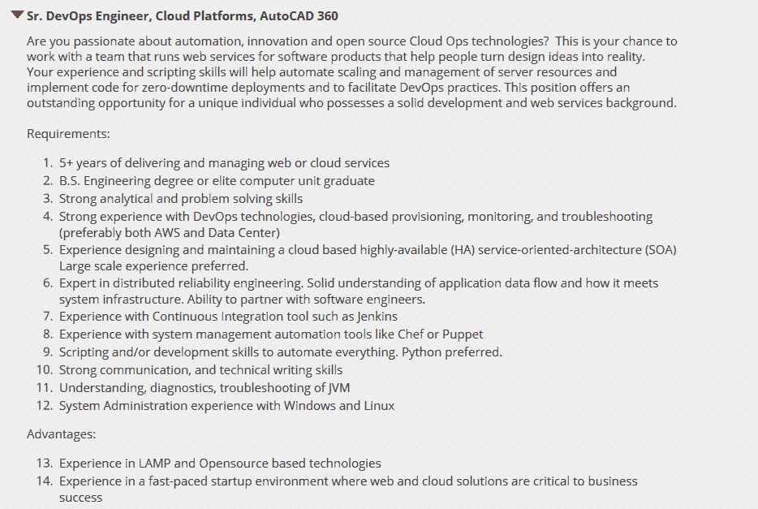

# 流行词滥用:DevOps 工程师的剖析

> 原文：<https://devops.com/buzzword-abuse-anatomy-devops-engineer/>

曾经，人们只用天才这个词来形容真正的天才*。具有非凡的智力和感知能力的人。今天，每个父母都用这个词来描述他们可能认知正常的孩子——这个词已经失去了任何好味道。我发现同样的趋势也适用于 [DevOps](http://getcloudify.org/tags/DevOps/) 。然而，这并没有阻止每个人说很多 DevOps，*(而且往往是在完全错误的上下文中)。**

### **问题是**

**现在很多招聘人员都在找“DevOps 工程师”。对“DevOps 工程师”的需求在过去几年中呈指数增长了数千%，这只是 indeed.com 的一个小趋势图和谷歌的一个片段。**

 **

我们经常听说公司在建立“DevOps 团队”和开发“DevOps 工具”。每个人都想要“DevOps ”,但不知道它是什么意思。

DevOps 的简短定义是最终的业务需求到客户到业务需求的周期(通常被称为最佳的“开发到生产周期”)。这在代码中会是什么样子:

(当然，这个片段非常宽泛地呈现了这个问题，并没有考虑严重的错误)

除了开发过程预计会自动发生之外，所有这些都不会对用户产生任何影响，而且监控非常智能，总能准确地指出问题所在。嗯。上面所描述的，当然是…乌托邦。

**现实检查**。大多数公司更有可能:

*   手动运行测试或根本不运行测试
*   监控错误的东西
*   以错误的方式对错误的问题做出反应
*   不能改善工作流程
*   不断重复上面的步骤，当更多的火出现时，试着去放火。
*   更多坏消息…

DevOps 旨在解决这些问题。

这是一种**文化**，其中**人**与**一起**到**改进**产品交付周期。

“在它的基础上，它需要良好的合作/沟通(与其他团队)，熟悉(与系统)，控制(对功能和故障)，短的开发到生产周期(这不是强制性的，但可以帮助防止重大错误)，以及质量测试”(nuff 说)。这实际上是对良好关系的一个很好的类比，除了它也需要自动化(使以上所有成为可能)，如果你想让你的物品留在房子里，这可能是你应该在你的关系中避免的事情。

## “DevOps 工程师”的感知剖析

我们来看看下面的职位描述。

# DevOps 专家

看到他们有什么奇怪的地方吗？是的， ***他们想要一个神*** 。

梦想 Errr…“devo PS 团队”基本上由以下人员组成:

*   Linux 专家(最好是世界上所有的发行版)
*   编码员(最好是 Python，Ruby，Perl，Bash，Batch，Powershell，Powerpoint…)
*   擅长 CM，CI，CD，NBA 和 NBC(所以他们一定知道大厨，木偶，詹金斯，哈德森，特拉维斯，Git…)
*   拥有丰富的云计算知识(例如..在天上？)
*   熟悉数据库(包括高可用性、灾难恢复、容错、故障转移…类似于一般的婚姻)
*   懂存储(WTF？)
*   知道监控(Nagios？实际上！)
*   了解网络…
*   了解大数据(越大越好)

总而言之，他们应该是一群什么都知道、什么都做的人，但是他们不开发应用程序(那是开发人员的工作)，也不手动安装服务器(那是运营人员的工作)。

甚至不要让我开始使用“DevOps 工具”——Puppet、Chef、Ansible、Cloudify、Saltstack、OpsWorks、Jenkins..这些都是“DevOps 工具”吧？不对！他们是 ***[自动化](http://getcloudify.org/cloud_orchestration_cloud_automation.html)*工具！他们不“DevOps”。它们自动执行，即 ***启用***“devo PS”。JIRA、HipChat、PagerDuty、CloudWatch、New Relic……这些都是交流、协作和监控工具。你明白了。**

没有“DevOps 工具”。开发人员有开发工具，因为开发人员是一种职业。就像铁匠有木槌一样。你能定义一套文化工具吗？钢笔、画笔和小提琴被认为是文化工具吗？不，它们是作家、画家和音乐家创作具有文化意义的作品的工具。

同样，还有自动化、协作和沟通工具，使 DevOps 文化能够实施到组织的 DNA 中。

当我们说 DevOps 时，我们的意思是:

*   我们使用 Puppet 来管理我们的服务器“配置”。
*   我们使用 Ansible 来部署我们的应用程序版本。
*   “我们使用 AWS 作为我们的基础设施”，“我们使用 Cloudify 进行我们的[编排](http://getcloudify.org)。

当我们说 DevOps 时，我们的意思应该是:

*   我们的开发人员和运营人员密切合作。
*   他们熟悉彼此的工作，这样开发人员就知道他们正在编写代码的系统，(并适应它)，运营人员知道他们正在部署的代码(并了解它如何影响系统)。
*   他们在短时间内开发，可以快速部署(基础设施和应用程序)以尽快克服错误，并在任何新错误出现时产生更小的问题(同样，不是强制性的，但可以有所帮助)。
*   在这个列表中还有很多项目…但是你得到了要点。

这是通过以下方式实现的:

*   保持代码整洁并有良好的文档记录，以便所有人都容易理解。
*   将我们的代码置于版本控制之下并进行备份，这样我们就可以在需要时随时回到我们环境中的前一个版本。
*   测试和监控系统最重要的方面，而不是我们不关心的方面。
*   自动化我们的基础设施，因为部署服务器和手动配置它们会使它们更容易出现人为错误。
*   自动化我们的代码部署，这样我们可以部署很多(这并不意味着我们必须部署很多)，而不会出错。

### 我们在哪里偏离了轨道？

文化是一个非常抽象和复杂的概念。它不像工具那样简单明了。

在这个过程中，我们采用了实现 DevOps 所需的工具和技能，并将它们命名为 DevOps。我们把处理这些工具所必需的技能添加到一个列表中，创建了一个工作描述，然后…剩下的就是历史了。

人们所说的"***【devo PS people】***通常(并不总是)是一个描述知道如何编码和自动化东西的操作人员的术语——“infra coders”。

所以相当多，你不能(嗯，你可以——就是没多大意义)有一个“***【DevOps 团队】*** 或者一个“ ***DevOps 工程师”*** 因为“devo PS”不是 ***一个东西*。**

它是 ***一个怎样的*** 。它没有回答这个问题:“你的工作是什么？”或者“你的团队是做什么的？”它的回答是:“你的公司是如何做到的？”。而且最重要的:DevOps，是“Devs**带 Ops”，而不是“Dev**和 op。”****

话虽如此，DevOps 不仅仅面向开发人员和运营人员。这是给所有人的。这与头衔或团队无关，而是关于一家公司如何以最佳方式处理将产品交付生产的过程。

“一切都是 DevOps”态度的问题在于，它让定义变得毫无意义。如果一切都是 DevOps，那么它就是一切和虚无，事实上没有任何意义。DevOps 已经是一个复杂的概念了。使它意味着一切，将使它实际上不可能实施。

最终，无论你如何称呼你的特种部队都没有任何区别。你可以叫他们“DevOps”，也可以叫他们 ***豆汤*** 。请确保不要欺骗自己，因为**在错误的** **上下文中不断使用 DevOps 这个词，**你的公司在**做 DevOps，**而你实际上做的一切**都是在使用木偶。**

***关于作者***

** 尼尔·科恩**——是 [GigaSpaces](http://www.gigaspaces.com) 的运营架构师，致力于 [Cloudify](http://getcloudify.org) 项目，也是 [DevOps Days Tel Aviv](http://devopsdays.org/events/2014-telaviv/) 的联合组织者。他是出色的开源软件包管理工具 [Packman](http://getcloudify.org/2014/06/18/packman-open-source-package-manager.html) 的幕后主脑。Nir 热爱系统架构，喜欢把自己想象成一个创新的、智囊团类型的人，他热爱挑战，对自动化和系统架构有着极强的亲和力。他主要致力于研究和部署新的系统和服务。对 Nir 来说，生活中最重要的是道德。在 [GitHub](https://github.com/nir0s) 上找到 Nir 或者在 [Twitter](https://twitter.com/thinkops) 上关注他。**