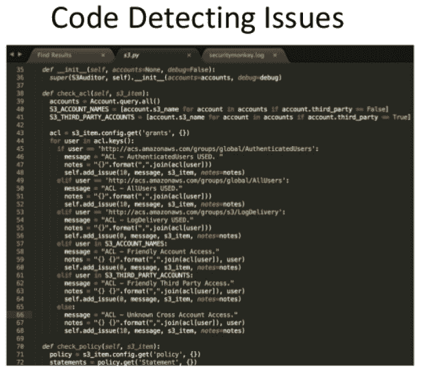

# DevSecOps 能阻止僵尸末日吗？

> 原文：<https://devops.com/can-devsecops-prevent-a-zombie-apocalypse/>

在任何 DevSecOps 计划中取得持续的进展通常是一项艰巨的任务。开发人员的数量往往大大超过运营人员，而安全责任却很少甚至没有。这使得 DevSecOps 注定要使用几十年前最初为内部环境设计的相同网络安全堆栈。尽管如此，我们的期望是在不损害安全标准的情况下，支持在云原生和混合环境中缩短部署周期。

为了完成如此高的要求，DevSecOps 团队配备了安全组和访问列表(更多的是相同的分布式防火墙技术),以保护基本上不再存在的边界。这篇文章将帮助你计算出在你的 CI/CD 管道被僵尸(真的)占领之前你还有多少时间，以及你能做些什么。

## **为什么云原生环境会受到基于规则的网络管理的阻碍**

基于规则的网络基础设施管理已经运行了几十年，并且毫无疑问将在未来继续支持许多企业，除非您的生产环境包括支持持续部署发布周期的公共云足迹。这时候事情开始变得有点奇怪。安全从业者没有放弃二元边界前提(内部与外部)并完全重新定义它，而是在公共云中重新创建了多个虚拟化边界。理论上，您至少可以启动与您运行的实例一样多的外围设备。不幸的是，在一个外围环境中运行良好的相同网络规则在拥有数百个支持动态变化需求的实例的虚拟化环境中会失效。事实上，云的本质是由应用层的业务逻辑驱动的，应用层在设计上与网络基础设施是分离的。这给云原生安全专家造成了一个两难境地，迫使 DevSecOps 团队手动将网络规则映射到高度敏捷和虚拟化的业务逻辑。没有人能够随着时间的推移真正地交付成果(并保持理智)。现实是，基于规则的网络管理永远跟不上云原生业务逻辑的要求。

## 官僚体制带来了极大的灵活性和安全性

不管 DevSecOps 团队有多熟练，或者他们有多大的积极性来领导持续安全部署的勇敢新世界，严酷的事实往往是令人失望的。虽然 DevSecOps 可能希望在不牺牲安全性的情况下交付敏捷性，但是实践者花费了大量的时间来实现这一点。几十年来，DevSecOps 被一种偏爱官僚主义而不是自动化的安全文化所困，倾向于使触发这种新兴实践的二分法永久化。在由创新和自动化驱动的云原生文化中，敏捷性是第一位的。这不可避免地成为一种徒劳的练习——您的部署越敏捷，您就越容易受到攻击。这意味着放弃基于规则的网络管理是一种可行的安全方法的想法。为每个实例管理几个专门的安全组(最多五个)的复杂性迅速失控。考虑到维护云的敏捷环境的必要性，许多团队有意识地在敏捷的祭坛上牺牲安全性，留下一个容易受到无限制访问的巨大攻击面。

## **欢迎使用云原生多边界安全**

面临的挑战是在任何敏感数据或工作负载受到危害之前，防止任何未经授权的代码(良性或其他)渗入云部署。如果没有强大的自动化来支持这一过程，这一挑战往往会被忽视。当这不起作用时，解决方案往往停留在官僚主义领域，只关注轶事症状而不解决根本原因。

不可避免的严峻问题不是*如果*你的部署处于危险之中，而是你有多脆弱以及多快可能会太迟。结果是可以衡量的，而且常常令人不安。下面是大多数开发人员熟悉的标准 KPI 清单:

1.  **CI/CD 管道未授权的流氓工作负载。**这些问题通常通过发现工具和临时网络扫描来解决，但往往被认为是不可避免的灾难。
2.  **错误的网络规则。**微分段计划通常会导致意外的工作负载间通信。通过 CI/CD 管道部署的工作负载可能无法有效通信，或者更糟的是，通过通信来支持适得其反甚至恶意的活动。
3.  **与第三方平台即服务的意外工作负载通信。**一个典型的例子是与 S3 等数据库的工作负载通信，这可能会导致数据泄露。记录在案的案例包括埃森哲(Accenture)和时代华纳(Time Warner)等领导者，他们无意中允许公众访问存储敏感客户数据和访问凭据的 S3 存储桶。
4.  **网络安全配置错误。**网络安全配置引入的漏洞往往几个月都得不到检查。这种无限制的访问通常被称为攻击媒介，它使未经授权的行为者能够渗透到一个巨大的云原生攻击面。
5.  **消耗资源的僵尸工作负载。充其量，你只是在浪费资源。很多时候，这些僵尸工作负载中的一个正忙于加密劫持，在不被注意的情况下挖掘你公司的加密货币。加密劫持非常猖獗，它已经在 2018 年超过勒索软件，成为最受欢迎的攻击载体。**

坏消息是，没有云部署可以使用熟悉的技术完全消除上述问题。然而，您可以减轻一些损害:使用您最喜欢的开源工具更定期地扫描您的网络(查看一个在 Ryan Hodgin 展示的 [网飞安全猴子](https://www.slideshare.net/RyanHodgin/netflix-security-monkey-overview/13?src=clipshare) 上实现的很好的例子)。永远不要让整个网络平台允许任何人不受限制地访问。理想情况下，请花时间评估旨在保护云原生部署的新技术。

DevSecOps 团队逐渐接受云原生部署需要一个基本的范式转变，以在不牺牲敏捷性的情况下维持可防御的安全态势。许多人(包括本文作者)认为，我们正在见证一场云原生安全革命，就像 20 世纪 90 年代互联网引发的革命一样。DevSecOps 当然可以解决上面描述的症状，但是如果安全策略仍然停留在网络层并依赖于官僚主义，它们将继续失败。

— [Ran Ilany](https://devops.com/author/ran-ilany/)