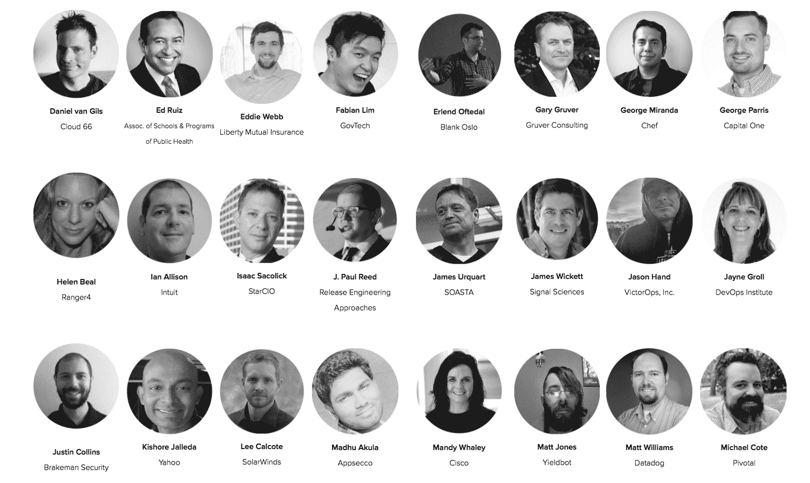

# 我不能去 DevOps 会议

> 原文：<https://devops.com/cant-go-devops-conference/>

去年，我参加了 18 个 DevOps 会议。在每次会议上，我看到了一些精彩的演示，遇到了令人难以置信的人，并扩展了我对最新实践的知识。虽然我作为 Sonatype 的 DevOps 倡导者的角色使我能够参加所有这些会议，但不是每个人都有时间、预算或批准一年参加一次活动。

## 为大众服务

这就是去年我和我的同事马克·米勒创办全天 DevOps 会议的原因。我们的梦想是为大众建立一个 DevOps 会议。我们决定在 15 个小时和 15 个时区内提供 57 个在线会议，注册将是免费的。我们最初的目标是看看我们是否能找到 1000 人参加(因为这在当时听起来是一个很大的数字)，但免费在线活动的想法像病毒一样传播开来，我们最终有超过 13，500 人注册参加。

会议期间的每一场会议都由 DevOps 从业者分享。我们有一个简单的会议规则，那就是:*没有供应商推销*。

## 团队时间

人们还告诉我们，他们很重视有机会与他们在 DevOps 会议上遇到的其他与会者交谈，所以我们为全天 DevOps 建立了一个免费的 Slack 频道。会议结束时，我们记录了演讲者、与会者和组织者之间的 10，000 多次对话。此次会议最吸引我们的一点是，埃森哲、Capital One、爱立信、甲骨文、Target、Telstra 和许多其他组织都有 20 多名员工参加了此次活动。其中一些有数百个。他们都不需要批准旅行、酒店或会议费用。他们只是在家或办公室观看并参与谈话。

这里是一些在去年的活动中就我们的 CI/CD、现代基础设施和自动化安全跟踪发表演讲的人。今年，我们还在议程中增加了一个政府发展项目。

这次活动非常成功，我们再次将其列入日程。[全天 DevOps 2017](http://alldaydevops.com/) 将于 10 月 24 日举行。它是在线的，免费的，今年的活动将持续 24 小时。因此，无论你住在哪里，只要你有网络连接，你就能收听我们的节目。

## 一些需要知道的事情

1.**您可以在****【www.AllDayDevOps.com】**免费注册。邀请您的整个 DevOps 团队加入。从 2016 年开始，每个注册用户都可以免费观看所有 57 场录制的会议。

2.**[**CFP 开放**](https://www.papercall.io/alldaydevops-2017) **至 5 月 31 日**。如果你有故事要分享，我们希望听到你的声音。请记住，不允许供应商推销。**

**3.**全天 DevOps 是一项社区活动**。去年，超过 40 家 DevOps 聚会和软件公司帮助我们传播了这个消息。对于那些提供帮助的人，我们在网站上添加了他们的标志。今年也是如此。在这里申请成为[的支持者。](http://www.alldaydevops.com/become-a-supporter)**

**请加入我们今年的活动！**

**最后，非常感谢 DevOps.com，它帮助我们向所有读者宣传了去年的活动。我们很高兴他们能帮助我们宣传 2017 年的会议！**

**— [德里克·威克斯](https://devops.com/author/derek-e-weeks/)**