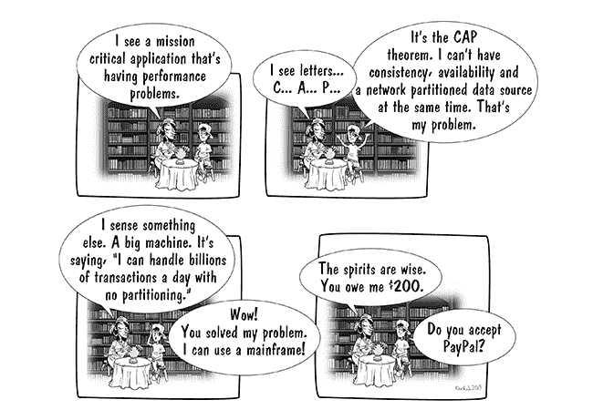
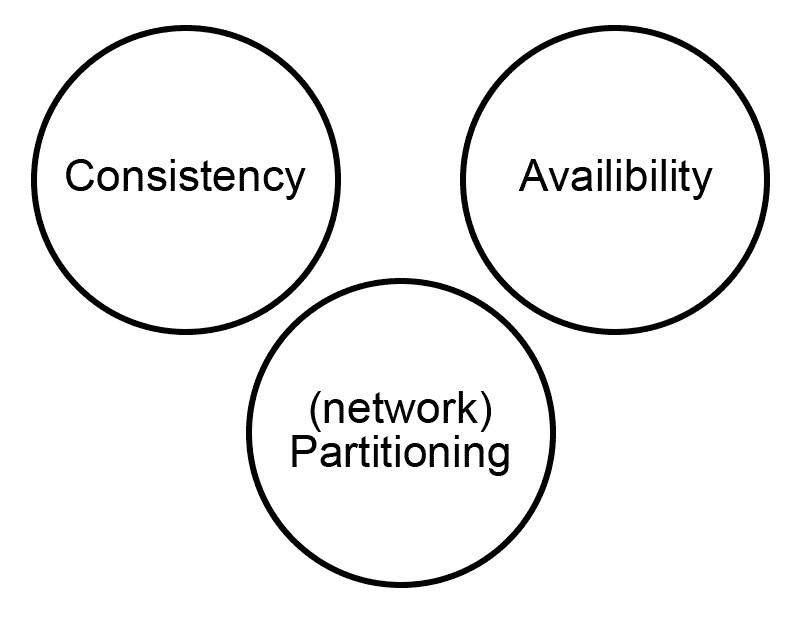
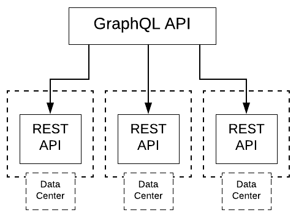
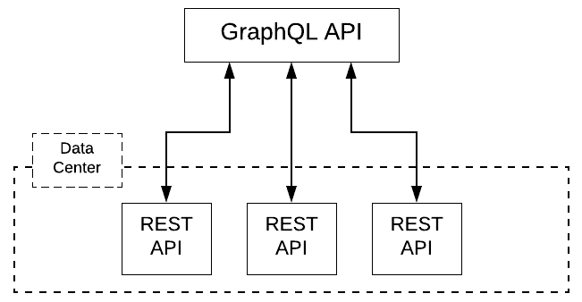

# CAP 定理不适用于大型机

> 原文：<https://devops.com/cap-theorem-no-match-for-mainframes/>

现代分布式计算中最大的问题之一是数据管理。如今，数据分散在各处。因此，在您需要的时候获取您需要的数据就成了一个问题。更广泛的分布会产生更多的网络延迟。如果你有一个系统，其中一些机器在加利福尼亚，另一些在纽约，逻辑表明数据从一个海岸到另一个海岸比从同一个地理位置传输要花更多的时间。这是常识问题。

随着互联网的发展，分布式系统产生的数据管理问题变得更加突出，互联网本质上是高度分布式的。加州大学伯克利分校的计算机科学家 Eric Brewer 在 1999 年发表了一篇论文，将分布式系统中的数据管理动态描述为一组不可变的约束。布鲁尔以 CAP 负责人的身份发表了这项工作。三年后，麻省理工学院的塞思·吉尔伯特和南希·林奇证明了这个原理是一个定理。今天，CAP 定理是设计和实现 web 级应用程序时的核心考虑因素。

简单地说，[上限定理](https://en.wikipedia.org/wiki/CAP_theorem)断言，当你的数据分布在各种机器和地理位置上时，如果你想要最新、最准确的数据，你必须等待。而且，如果你不想等待，你得到的数据很可能是陈旧的。但是，如果数据驻留在一台机器上，那么一切都会改变。在这种情况下，您可以随时按需获得最新数据。

当然，拥有单一数据源意味着拥有一台支持 web 级需求的机器。可悲的是，x86 机器还没有被制造出来。但是大型机可以。此外，它不仅可以处理巨大的操作负载，而且在适当的情况下，它还是满足当前需求的一种经济高效的方式。

请允许我详细说明。

## CAP 定理解释

在我们详细讨论为什么 IBM Z 或 LinuxONE 等大型计算机能够以合理的价格解决 CAP 定理提出的问题之前，让我们先来看看这个定理本身。

本质上，CAP 定理断言在分布式系统中数据管理的三个方面——一致性(C)、可用性(A)和分区容差(P)——在任何时间点只能有两个。

Figure 1: The CAP theorem dictates that of the three aspects of data management in a distributed system, only two are available at any point in time.

换句话说，如果您希望立即从数据源获得最新的信息(一致性)(可用性)，那么该信息需要存储在一个单一的、防故障的位置(分区容差)。如果您希望将数据分布在许多机器上(分区容差)，要么数据在某个时间点是准确的，但不是立即准确(一致性)，要么您可以立即拥有数据，但它可能是陈旧的，等待更新到最近的状态(可用性)。

CAP 定理不仅仅是理论上的。它对公司有实际的运营影响。一个很好的例子是网飞在实施其 [Monet](https://medium.com/netflix-techblog/our-learnings-from-adopting-graphql-f099de39ae5f) 系统时遇到的问题。

## 网飞被封顶了

回到 2018 年左右，网飞决定使用 [GraphQL](https://graphql.org/) 实现一个正在设计中的内部广告管理工具，GraphQL 是一种源于脸书的开源 API 规范，在许多以网络规模运营的公司中变得流行。事实上，GraphQL 仍在不断普及。所以网飞决定冒险在一个名为 [Monet](https://medium.com/netflix-techblog/our-learnings-from-adopting-graphql-f099de39ae5f) 的内部项目中采用 GraphQL。

网飞决定实现 Monet 的方式是让 GraphQL API 服务器充当现有 RESTful APIs 的门面。想法是获得 GraphQL 提供的好处，同时尽可能多地重用现有代码。想法是好的，但实际部署却不尽如人意。一旦莫奈被投入生产，它跑得很慢。

原来 REST APIs 分布在各种数据中心中(见图 2)。网络延迟正在扼杀他们。

Figure 2: Initially Netflix’s Monet system queried data from a variety of data centers.

该公司的解决方案是将所有的 REST APIs 整合到一个数据中心(见图 3)。

Figure 3: Netflix improved Monet’s performance by moving all RESTful APIs into a single data center.

结果呢？一旦所有数据都驻留在同一个数据中心，性能就会显著提高。有道理。更短的传输距离意味着整个系统的延迟更少。

这和 CAP 定理的关系很有趣。请记住，根据 CAP 的说法，随着分区下降(P)，一致性(C)和可用性(A)上升。因此，虽然网飞确实没有使用单台机器作为数据源，但是将所有东西都转移到一个数据中心就创建了一个虚拟数据源。是的，数据中心内可能存在延迟问题。但是，机架到机架的延迟远远没有地理位置之间的延迟高。我们说的是 1 到 10 毫秒的差别，而不是几百毫秒，如果不是几千毫秒的话。

在网飞的案例中，该公司通过减少地理位置级别的分区宽度来解决 CAP 定理带来的限制。所有数据都存放在同一个数据中心。想象一下，如果可以在机器级别上减少分区大小。如果数据不是分布在同一个数据中心的多台机器上，而是实际驻留在一台机器上，会怎么样？分区大小将减少到一个。然后，应用程序可以立即获得最新的数据。所需要的只是一台能够处理负载的机器。这就是使用大型机发挥作用的地方。

## 大型机是为大数据和敏捷开发而构建的

大型机从一开始就旨在能够存储和处理大量数据。今天，世界上 80%的数据仍然驻留在大型机上。正如关于这个主题的前一篇文章中提到的，一台大型机每天可以处理 25 亿个事务。这相当于一天内有 100 个[网络星期一](https://en.wikipedia.org/wiki/Cyber_Monday)。这种强大的计算能力相当于数据中心中的几个商用硬件机架。事实上，在某些情况下，一台大型机可以提供整个数据中心的计算能力。

所以，让我们回到网飞问题。如果不是将这些分布式 RESTful API 重构到一个数据中心，而是将花费的时间和金钱用于将这些 RESTful API 重构到一个大型机中，会怎么样？是的，有一些技术障碍需要克服，但是考虑到现在在大型机上运行 Linux 是标准的，这并不像我们在谈论将一堆 Python 代码转换成 COBOL。从标准的 RDBMS 数据库如 [DB2、](https://www.ibm.com/us-en/marketplace/db2-devops-experience) [Oracle](https://www-03.ibm.com/support/techdocs/atsmastr.nsf/5cb5ed706d254a8186256c71006d2e0a/94618cab4b69456486258415005c507b/$FILE/Oracle%20DB%2019c%20on%20Z%20servers%2006JUN19.pdf) 到 NoSQL [MongoDB](https://www.openmainframeproject.org/wp-content/uploads/sites/11/2016/10/omp_mongodb_techbrief.pdf) 都可以在大型机上完美运行。有工作要做，但重新发明轮子不是任务之一。使用大型机是一个可行的解决方案，除了一个棘手的小问题:传统的想法是使用大型机非常昂贵。因此，倾向于商用硬件机架或简单地采用云服务。

## 大型机是一种经济高效的解决方案

大多数 IT 商店的普遍看法是，只有大银行、保险公司、政府和大型制造商使用大型计算机。对于中小型企业来说，它们太贵了。虽然许多大型机的价格可能超过 100 万美元，但仍然有令人惊讶的实惠型号。例如，一台入门级的 IBM z114 大约要 75000 美元。

如果您是一家每月在 AWS 或 Google 云计算资源上花费 50，000 美元的公司，那么对于您每年在云提供商上花费的 600，000 美元以及随之而来的延迟，您的公司不仅可以负担得起入门级 IBM Z 系统来处理生产负载，还可以负担第二个系统作为备份，以防出现故障。

就系统管理而言，在 DevOps 世界中，几乎所有常用于支持现代 CI/CD 流程的工具都有用于大型机实现的[对应的对等物](https://developer.ibm.com/mainframe/)。就像采用任何不熟悉的技术一样，有一个学习曲线。但是，再说一遍，我们不是在重新发明轮子。工具、资源和专业知识是存在的。采用只是遵循大中型公司典型的标准变更管理实践的问题，这些公司定位良好，并使用大型机来利用实现经济高效的无分区数据源策略的优势。

## 将大型机技术集成到 DevOps 驱动的生态系统中

大型机能够以开放、敏捷和协作的方式进行开发操作。支持大型机参与 CI/CD 流程所需的工具、资源和专业知识如今已经存在。例如， [Zowe](http://zowe.org) 是一个开源软件框架，它提供的解决方案允许开发和运营团队像任何其他平台一样在大型机上安全地管理、控制和开发。[z/OS 的 DB2 DevOps 体验](https://www.ibm.com/us-en/marketplace/db2-devops-experience)是基于 Zowe 的第一批商业产品之一。它允许 It 控制大型机数据库、其业务规则和标准，同时允许开发团队使用自助服务和与现代 CI/CD 工具的集成来独立工作，以更好的质量和开发实践来加快他们的应用程序发布时间。

仔细想想，在某些任务关键的情况下，使用大型机随时获取最新数据不仅从技术角度来看有意义，而且从投资回报的角度来看也很有吸引力。诀窍是能够识别正确的用例。当然，如果你有 90%的用户在加利福尼亚，而你有一个位于班加罗尔的主机，物理定律将适用。将比特从主机转移到用户需要时间。但是，如果您遇到用户和数据在大陆附近的情况，使用大型机作为标准数据源开始变得非常有吸引力。

同样，拥有正确的用例是关键。但是，在其他条件相同的情况下，将大型机用于敏感的、数据驱动的应用程序值得认真考虑。

## 把所有的放在一起

CAP 定理对分布式计算的限制对于那些设计和实现 web 规模的大型应用程序的人来说仍然是一个挑战。对于提供面向普通消费者的内容的简单网站来说,“选择两个”的限制可能是一个烦恼。但是，对于大规模的数据密集型应用程序，立即获得准确的数据不是可选的，而是必不可少的。因此，使用大型机技术创建无分区的数据基础设施成为解决 CAP 定理所带来的限制的可行方法。在适当的条件下，让大型机成为应用程序数据的中央存储库，可以提供与基于商品的云提供商相比难以企及的巨大投资回报。

使用大型机的好处是，当谈到上限定理时，您仍然只能选择两个，但您可以选择的两个是一致性和可用性。在事情的发展过程中，这两点是最重要的。

鲍勃·雷瑟曼