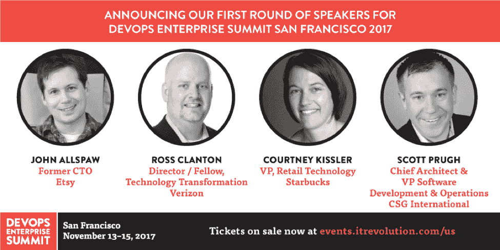

# 从顶级技术领导者那里学到的职业经验

> 原文：<https://devops.com/career-lessons-learned-top-tech-leaders/>

在技术领域，我们正处于一个难以置信的颠覆和创新的时代。很多年前，我的朋友和《DevOps 手册》的合著者约翰·威利斯(John Willis)预测，十年后，学术界将把这一时期称为“寒武纪大爆发”——这是一个令人难以置信的充满活力的 2500 万年时期，导致了细胞生命形式令人难以置信的多样化，包括复杂的多细胞生物的出现，为我们今天看到的生命多样性奠定了基础。

类似地，在过去的十年里，我们已经看到几乎每个技术领域都出现了令人难以置信的创新和颠覆:云计算、容器、虚拟化；敏捷、迭代开发、持续集成和部署，以及自动化配置管理。

如果这一切变化势不可挡，你可以被原谅；我想在我们的职业生涯中，我们都有过这样的时刻，“我不确定我是否准备好学习如何应对下一件大事。”即使是热爱学习的人也会变得愤世嫉俗，或者只是对变化感到厌倦。

但是我们中的大多数人，也许经过一些冷静的思考，会认识到在技术领域从来没有比现在更有趣的时候了。许多这些新的技术和实践带来了更好的工作方式，在最初的学习曲线之后，我们再也不会回到旧的方式。我相信这实际上需要兴奋！而且，我不是一个人。

我们最近举办了一场[实时聊天](https://www.youtube.com/watch?v=-2fALdXtZVY)，多位技术领域的领导者在过去的 [DevOps 企业峰会](https://events.itrevolution.com/us/)上发表了演讲。由于我们正在全力准备今年 11 月在旧金山举行的下一次活动，我们请我们尊敬的小组成员分享他们在技术领域的职业生涯以及他们对学习和变革的热情。能够从 LeanKit 的 Dominica DeGrandis、DORA 的 Nicole Forsgren 博士、CSG 国际的 Erica Morrison、雷神的 Terri Potts 和洛克希德·马丁的 Robin 叶曼那里获得灵感是一件非常愉快的事情。在讨论过程中，每个人都分享了他们是如何在技术领域起步的，以及他们在过去 20 年中在该行业学到的许多经验教训。在整个讨论过程中，大家一致认为，虽然事物在快速发展，但这是一个令人兴奋的时代，充满了不断学习的机会、大量的增长空间以及尝试新工具和流程的时间。有关讨论的完整视频回放和文字记录，请参见下文。

此外，别忘了[注册](https://events.itrevolution.com/us/register/)参加 2017 年旧金山 DevOps 企业峰会，聆听更多技术领袖的演讲，并一瞥他们组织的 DevOps 之旅。7 月 31 日前可享受早鸟价格折扣！

[https://www.youtube.com/embed/-2fALdXtZVY?ecver=2](https://www.youtube.com/embed/-2fALdXtZVY?ecver=2)

Gene Kim: 大家好，欢迎收看本期 DevOps 企业峰会实时聊天。今天，我们和一群我认识多年的人聚在一起，他们是我真正钦佩的人。他们都是 DevOps 企业社区中的专家和领导者，正在帮助形成许多实践，这些实践在未来十年中几乎肯定会在技术组织中变得司空见惯。在过去的 20 年里，我一直在研究高绩效的技术组织，最近我开始研究变革型领导者，并试图理解他们是如何成为变革型领导者的。我发现有趣的是，有证据表明这些特性不一定是天生的，而是后天习得的。

在接下来的一个小时里，我的目标是了解这个小组中的这些领导者，他们的职业生涯和经历塑造了他们今天的样子。我期望的结果是，我们都将学到一些东西，可以整合到我们各自的旅程中。在接下来的一个小时里，你肯定会发现，这些人都很棒。提醒一下，即将到来的 DevOps Enterprise San Francisco 活动将于 11 月 13 日至 15 日举行，如需了解更多信息，请访问 events.itrevolution.com。提醒一下，早鸟定价将于 7 月 31 日结束。

让我们快速浏览一下小组，每个人都可以介绍一下自己、姓名、公司角色、您何时介绍了 DevOps Enterprise 以及您的演讲内容，并且可以自由发言，分享您最自豪的职业成就。多米尼克，从你开始吧。

多米尼克·德格兰迪斯:好的。嗯，我是一名构建工程师，花了 20 年时间来了解在什么环境中什么服务器上有什么文件的什么版本。目前，我是 LeanKit 的培训和教练总监。我已经连续四年在 DevOps 企业峰会上发言了，主要是谈论经验报告和指标，以及让事情变得可见。我想，我最专业的成就，我认为是找到我的勇气站在一群人面前，解释或展示数据，并展示如何用指标获得领导的认同。

金:太棒了，谢谢。艾丽卡·莫里森。

艾丽卡·莫里森:大家好。我是奥马哈 CSG 国际公司的软件开发和运营总监。过去几年，我们在 DevOps 企业峰会上讲述了我们在 DevOps 领域的历程，我们将继续讲述这一历程。我最自豪的事情，可能是在我的职业生涯中带来最多挑战的事情，实际上是在 DevOps 领域。在过去的一年里，我们经历了一次相当大的转变，带来了许多团队，但特别是一个团队，他们在稳定性和自动化方面取得了实质性的进步。参与其中真的很有趣。

顺便说一下，在 DevOps Enterprise 的每一年中，跟随您的经验报告一直是我的最爱，太棒了。罗宾。

罗宾·叶曼:嗨，我是罗宾·叶曼，洛克希德·马丁公司的研究员。我在国防工业的工程领域工作了大约 23 年，涉及从潜艇到卫星的所有东西，以及介于两者之间的所有东西。我认为我最大的成就是能够看到变化。当我第一次开始在 DevOps 中做敏捷时，你真的看不到它，但是现在我开始从客户那里得到合同和 RFP，逐字重复我以前告诉他们的。看到影响力摆在那里，很酷。它可能没有我希望的那么快，但它就在那里。

Kim: 太棒了，然后你讲了 DevOps Enterprise 在旧金山和伦敦的最后两年。

叶曼:你说得对。是的，过去两年在改造大型传统组织方面。诺斯罗普·格鲁曼公司的苏珊蒂·约翰逊和我本人来自洛克希德·马丁公司，因为我们都有非常相似的经历。

**金**:牛逼。谢谢你罗宾。妮可。

妮可·福斯格伦:是的。大家好，我是 Nicole Forsgren，DevOps Research and Assessment 的首席执行官兼首席科学家，又名 DORA。我花了几年时间在 IBM 从事软件开发和企业存储，后来我获得了博士学位。这可能是我最引以为豪的职业成就，因为我在过去 10 年里一直在学习和研究基本上被称为 DevOps 的东西，然后将我的发现应用到行业中，并与 Gene 和 Jez Humble 以及 Puppet 的团队一起研究 DevOps 报告。我们都经历过 2000 年的网络泡沫破裂，我们看到许多公司倒闭，我不想再看到这种情况。真正有助于在行业中产生影响，让事情变得更好，对我来说是一种成就。

Kim :太好了，谢谢你，Nicole，我想每年 DevOps Enterprise 都有你的演讲。太棒了。特瑞·波茨。

特丽·波茨:大家好，我是特丽·波茨。我来自雷神公司，是软件开发机构的技术总监。像 Robin 一样，我们主要专注于与国防和英特尔社区相关的合同。我从软件开发行业起步，实际上是在空军，并在那里度过了 11 年，通过晋升来到雷神公司，在做了几年开发后成为一名架构师，并自 21 世纪初以来一直是技术变革的倡导者。

我在 DevOps 企业峰会上讲过几次。一次是关于我们的遗留转换，因为我们已经存在很长时间了，我们的很多代码都很旧了。去年，我谈到了如何建立可以支持您的 DevOps 转型的员工队伍，因为很难走出去雇佣这些人，一些关于如何做到这一点的想法。

太棒了，非常感谢你，泰瑞。顺便说一下，我记得在 2014 年的 IBM 互联大会上见过您，您实际上是 DevOps Enterprise 的首批发言人之一，对此我非常感谢。

首先，让我陈述一下我的一个假设，那就是尽管事物在快速变化，但在技术领域，这是一个从未有过的有趣和激动人心的时刻。事实上，变化的速度让许多专业人士对我们的生活和职业感到恐惧，但我真诚地相信，最好的时代还在我们前面，而不是在我们后面。你们相信吗？如果是，为什么？艾丽卡，我们能从你开始吗？

莫里森:当然可以。我想起当我从大学毕业并获得计算机科学学位时，我专注于编写一种语言并把这种语言写好，现在我们已经有了无数不同技术、不同语言的激增。就像你说的，节奏越来越快了。我们实际上在这里举办了一次黑客马拉松。我们已经为大学生做了两个，他们使用的一些不同的技术绝对让我震惊，但我发现继续为所有这些不同的东西进化是非常有趣的。这不再只是一个小小的专用空间，而是不断学习我喜欢做的新东西。每天都有新的挑战，让我们对工作保持兴趣，让工作成为终身学习者。我喜欢在我们的职业生涯中不断学习，现在只是专注于学习不同的东西。

金:牛逼。罗宾，你呢？

叶曼:我完全同意。我真的认为这是最激动人心的时刻。就像 Erica 说的，大学生带着 15，20 种不同的语言进来，他们带来了各种新技术，他们带来了游戏化。他们确实带来了一些不同的领导风格。很刺激。我知道我们的一些工程师会紧张，但如果你抓住机会加入其中，那会很有趣。

老实说，这是我喜欢科技的一点。我是说，这让我很投入，让我很兴奋。当我做一些开发工作的时候，总是有新的东西要做。就像你说的，总会有另一部分。事情总有另一面。我们在越来越复杂的系统中工作，这确实非常非常困难，在我们的评估中，这是我们在与有 DORA 的公司合作时看到的情况。你必须确保你能集中精力，但是你需要知道你的限制是什么，特别是当我们在进行技术变革的时候。我们需要确保我们能够专注于最重要的事情。我们需要确保我们可以限制我们的鞭子，我们可以专注于我们的约束，我们可以确定最重要的事情是我们没有蔓延，只是造成技术债务。但是，我认为这正是我们的工作富有挑战性、令人兴奋和有意义的原因。

我喜欢变化，这也是为什么我的职业生涯会让我有今天的成就，因为你接触的不同事物越多，我认为你就越全面，你就越能适应新技术。我今天看到的是所有的技术变化，特别是自动化，我们许多人都在经历这种转变，我一直认为这是一件苦差事。如果你在某个工厂工作，让我们将所有的苦差事自动化，然后让我们的团队有时间探索更多关于分析或机器学习的东西。这让我很兴奋。

是的，你让它听起来很令人兴奋。多米尼克，你在笑。

嗯，我只是在回想我获得计算机科学学位后的第一份工作。当时更多的是配置管理，即从 IBM 获取磁带上的所有内容，并将其放在某个安全的库(物理库)中，以便将其部署到生产中。但我认为对我来说，这只是现在有大量的机会。对于每个人来说，无论他们是否拥有计算机科学学位，都有大量的机会去分享。现在分享和学习的能力比以前强多了。

金:那是真的。我是说，现在是学习的最佳时机。如今似乎没有入场费。

绝对是。

金:我想这不是你在职业生涯中第一次看到这个行业发生如此巨大的变化。如果你能告诉我们那段时间，以及它如何影响你对自己的技能、职业和未来的看法，我会很高兴。罗宾，你介意开始吗？

叶曼:当然可以。当我刚开始时，我们有很多 ToR 趋势和 ad a，我担心 ADA 的下一代，以及他们是否能跟上。所以，就像多米尼克和其他人说的那样，我晚上花了很多时间努力学习，确保我能保持领先，因为我和这些了不起的工程师一起工作，我不想落后。我现在也在做同样的事情。

Kim: 顺便说一下，我的意思是从 1 到 10 的范围内，你的恐惧程度是多少？一种是这只是另一本书不要害怕，10 是存在主义的害怕，“我可能无法完成这本书，因此我的职业生涯结束了。”

叶曼:我和一些工程师一起工作——他们很聪明，让我感到害怕。我会说 10 分中有 8 分或 9 分，因为有些人理解得很快，我必须努力——我不是天生的。我吓坏了。

Kim: 顺便说一下，这让我想起最近在学 Clojure。这是我的第一种脚本语言，我想我必须读 40 个小时才能写出一行代码。这很有挑战性，但也很有收获，但也很吓人。妮可，你呢？

我在科技行业的第一份工作是在我还在上大学的时候，那是在一台主机上。大概在 99 年，我刚从我的同事那里出来，那是一个大的千年虫问题，每个人都很恐慌，它真的从根本上改变了我对科技的看法。每个人都很恐慌，网络泡沫破灭了，我之前提到过，“生存不是强制性的，公司可能会倒闭。”

这是影响我工作的一个因素，我不想看到公司倒闭。我相信你们都在会议上和我谈过，突然我就开始钻研，我充满激情。我有这种动力来确保我们知道我们可以找到帮助公司不倒闭的方法，但它以不同的方式从根本上影响了我，因为在 90 年代末，几乎有一种战术性的方法来解决这个问题，那就是教给每个人基本的东西。人们看着我，他们说，“你是怎么做大型机的？”那是大型机、COBOL、Fortran，那是我们教给许多学生的全部内容，因为我们迫切地有一种非常战术性的需要，以确保当我们到达 2000 年时，世界不会在技术上终结。

然后做了一堆咨询，然后拿了博士，然后当了教授。我们几乎采取了另一种立场，即我们只是想或者我们现在非常有目的，我认为这有时会导致技术的复杂性，但我们希望确保我们理解我们正在做的事情背后的目的。我们想确保我们有灵活性，我们是战略性的，而不仅仅是战术性的。

因此，我们设计了 DevOps 报告的状态。它们与供应商和工具无关。我们告诉你重要的原则，重要的架构设计，使用版本控制背后的重要原则。我们不会告诉你使用 Git 或 Subversion，我们会告诉你使用 Subversion control。真正影响我职业生涯的另一件事是，我需要确保，如果我遇到一种情况，我可以从概念层面告诉某人什么对改善他们的技术实践真正重要，并且它不会只局限于特定的技术，因为那可能最终会受到限制。如果你只告诉某人教某人一门语言，而不是这门语言背后的基础，那是行不通的。

原则是永恒的，而那些东西不是。太棒了，特瑞。

**Potts:** 当我想到这些时，我想到的事情可能是大约 20 年前，当系统软件架构开始成为一等公民时，至少在雷神公司是这样。我记得我看过第一本书，我的一个导师说，“嘿，我将有一个关于软件架构的学习小组，你想加入吗？”我想加入，并开始将它视为一种发展职业生涯的方式，能够影响系统的更大部分，并试图使事情更容易维护，真正做出正确的决策，而不是只是跌跌撞撞地做事情。我不会说我害怕，但我真的很好奇，而且肯定觉得这是我需要跟上的东西，我在办公室外面和学习小组一起做了很多学习，从他们那里学到我能学到的一切。

金:听起来很有趣。在这种情况下，它就像一个导师，实际上是他指引你走向某个方向。拥有伟大的导师似乎是一种模式。太棒了，多米尼克。

当谈到戏剧性的变化时，我不得不说是 2005 年或 2006 年。当时我在 Corbis 工作，管理环境，我们在 9 到 12 个月的时间里从维护 25 台服务器发展到维护 250 台服务器。手动构建服务器是不可能的。我们必须开始自动化，而开发人员会说，“构建时间太长了。”他们想把他们自己的改变放到他们自己的开发集成环境中，并且他们很认真地对待它。他们说，“好吧，那你就像构建开发环境一样拥有它，维护它。然后，我就去构建维护 QA 和准备内部产品。”我认为这是一个巨大的变化，能够快速适应这种变化对我来说是最大的教训。

金:具体来说，是因为这是一种完全不同的做事方式，还是因为你的角色和职责发生了变化，或者是什么让它变得如此戏剧化？

**DeGrandis** :因为在过去的六年里，我们一直在这个流程中分配职责、谁在做什么以及我们如何做，现在这个流程发生了转变，因为我们必须提供更快的速度、更好的质量，我们必须让这些环境正常运行，一切都随着服务器和环境的数量呈指数级增长。我过去六年的工作方式是完全不同的，那是相当成功的。这是热力学第二定律，任何事物都处于不断的变化和运动中。

金:我喜欢。这是大卫·杰伊·安德森的书中的著名故事，也是你即将出版的书《多米尼加》中的故事。太棒了，艾丽卡，你在职业生涯的某个阶段发生了巨大的变化。

莫里森:除了已经提到的那些，我还想到了一对夫妇。首先，引入敏捷。我开始我的职业生涯非常瀑布。我可能写了三到六个月的代码，然后才把它扔给其他人使用，这对我们来说显然是令人震惊的，但那是我们当时进行软件开发的方式。在我们几乎所有的过程中，这是一个主要的剧变，围绕着我们如何进行软件开发。

我认为总的来说，所有这些项目都表明了一个事实，即软件是不断发展的，而不是一成不变的。当下一个东西出现时，我们已经习惯了这种变化的演变。作为开发人员，我们只是接受它，并寻求学习下一个最好的东西，以及我们如何发展和继续变得更好。

Kim :从你的角度来看，敏捷转型有什么不同或显著之处？

莫里森(Morrison):关于它的几乎所有东西，只是将工作分成小块的概念。我参与了和其他团队一起推广敏捷的工作，对于这些团队来说，你可以承担这么大的工作量，你甚至可以把它分成一周或一天的增量，然后把它扔进去，对我的团队成员负责，这有点令人吃惊。那个测试现在是我的责任，我将如何自动化它，因为作为一个开发人员，我们希望尽可能自动化那个测试。这只是更多的这种集成，快节奏，我们所有人拥有所有的工作，并专注于通过系统的流动。

Kim: 我确实记得那是在 2005 年左右，我们刚刚开始我们的第一次敏捷实验，甚至在一周内完成一些事情都是令人兴奋的。这就是我们通常填写珠三角表格所花的时间。我喜欢你分享的这些精彩故事。如果你可以将现在的自己与 20 年前的自己进行比较，那么现在的自己与 20 年前的自己最重要、最显著的区别是什么？你需要发展哪些技能？妮可，从你开始吧。

二十年前，回想起来，没有脸书，没有推特，几乎没有电子邮件。它是存在的，但不是真的。我的意思是，肯定是所有的技术技能，但对我来说，学习如何成为一名领导者，如何与人交往，以及如何以一种软实力的方式施加影响。

再一次，回去和我 20 年前认识的人交谈，学习如何以更微妙的方式做事，这是你在管理大型项目时需要做的。对我来说，这是一个软技能的事情。我总是开玩笑说，技术很容易，人很难，即使技术可以有多复杂。这可能是我最大的收获。

金:在我们工作的许多方面，他们都是志愿者项目。当每个人都在贡献自己的时间时，甚至更软的技能也是必要的。太好了，特瑞。

二十年前，我结束了在空军的最后一年，做了一些领导工作，但更多的是作为一个个人贡献者。我很清楚在空军方面管理大合同、测试系统和操作是什么样子。但是从那以后，我觉得有一些事情我真的需要改进。一个是我的网络，我从中学习的一群人，在过去的四年里，他们在雷神之外的地方发展壮大。我在雷神公司有一个非常好的关系网，但是当我遇到 Gene 并开始参加 DevOps 企业峰会和论坛时，我非常喜欢这个职业或关系网是如何从那里发展起来的。

我也一直对真正跟上现代技术并找到让我们的团队更有效率的方法感兴趣，我认为这总是会发生变化的。你必须始终站在最新事物的顶端，帮助你的团队更有效率。敏捷转型也是如此，因为在空军中，我们一直是瀑布式的，我在雷神公司的头几年也是如此。

金:你提到了网络，这很有意思。我最喜欢的一句话是，“你只和你交往的前五个人的平均水平一样聪明。”但是我认为有趣的是当你真的可以利用这个网络来帮助其他人解决他们的问题。它成为一个真正强大的资产和每个人的想法。

嗯，我想 20 年前，我认为其他人都知道他们在做什么，如果他们做的是正确的事情，我会觉得我不知道我会做什么。我不知道发生了什么，我不知道我在做什么。我只是被试图快速学习淹没了。现在我认识到大多数人真的不知道他们在做什么。没有人知道所有的答案，提出问题是绝对没问题的，为了让你的声音被听到并成为理性的声音，为了以其他人可以理解的方式展示它们，指标是多么重要。

**福斯格伦:**在度量上加一。我会整天为度量拉拉队。

我过去常常抱怨我们没有自动化测试，冒烟测试花费太长时间，而且毫无进展。现在，能够平静而自信地展示数据，成为组织中理性的声音，是过去 20 年中最大的学习变化之一。这也是我学习更多关于流程、精益、看板和不同方法的原因——这也是我写这本书的原因,*让工作变得可见*以帮助其他人明白如何成为理性的声音。我认为这是非常重要的一点。

金:太棒了，我们有冷静理智的声音。太好了，艾丽卡。

莫里森:我同意关于人和人际关系的评论，我认为在大学里，我们不知道除了技术问题之外还有非技术问题。真的，我们都以不同的方式看待这个世界，我们必须明白，与我们一起工作的每个人都不会有与我们完全相同的看法，我们需要合作，获得这些不同的观点，建立这些关系，建立这些网络。直到我职业生涯的中途，我才意识到这一点。我只希望有人在我的旅程中早点告诉我。

然后，我认为对我们所处的生态系统的欣赏，我在我刚从学校毕业时，作为一名计算机科学毕业生谈到过。我专注于我对世界的看法和我正在编写的代码，我认为大局是理解我团队中的其他开发人员在做什么，而不是理解我们如何部署这些代码，如何维护它们，我们运行的基础设施是什么，我们的客户如何使用这些代码。所有这些不同种类的东西，我我们现在努力为人们获得更大的图景，但是这种欣赏，这种更大的图景使你擅长你的特定部分。然后就是不断提升自己的需要。这不仅仅是做好你现在正在做的事情，而是着眼于未来，我如何继续发展和提高自己，以帮助推动我们的公司向前发展。

**多米尼克:**埃丽卡说得好。听着，听着！

我能与其中的所有元素产生共鸣，但只是为了分享一个故事。我和一个年轻的开发人员聊天，他大概 25 岁左右，和一群运营人员在一起，我问他，“你在这里和一群运营人员在一起做什么？”他说了一些我认为很搞笑的话，也许不是最政治正确的，但我不能挑剔他的好奇心。他说，“我只想知道我的代码去了哪里。对我来说，这就像是我把它冲进了马桶，我只是我已经这样做了两年，我只是想知道它去了哪里。”我认为这是一个不幸的比喻，但是他说，“我是真正关心整个系统的少数开发者。”显然，这给我留下了深刻印象。

如果你回到改变的话题，我最近经常听到的一件事是，在我们的职业中，人们经常对自己的未来感到非常不确定，特别是关于如何保持自己的相关性。我在想我遇到的一个人，我实际上可以在我的博客上采访他，是的，他和我同龄，尽管他有 MBA 学位，尽管他有工程管理硕士学位，尽管他是约束理论的专家，尽管他是波音公司的运营主管，他写信询问职业建议说，“我要怎么做才能确保我在五年后和五年前一样重要？”具体来说，如果有人在运营中感觉如果他们不采取严厉的措施，他们将不再相关，你会给他们什么建议，你会建议采取什么行动？特瑞，为什么不从你开始呢？

我一直在想这个问题，这在很大程度上取决于他想把自己的职业生涯带向何方。你必须知道你想去哪里，才能为如何到达那里制定一个计划。鉴于他所有的学位，以及他正在做的事情，看起来他并不真的想离开并开始重新设计软件，或者在我看来他并不需要获得整个计算机科学学位。但是如果他想真正理解自动化是如何工作的，也许他会上几堂 Python 或 Ruby 或其他脚本语言的课来帮助他，并参与其中。但似乎走出去会相当激烈，因为有很多机会来领导变革，显然他已经掌握了这些领导技能。我会说，“寻找真正符合你个性和技能的机会，而不是回到学校寻找答案。”

的确，顺便说一句，我刚刚意识到，对不起罗宾！我没有忘记你的回答——你能说说 20 年前你会给自己什么建议，什么技能最重要？然后我们会回到我们的朋友帕特·伯克兰。抱歉帕特。

罗宾:和其他人一样，我会说是人和人际交往技巧。我真的是 A 型，真的被驱动去构建我的代码，我认为我越努力工作，我就会产生越大的影响，但是随着年龄的增长，我真的知道我在我周围建立的人越多，我产生的影响就越大。能够建立那些为我工作的同事或人们实际上放大了十倍，只是我当时没有想到。我真的会关注你的分享。我们倾向于因为我们知道的而得到奖励，但是如果我们因为人们分享的东西而奖励他们，你会对可能发生的事情感到惊讶。

谢谢 Robin，我发现你的演讲中最有影响力的一件事是你分享了你是如何创建这个非常非正式的社区的故事，大家只是分享，你们每周或每月见面，15 年后你们仍在见面，然后你们一起提升。我是不是记错了那个故事？

罗宾:不，不，我们实际上还在开会，我们正在培养人才。我认为我和 Suzette [Johnson]都在同一条船上，因为我们同时也在寻找其他能帮助我们的人，因为我们在职业生涯中很早就开始了敏捷，我们真的需要任何信息。只是没有很多志同道合的团体聚在一起互相建设。

Gene: 太棒了，我想如果让我来推测的话，所有人都很好奇，都有雄心壮志，都擅长交际，这是一个很好的学习和合作群体。

罗宾:你说得对，你说得对。他们被吸引到了一起。

**基因:**牛逼，谢谢罗宾。让我们回到这个非虚构的帕特·伯克兰，他慷慨地写下了他的一些想法和经历。Terri，你的建议是不要回到学校，但也许更清楚他想在自己的职业生涯中去哪里，并找到机会。我喜欢这样。多米尼克，你对帕特·伯克兰的看法。

**多米尼加:**首先，我肯定能产生共鸣，因为我之前也有同样的想法，“伙计，我应该回去拿我的硕士学位。我需要。我只需要另一个学位，在末尾写更多的字母。”但是我真的做不到，因为我要全职在家带小孩。只是真的很难。我没有保姆。我认为某人能立即做的是更好地学习业务。也许只是从业务角度再提一点，看看业务挑战和风险是什么。然后，想办法降低一些风险，也许是通过让事情对你来说更可预测一点。这将是一次巨大的成长经历，也许可以参观一下价值流的其他部分，看看整个价值流，看看东西都在哪里。你让它更快地落下。

Gene: 这真是一条有趣的建议。顺便说一下，这提醒了我，我一直羡慕的一件事是，如果我必须重新开始我的职业生涯，我会喜欢在四大审计事务所呆几年，只是因为我羡慕我的朋友们，他们实际上可以看到大的价值陈述，采购到支付，订购现金。这让我很羡慕，甚至是他们说的语言。多米尼克，我完全有同感。艾丽卡。

**Erica:** 有一件事我告诉过我们的一些运营人员，我曾与他们进行过类似的对话，那就是“优秀的人总会找到成功的方法。”我会随时雇佣优秀的员工，他们会学到新的技能。当谈到对形势感到紧张时，我认为只要人们渴望并愿意学习新事物，他们就会成功。然后我们作为公司需要为他们的成功做好准备。因此，他们可以亲自与他们的经理交谈，看看他们是否在特定领域有改进的机会。然后就像 Terri 说的，找到你的激情并投资于那个特定的领域。

有很多问题需要解决，我想这就是你的意思，埃丽卡？

艾丽卡:没错。

基因:是啊，那其实很棒。帕特，我希望你在听。我会把这个给你转录下来。罗宾。

在伦敦举行的 DevOps 企业峰会结束后，我做的第一件事就是回来告诉大家 Nicole 的研究，“变革型领导真的提高了你成功的可能性。”我们缺少这些，我认为能够围绕他们建立这些人，并真正推动，帮助技术人员理解价值流，正如多米尼加所说。我认为那里有大量的工作要做，这将是非常有益的。

基因:太棒了。事实上，我的意思是我很喜欢那些说这些变革型领导特质是后天习得的行为的文献，而不是老派所说的这些是你与生俱来的。伟人理论，你必须生来如此，否则你只是，是的，你只是不生来如此。我认为这很令人兴奋。妮可，在帕特·伯克兰。

妮可:是的，我首先会问，在理想世界中，帕特在六个月和一年后会做什么？然后，逆向工作。你理想的工作是什么？你想做什么？然后需要什么技能？因为你再看看他做了什么，看看他的资历。他有 MBA 学位，是约束理论专家，还有工程管理硕士学位。听起来，他正在领导一场技术变革，做着令人难以置信的事情。如果他想这样做，他可能需要温习一两个新技术的细节，以便能够真正与他的几个团队的开发人员或运营人员交谈，但他可能会在那里。

有趣的是，我这样说，尤其是当我听到多米尼克说她想要一个硕士学位，这样她就可以添加字母。有些人走向我，他们会说，“我想要一个博士。”因为我有一个博士学位，我想为什么？他们看着我，好像我想成为唯一一个获得博士学位的人。我说，“不，好像你为什么要获得博士学位？”不要为了好玩而去读博士。”博士学位是一种研究学位。举例来说，如果帕特说我想在六个月或一年内做研究，这将需要一年多的时间，那么就去拿一个博士学位，但如果你想要一个博士学位是因为或者如果你想获得学位是因为你想让别人知道你有学位，这不是获得学位的理由。但是如果你在六个月或一年后想要的工作是写代码，好吧，那么你需要获得一个学位或者参加一些课程或者 Udemy 或者其他什么。但是如果你想在六个月或一年内做的事情是引领变革，你已经做到了，你已经准备好了。

如今有许多简单的学习方法，博士只是其中之一。顺便说一句，如果我可以回到这个和这个，但我记得我职业生涯中的一个点，这一定是，一定是在 2005 年左右。而且，我听到所有这些谈论“学习东西很容易，耶，拉，拉。改变是好的。”我记得当微软改变他们的数据库接口时——它将从 ODBC 改为 ado.net，我的反应是，“这是废话。我不想学习另一种访问数据库的方法。这太可怕了。”我对那个没有胃口。我的意思是，当然你可能遇到过有这种反应的人，在 2005 年你会给我什么建议？我会接受任何人的建议，否则我会去拜访。

**Dominica:** 我有一些开发人员朋友，他们对学习中的持续变化感到非常沮丧。但是如果他们觉得他们学到了一些非常好的东西，然后一切又都变了，这对他们来说是多么令人沮丧，这让他们想成为一名商业分析师。但是，我认为这只是自然的需求。这就是我们生活的现实，我们需要学习和适应，变化总是存在的。

Terri: 好的，我从我们组织中的一些人那里得到了有趣的反应，他们似乎认为学习新的东西会威胁到他们的工作，就像如果你转移到自动化测试，他们可能就不会再有工作了。当人们不想学习时，我总是感到惊讶，因为学习是让我保持动力和兴奋的一种方式。虽然有时候，你会觉得这可能超出了你目前的技能。但是，是的，有很多，有很多方法可以做到这一点，并找出答案。更糟糕的是，如果最坏的情况发生，找几个和你处境相似的同事或朋友，你们都想学习同样的东西，你们一起学习一门课程或一本书，也许集体努力会让它变得更有趣，不那么令人生畏。

我学到的是，有一个伙伴总是有帮助的。对于《基因 2005》中被 ado.net 激怒的人，你还有什么建议吗？

罗宾:我只想说它一直在变化，如果你被它激怒，你只会一直不开心。这几乎就像是天赐的。你不妨试着去喜欢它或者假装你喜欢它。

**基因:**厉害了，罗宾。

**多米尼克:**你认为还有一件事没有被讨论，那就是人们的恐惧感。他们真的擅长一些事情，他们知道这项技术，他们在他们的游戏中处于领先地位，每个人都去问他们关于这件事的建议，现在这种情况正在改变。这让很多人感到害怕，比如“哇，就在一年前，我在这方面很棒，现在一切都变了，我现在到底在做什么？我的意思是，看看现在的一些项目经理，他们从瀑布图、PMI 和甘特图中走出来。现在所有的一切都颠倒了，他们将何去何从？”我认为解决人们曾经真正擅长的事情的恐惧是真实的。

多米尼克，这些都是很好的观点。

顺便说一下，我并不幻想自己擅长 ODBC。我是说，我几乎不能胜任。我觉得他们的人只是随意地挪动椅子，强迫人们从 Windows 95 或其他什么系统升级，我看不出这有什么价值。是的，但我喜欢这是生活的现实，是真正的奇迹。就像，谁会想回到老路上？

我们做了一个网上研讨会。它的主题是如何让你的 DevOps 企业提交被会议接受，其中一个小组成员是 Margo Cronin。她是苏黎士保险公司的企业架构师，现在在 AWS，但我们实际上是通过 CFP 流程接受她的。看到她的观点和建议真是太棒了，但她说的一件事给我留下了深刻的印象。她说，“要有信心，你有一个有趣的故事要讲。”我想她甚至说，“仅仅因为你不是首席开发人员或使用新的尖端技术，就不一定像在大型组织中帮助推动行为改变和转型的人那样有趣。”你同意她的观点吗？如果是这样的话，你会对那些有故事要分享，但可能犹豫不决的人提出什么建议呢？让我呼唤你多米尼加。多米尼克，这很好，因为你是编程委员会的成员。

**多米尼加:**这个我听多了！人们不觉得他们有故事可分享，但每个人都有。他们可以带来不同的视角，我们都经历过许多相似的细微差别，但我认为听到，特别是我们以前没有听到过的人，一个新的视角和他们的挑战总是会成为一个有趣的故事。

或许你现在可以透露一点这个过程的结果。我们正在研究每一份提交的材料，我们正在寻找有趣的故事。

**多米尼加:**是的，我们收到了多少份旧金山的申请？

**基因:**250 多快 300 了。

**多米尼克:**是的，经历所有这些是一个挑战，我真正寻找的是人们讲述真实故事时的原创、真实的措辞，并且不回避使用他们自己的语言。我不认为人们应该觉得他们必须在提交中使用书本上写的完美语言。说什么都行——有什么问题，为什么重要，他们做了什么。我想听的是真实的故事，什么是成功的，什么是失败的，什么是失败的，他们现在在哪里，他们希望去哪里。

**基因:**伟大。是的，深思熟虑的间歇。事实上，大多数人可能不知道的一件事是，关于我们在裁谈会中接受谁的一些辩论的激烈程度。我的意思是会变得非常非常热的东西。我不确定它是否真的被挂在会议外面，但有时非常接近。艾丽卡，你呢？

**Erica:** 是的，在我们参加了当地的 DevOps 聚会后，我和我的一位同事进行了一次交谈，她说:“我很想在某个时候朝着在这个(活动)上展示的目标努力。”她实际上来自一个非技术背景，她参加了许多与我在 DevOps 旅程中相同的事情，我说，“你知道，我认为通过你的眼睛听到同样的故事会很有趣，我认为这将是一个与我的版本不同的故事，只是不同的事情引起了你的注意，让你感到惊讶。”我真的鼓励了她，我说，“我想听听这个故事。”即使只是我们两个讲述同样的旅程，对它的不同观点也非常非常有趣。

Gene: 你指的是你去年演讲的那部分吗？那是开发经理接管运营部门的时候？

是的，没错。

吉恩:我很想听这个故事。事实上，你的三个同事确实通过 CFP 提交了。我很想知道它会走向何方。谢谢你给他们的任何鼓励。谢谢艾丽卡。罗宾。

罗宾:就像艾丽卡一样，我认为每个人都有自己的故事要讲，从另一个人的角度来看，这是一个完全不同的视角。有时候我们每天做的事情似乎很平常。这种事经常发生在我身上，但是当你告诉别人时，他们会说，“哇，我都不知道它的存在，或者你是怎么做到的。”我认为，再一次，只要对自己有信心，并意识到你确实有独特的东西可以卖给别人，这就是你需要做的。

**基因:**有意思，谢谢。妮可。

尼科尔:是的，有时候当我在参加会议时想到什么可能是一个很好的话题时，我会想到我做的非常普通或非常容易的事情，并想到过去不太容易的事情，对吗？如果是我做过的一个过程，或者是我们现在正在经历的一个过程，那么这个过程是什么样子的。对吗？因为如果我现在就能做到，而且相当容易，几乎是习惯或反射，什么时候不是习惯和反射了。然后，我是怎么到这里的？我到这里的步骤是什么？我们有清单吗？有哪些疯狂的跨栏？因为如果现在对我来说很容易，而在某个时候对我来说可能并不容易，那么我必须学会到达那里。这可能会有用，或者至少会引起某人的兴趣。

然后，写下来。然后，这就是故事，但是我认为写出来是另一件事。就像多米尼克说的，我是预算项目委员会的成员，当我阅读 300 份或 1000 份提交材料时，我会注意到这一点，这很有趣，我可以告诉你在台上会有一些个性，让观众知道他们会从中获得什么。当他们在宣传册上读到的时候，他们就知道该去参加哪个讲座。我能从中得到什么？我会得到一些提示和技巧吗？我会知道应该避免什么吗？我会知道从哪里开始吗？这些是一些写作方面的建议。有时候我写自己的投稿会忘记，所以没有人是完美的。

**基因:**牛逼。

妮可:继续努力。我是说，我还是会被 CFP 拒绝。我们都是。

**基因:**不，太真实了。特瑞·波茨。

Terri: 是的，我经常和我组织里的人这样做，因为在雷神公司，如果你想继续做技术工作，就需要提升你的职业链。首先可能在雷神内部，然后在外部。

妮可:我喜欢。

Terri: 对，所以很多时候人们会想，“哇，我是做什么的？那太无聊了。”我试着和他们交谈，让他们告诉我他们最近做的一些事情。我很喜欢听到的一些事情是，“好吧，你开始使用木偶或者你开始使用厨师，第一次是不是很完美？”“嗯，不行，我们试过这个，那个不管用。然后我们就这样做了。”我想，其他人会喜欢听到他们不会犯同样的错误。所以写一些东西来说这些是我们发现非常有效的东西，这些是我们发现不那么有效的东西，所以不要重复那些错误。"

**基因:**太好了。作为一个专业的会议观众，我的意思是我喜欢我最喜欢的变化之一，如内部技术会议，因为这是一个已经共享的共享环境的希望。你想帮助你自己组织内的人，这是一个唯利是图的原因，而这个原因在更广泛的行业会议中是不存在的。我是说，我真的去参加了第一资本和国家保险公司的会议。我只是，他们在我的记忆中很突出。这是令人难以置信的独特体验，对于内部技术人员来说，能够展示他们所做的惊人的事情是非常棒的。

好了，我们快没时间了，最后一个问题。我认为一个反复出现的主题是我们是终身学习者。在我们玩的这个游戏中，学习是游戏的一部分。不管我们喜不喜欢，学习肯定是其中的一部分。希望我们会喜欢它，而不是不喜欢它。你最好的学习资源是什么？也许有两种答案——有史以来，也许就在此时此刻。艾丽卡，从你开始吧。

当然可以。有史以来，曾几何时，在我真正使用谷歌之前，我一直在参考我的 C++书，所以有这些东西。但是，最近，我非常依赖 Twitter，以及我在 Twitter 和 DevOps 领域的领导者身上看到的许多东西，以及他们正在阅读的内容，他们在 Twitter 上发布的内容。显然有像*《开发人员手册》*这样的书。还有*凤凰计划*，我试着一次大概读一本书，但之后我喜欢看看太空中发生了什么。是的，我会看看是否有一个会议正在进行，我会去寻找那个会议，那个会议发生了什么，以及从那里出来的幻灯片，这有助于我了解最新情况。然后也要依靠同事。他们会发送电子邮件和他们读过的不同文章。

**基因:**太牛逼了。顺便说一下，我想强调的一件事是你们提到的，和同事一起学习总是有帮助的。我的意思是，我记得在 React 中自学 JavaScript，这令人难以置信地满意，但这是难以言表的可怕，因为有大约 40 种工具我必须学习它们是什么，而我不在乎。只是有一个学习伙伴总是有帮助的。我喜欢这个图案。谢谢你艾丽卡。Robin，顶级学习资源。

Robin: 所以，我再次关注 Twitter，就像我们这里的同行一样。我是 LinkedIn 的超级粉丝，我看 LinkedIn，看那里最新的东西。我是野生动物园图书的会员。他们总是有我喜欢的最新科技书籍。我看了博客。这很有意思，因为你会从不同的博客中获得许多不同的观点，迈克·科恩认为很酷，肯·施拉德认为很酷，然后你转过身去，听大卫·安德森说。也许他们在沙盒里并不都玩得很好，但听听他们要说什么是很有趣的。

Twitter 很有趣，我们过去总是把它当成玩具，但我越来越觉得它有趣，因为一些最有趣的阅读来自于我朋友们阅读的内容之外的内容。有趣的罗宾。妮可。

尼科尔:对我来说，总体上最好的学习可能是我的博士学位，因为它教会了我如何进行大量的批判性思维、统计性思维、分解事物、如何设计、批判性地分解研究，并以一种真正具体、一致、详细的方式思考问题。总的来说，在今天，推特，新闻网站。我努力确保尽可能保持它的完整性。*《纽约时报》*、*、《华尔街日报》*、*半岛电视台*，我试着了解我的朋友们在读什么，但我也试着偶尔进行随机搜索，以了解我的朋友们不在读的东西。

**基因:**伟大。谢谢你妮可。特瑞。

Terri: 让我想想，我的意思是我多年来一直是 IEEE 和 ACM 的会员，只是想了解正在发生的事情，但现在事情变得更加电子化了。我经常做的一些事情是我试着听大多数软件工程每日播客。

**基因:**哦，太好了。

Terri: 还有所有 SE-org 的播客，他们有大量的播客，我觉得非常非常有用。当然，我每年都会参加一些会议，所以我在 DevOps 企业峰会上学到了很多东西，今年我出席了 SEI 的架构和技术用户网络会议，看到围绕如何转变遗留系统和自动化架构的大量架构工作真的非常好。

**基因:**太好了。顺便说一句，我赞同你对软件工程播客的支持，因为那里有很棒的人。

妮可:是的，我会在 IEEE 和 ACM 考试中加分。ACM 队列真的很棒。

**基因:**对，然后最后是多米尼加。

多米尼加:是的，我从观看 ted 演讲中学到了很多。这是我多年来最大的学习来源之一。我指的是汉斯·罗斯林，“让我的数据集改变你的心态”——在 20 分钟内，你能从中学到什么。或者大卫·麦克肯多斯在《数据可视化之美》中说的——太惊人了。然后是过去四五年的 DevOps 企业峰会视频，从技术方面来说，YouTube 上有非常好的学习资源，很容易找到。

Gene :太棒了，是的，因为有一个 YouTube 频道，你可以订阅它，然后有新的频道时你会得到通知。事实上，我昨晚正在看。太好了，嘿，非常感谢。我非常感谢你的时间和你分享你所有的经历。这是一个我非常关心的话题，我想我们实际上会把它写下来，这样人们就可以以书面形式获得它和它的摘要。

我期待着尽快见到你们，无论如何。最晚在旧金山的 DevOps 企业。我希望你和我今天学到的一样多。

感谢所有小组成员，他们在你们各自的组织中做出了惊人的工作，你们也将能够在 11 月 13 日至 15 日在旧金山的 DevOps Enterprise 看到他们。它位于希尔顿联合广场，请登录网站[events.itrevolution.com](https://events.itrevolution.com/us/)查看更新。事实上，随着我们开始处理 CFP 提交的材料，我们将在接下来的一两周内宣布更多的发言人。最后提醒一下，早鸟票的定价将于 7 月 31 日结束，请务必尽快注册，享受 20%的折扣！

非常感谢 Erica Morrison、Robin 叶曼、Nicole Forsgren、Terri Potts 和 Dominica DeGrandis。各位，下次见。

— [吉恩·金](https://devops.com/author/realgenekim/)