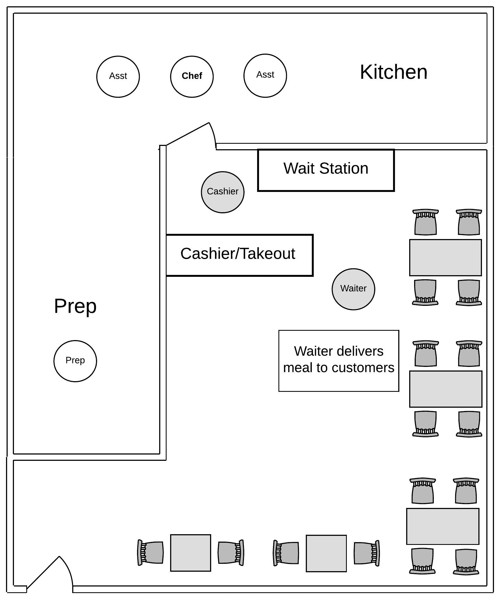
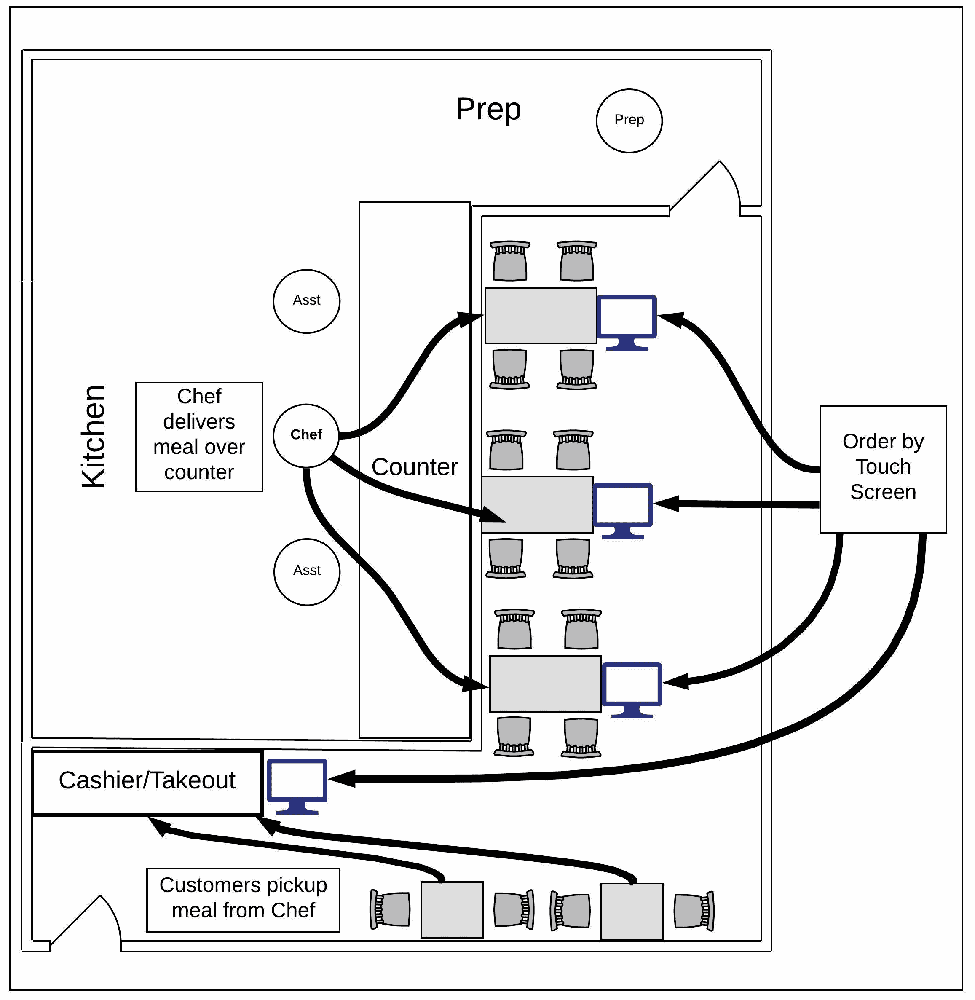

# 自动化时代反对人类就业的理由

> 原文：<https://devops.com/case-human-employment-age-automation/>

几个月前，我住的那条街上的小日本餐馆装修过了。这位老板重新设计了他的企业布局，以解决一个令人烦恼的问题:当面临员工不上班的持续模式时，如何继续经营下去。

他餐馆的布局是这样的:

**图 1:自动化前的当地日本餐厅**

对这一个:

**图 2:自动化后的附近日本餐厅**

新的布局不再需要服务器。事实证明，他雇佣的那些从厨房接受订单并把食物送到顾客餐桌上的人并没有来上班。我们不是在谈论一两个随机的缺席；更确切地说，这是他雇佣的员工的习惯性行为，这些员工大多是高中毕业生和大学生。每一天都变成了一场赌博。他会在轮班开始前一两个小时收到一条短信，报告一些其他的借口:生病，丢了狗，等等。通常，便条以不可避免的结尾，“对不起，今天不在了。明天见。”

所以他自动化了。

* * *

相关内容:[完全自动化的意外障碍](https://devops.com/unanticipated-obstacle-automation/)

* * *

新设计进行得很顺利。你进来。他带你去一张桌子。每张餐桌上都有一个触摸屏显示器，供用餐者点餐时使用。订单直接送到厨房，厨房和一排桌子之间用玻璃隔断隔开。当一道菜做好后，老板(他也是厨师)或助手会从杯子底部的开口将食物送到用餐者的桌子上(见上图 2)。饭后，主人在你买单的前站接你。不再有服务员。不再有收银员。再也没有“我今天去不了”的短信了。

# **实现业务自动化**

对于所有者来说，移除服务器并使用自动化并不是一个容易的决定。他的企业不是一些大规模、多单位的公司企业，而是希望通过自动化人工劳动来提高利润率。这个人 10 年来每周工作 7 天，把他的生意发展成了社区的支柱。他更喜欢雇佣人类，但他不能。他正在自动化，因为可用的人力是不可靠的。他认为使用如此不可靠的劳动力最终会让他破产。他真的需要做出改变。

他照做了。

# **无员工，无员工保留**

到目前为止，事情进展顺利。然而，现在厨房员工开始加入不露面俱乐部，尽管他以每小时 14 美元的价格雇佣厨房工人，这对于厨房工作来说是一个不错的工资。是什么导致人们失踪？也许是产品的原因。毕竟，在无聊到发疯之前，你能做几个加州卷呢？也许很难为他工作。我怀疑他们会跳槽去米奇 D 餐厅工作。金色拱门每小时只支付 10 美元。在任何情况下，老板都有一个员工保留问题，我的猜测是，他将使用自动化来解决这个问题。

# **这跟 DevOps 有什么关系？**

在某些时候，每个人都变得不可靠。有些人工作习惯不好，但大多数人都是人，人都会犯错。这就是我们的构造。我们中的一些人犯了一些错误，而另一些人犯了很多错误。但是，我们都会犯错。我们大多数人从错误中吸取教训，我们还会犯其他错误。我们犯错误的人性使我们天生不可靠。

机器智能没有这个问题。最终，一切都会好的。然后，一旦可靠地运行，这种智能很少会恢复到不可靠的状态。一个人可能在任何时候变得不可靠——请一天病假、辞职或者学习一项新技能或技术时犯的所有错误。

我们德文郡人和我家附近日本餐馆的老板有很多相似之处。我们中的大多数人都非常努力地工作，让我们的客户高兴，并不断回来，远远超过了典型的每周 40 小时的工作时间。在很大程度上，我们是成功的。

我们的成功增加了需求。当需求增加时，我们工作的复杂性会增加，对更可靠操作的需求也会增加。但在某些时候，我们固有的人类不可靠性开始发挥作用。我们会犯错。为了让事情可靠地进行，我们实现了自动化。然后我们继续下一件事。幸运的是，在可预见的未来，将会有“下一件事”继续前进。

然而，我们工作的内在动机是从技术领域中消除人类劳动。我们没有恶意。我们只想尽可能做好工作。如果要在脚本和人类之间进行选择，我们每次都会选择脚本。该脚本将发展到 100%的可靠性。人类不会。

如我所说，就目前而言，这不是一个真正的问题。会有下一件事要继续。就我家附近的寿司店而言，也许失业后不来上班的人会明白准时上班并准备好工作的价值。或者，也许他们不会。也许随着自动化成为重复性工作的劳动实现标准，不成熟的工人将永远没有机会获得他们所需的经验，使他们能够掌握基本的就业技能。毕竟，他们也是人，总有一天会变得不可靠。那么，为什么要雇佣他们呢？为什么不找几个电脑化的小发明来做多余的工作，然后专注于让客户满意并在竞争中保持领先呢？

没有员工就意味着没有不可靠的员工。没有不可靠员工的企业是高效的企业。商业的效率就是一切。

我的朋友们，这就是自动化时代反对人类就业的情况。

鲍勃·雷瑟曼