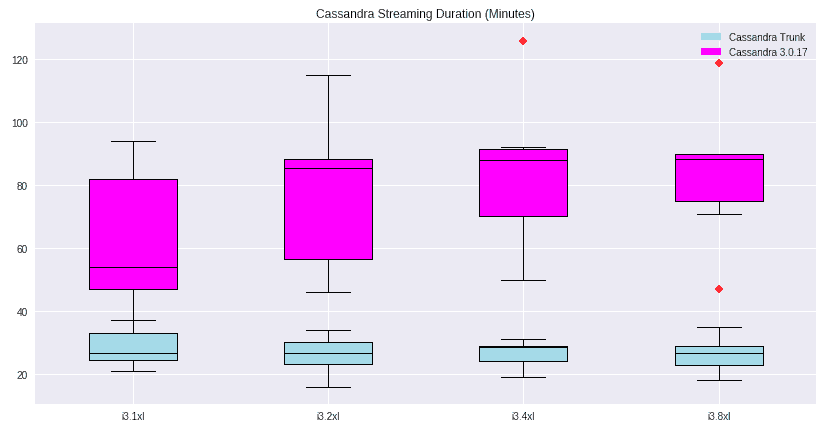

# 卡珊德拉更新提高恢复速度

> 原文：<https://devops.com/cassandra-update-boosts-recovery-speeds/>

Apache Cassandra 是一个面向行的 NoSQL 数据库，由在脸书工作的开发人员创建。由于弹性是其关键特性之一，开源贡献者为测试版推出的 [Cassandra 4.0](https://cassandra.apache.org/doc/latest/new/) 添加了新的流媒体功能。事实证明，这些改进使数据库能够以比过去快五倍的速度在节点之间传输数据。

这意味着，例如，如果网络上的一个节点崩溃，数据可以更快地传输到另一个替代节点。Cassandra 的贡献者说，相反，在高峰负载数据时间，云或内部服务器上的不同节点可以更容易和更快地管理潜在的数据溢出，以提高运营弹性。

在以前的 Cassandra 版本中，弹性——或缺乏弹性——通常被视为弱点。事实上，Cassandra 委员会委员兼项目管理委员会成员 Josh McKenzie 说，针对利用分布式微服务环境的开发运维的弹性改进“真的是一个关键点”。McKenzie 还是开源战略的负责人和 DataStax 软件工程的副总裁，该公司一直为 Cassandra 的贡献和支持提供大量资金。

Longbottom Associates 的分析师 Clive Longbottom 说，新的流功能也可能成为数据库管理的一个受欢迎的功能，特别是在 Kubernetes 和微服务的高度分布式无状态环境中。

“对于第一个，这似乎是一个很好的更新。它使得卡珊德拉的‘最终一致性’不再是一个问题，在一系列情景中更有保证的复苏时间表是受欢迎的，”隆巴顿说。“我希望这样一个重大的变化会让更多人考虑 Cassandra 来做这样的数据工作——如果实施正确，并有合适的工作，它可以成为一个有效的数据平台。”

McKenzie 说，新的流速度之所以成为可能，是因为数据能够绕过服务器 CPU 的使用。“当引导新节点从故障中恢复或扩展集群时，能够获得四到五倍的吞吐量意味着该过程现在完全不同了。”

An example of a six-node cluster setup.

对于 DevOps 团队来说，这意味着 Cassandra 的修改——包括其现在更简单和更短的代码配置——有助于在引导新节点或灾难数据恢复期间实现更快的流速度。McKenzie 说:“运行修复和处理[服务器故障]意味着您不必重建太多数据，现在您可以像网络一样快速地运行。

开发人员还试图减少花费在执行过去特别繁重的任务上的时间，这些任务是在网络中的不同数据库源之间传输数据。多种云以及混合和匹配传统和云环境使流程更加复杂。

在其他数据库平台中，数据库容量翻倍的过程可能需要五到七个月。McKenzie 说，Cassandra 4.0 部分基于过去版本提供的稳定改进，现在可以在几个小时内完成这个过程。“我喜欢听到人们现在可以用脚本运行 Cassandra，只需要在周六早上花六个小时和一个人用一个脚本，而不是整个周末，”McKenzie 说。“所以，这实际上是对那些独特优势的加倍努力，这些优势使 Cassandra 非常适合我们今天在世界上所处的位置:总是应对大量涌入的数据。”

委员会成员还试图延长最终测试版的发布时间。麦肯齐说，Cassandra 4.0 的贡献者没有在试图加快发布周期的同时增加更多的增量改进，而是寻求“真正花时间，确保我们正在锤平所有的凹痕”。“我们想让事情发展到我们有一个非常非常稳定的平台，可以非常快速地迭代。”